# Markdown Articles

A reusable project for writing and publishing markdown articles to Blogger.

This project will publish Markdown articles to Blogger using GitHub Actions.

Each sub-directory is its own article, with a Makefile, images and supporting
files.

## Pipeline Overview

The publishing pipeline is automated using GitHub Actions and consists of three
sequential jobs:

1. **Validate**: Checks that all required inputs (article name, title, and
   labels) are present.
2. **Build**: Compiles the Markdown source into HTML using Pandoc and uploads
   the result as an artifact.
3. **Publish**: Downloads the HTML artifact and publishes it to Blogger using
   the Google Blogger API.

```mermaid
graph LR
    %% Trigger
    Start(("User Trigger<br/>(workflow_dispatch)")) --> ValidateJob

    %% Job: Validate
    subgraph ValidateJob ["Job: Validate Inputs"]
        direction LR
        InputLogic{"Check Inputs:<br/>Name, Title, Labels"}

        InputLogic -- "All Empty" --> OutputSkip["Output: build=false"]
        InputLogic -- "Partial / Missing" --> ExitFail["Exit 1 (Fail)"]
        InputLogic -- "All Provided" --> OutputBuild["Output: build=true"]
    end

   %% Conditional Logic between Jobs
    OutputSkip -.-> EndSkip([End: Skipped])
    ExitFail --> EndFail([End: Failed])
   OutputBuild ==>|build=true| StepCheckout

      %% Job: Build
      subgraph BuildJob ["Job: Build"]
        direction LR

        StepCheckout[/"Step: Checkout Code<br/>(actions/checkout)"/]
        StepPandoc["Step: Build with Pandoc<br/>(frankhjung/pandoc)"]
        StepUpload[/"Step: Upload Artifact<br/>(actions/upload-artifact)"/]

        StepCheckout --> StepPandoc
        StepPandoc --> StepUpload
    end

    %% Job: Publish
    subgraph PublishJob ["Job: Publish"]
        direction LR
        StepDownload[/"Step: Download Artifact<br/>(actions/download-artifact)"/]
        StepBlogger["Step: Publish to Blogger<br/>(frankhjung/blogger)"]

        StepDownload --> StepBlogger
    end

    %% End State
    StepUpload ==> StepDownload
    StepBlogger --> EndSuccess((End: Success))

    %% Styling
    classDef green fill:#e1f5fe,stroke:#01579b,stroke-width:2px;
    classDef red fill:#ffebee,stroke:#b71c1c,stroke-width:2px;
    classDef yellow fill:#fffde7,stroke:#fbc02d,stroke-width:2px;

    class Start,EndSuccess green;
    class EndFail red;
    class EndSkip yellow;
```



## Project Structure

```text
markdown/
├── LICENSE                   # Project license
├── Makefile                  # Top level build rules
├── files/                    # Shared resources
│   ├── article.css           # HTML styling
│   ├── article.md            # Template article content
│   ├── article.mk            # Template article build rules
│   └── preamble.tex          # PDF preamble
├── images/                   # Shared images (if used)
│   └── banner.jpg            # Template banner image
├── docs/                     # Project docs
├── <article>/                # Article subfolder
│   ├── article.md            # Main content
│   ├── Makefile              # Article build rules (hard link to article.mk)
│   ├── docs/                 # [OPTIONAL] Supporting documents for article
│   ├── files/                # Hard links to shared files
│   ├── images/               # Article images
│   └── [public/]             # Build output for article HTML and PDF files
└── .github/workflows/
    └── publish.yml           # Blogger publishing pipeline
```

The `<article>/public/` folder is generated by the build process and contains
the final HTML and PDF outputs for that article. It gets removed on `make clean`
or `make <article>-clean`.

## Creating a New Article

There are two ways to create a new article: manually or using the `new-article`
Makefile target.

### Manual Setup

You can create a new article by following these steps:

1. Create a new folder with the article name (e.g., `my-article/`)

2. Create a hard link to the article Makefile template:

   ```bash
   ln -f files/article.mk my-article/Makefile
   ```

3. Create `article.md` with YAML front matter:

   ```markdown
   ---
   title: My Article
   author: "[Your Name](https://www.linkedin.com/in/yourname/)"
   date: 2026-02-08       # updated automatically on publishing
   tags: [article, blog]  # update with your own tags
   ---

   *Your content here.*
   ```

4. Create hard links to shared files:

   ```bash
   mkdir -p my-article/files
   ln -f files/article.css my-article/files/article.css
   ln -f files/preamble.tex my-article/files/preamble.tex
   ```

5. Create an images folder with a banner:

   ```bash
   mkdir -p my-article/images
   cp images/banner.jpg my-article/images/banner.jpg
   ```

6. [Optional] Add supporting documents to `my-article/docs/`

### Using the `new-article` Makefile target

Alternatively, you can use the `new-article` target to automate this process:

```bash
make new-article
```

This will prompt you for the article name and create the folder structure with
the necessary files.

## Building Locally

Build a specific article (HTML only):

```bash
make consciousness
```

Or build directly in the article folder:

```bash
cd consciousness
# HTML is the default target
make
```

This generates:

- `public/article.html` — standalone HTML article

To also build a PDF version:

```bash
cd consciousness
make consciousness.pdf
```

This generates:

- `public/consciousness.pdf` — PDF article

Update shared file hard links for all articles:

```bash
make update-links
```

Clean build artifacts:

```bash
make consciousness-clean
# or
make clean  # cleans all articles' generated public folders
```

## Publishing to Blogger

The GitHub Actions [workflow](.github/workflows/publish.yml) publishes articles
to Blogger. It first validates that all required inputs are provided, then
builds the HTML using a Pandoc Docker image and publishes to Blogger using the
Blogger API Docker image.

### Trigger the Workflow

1. Go to **Actions** → **publish article**
2. Click **Run workflow**
3. Enter the required inputs:
   - **Article folder name**: (e.g., `consciousness`)
   - **Article title**: The title of the post on Blogger
   - **Comma-separated list of labels**: Labels for the post
4. Click **Run workflow**

All three inputs are required. If any are missing, the workflow will fail with a
validation error.

### Required Secrets

Configure these in **Settings** → **Secrets and variables** → **Actions**:

| Secret                  | Description                                   |
| ----------------------- | --------------------------------------------- |
| `BLOGGER_BLOG_ID`       | Your Blogger blog identifier                  |
| `BLOGGER_CLIENT_ID`     | Google OAuth Client ID from Cloud Console     |
| `BLOGGER_CLIENT_SECRET` | Google OAuth Client Secret                    |
| `BLOGGER_REFRESH_TOKEN` | Long-term token for non-interactive API access|

See
[Blogger API documentation](https://developers.google.com/blogger/docs/3.0/using)
for setup instructions.

## Docker Images

The pipeline uses two Docker images:

### Pandoc (DockerHub)

Used to build HTML articles from Markdown.

```bash
# Pull image
docker pull frankhjung/pandoc:3.1.11.1

# Build an article (run from project root)
docker run --rm -v "$(pwd)":/workspace -w /workspace \
  frankhjung/pandoc:3.1.11.1 \
  make -B consciousness
```

### Blogger (GHCR)

Used to publish articles to Blogger.

```bash
# Pull image
docker pull ghcr.io/frankhjung/blogger:v1.3

# Publish an article
docker run --rm -v "$(pwd)":/workspace -w /workspace \
  ghcr.io/frankhjung/blogger:v1.3 \
  --source-file "consciousness/public/article.html" \
  --title "My Article Title" \
  --labels "label1, label2" \
  --blog-id "YOUR_BLOG_ID" \
  --client-id "YOUR_CLIENT_ID" \
  --client-secret "YOUR_CLIENT_SECRET" \
  --refresh-token "YOUR_REFRESH_TOKEN"
```

## Dependencies

- [GitHub Actions](https://github.com/features/actions) — workflow automation
- [GNU Make](https://www.gnu.org/software/make/) — build tool
- [Pandoc](https://pandoc.org/) — document conversion
- [XeLaTeX](https://tug.org/xetex/) — PDF generation (via TeX Live)
- [Blogger API](https://developers.google.com/blogger/docs/3.0/using)
  — publishing platform
