# Markdown Articles

A reusable project for writing and publishing Markdown or R Markdown articles to
Blogger.

This project will publish Markdown or R Markdown articles to Blogger using
GitHub Actions.

Each sub-directory is its own article, with a Makefile, images and supporting
files.

## Pipeline Overview

The publishing pipeline is automated using GitHub Actions and consists of four
sequential jobs:

1. **Validate**: Checks that all required inputs (article name, title, and
   labels) are present.
2. **Detect**: Identifies the article type (Markdown or R Markdown) based on the
   presence of `article.md` or `article.Rmd`.
3. **Build**: Compiles the source into HTML using the appropriate tool (Pandoc
   for Markdown, R for R Markdown) and uploads the result as an artefact.
4. **Publish**: Downloads the HTML artefact and publishes it to Blogger using
   the Google Blogger API.

```mermaid
---
config:
  look: handDrawn
---
graph LR
    %% Trigger
    Start(("User Trigger<br/>(workflow_dispatch)")) --> ValidateJob

    %% Job: Validate
    subgraph ValidateJob ["Job: Validate Inputs"]
        direction LR
        InputLogic{"Check Inputs:<br/>Name, Title, Labels"}

        InputLogic -- "All Empty" --> OutputSkip["Output: build=false"]
        InputLogic -- "Partial / Missing" --> ExitFail["Exit 1 (Fail)"]
        InputLogic -- "All Provided" --> OutputBuild["Output: build=true"]
    end

    %% Job: Detect
    subgraph DetectJob ["Job: Detect Type"]
        direction LR
        DetectLogic{"Check Article File"}
        DetectLogic -- "article.md" --> TypeMD["Output: type=md"]
        DetectLogic -- "article.Rmd" --> TypeRMD["Output: type=rmd"]
        DetectLogic -- "Not Found" --> DetectFail["Exit 1 (Fail)"]
    end

   %% Conditional Logic between Jobs
    OutputSkip -.-> EndSkip([End: Skipped])
    ExitFail --> EndFail([End: Failed])
    OutputBuild ==>|build=true| DetectJob
    DetectFail --> EndFail

      %% Job: Build
      subgraph BuildJob ["Job: Build"]
        direction LR

        TypeMD ==>|type=md| StepPandoc["Step: Build (Pandoc)"]
        TypeRMD ==>|type=rmd| StepGNUR["Step: Build (GNUR)"]

        StepPandoc --> StepUpload[/"Step: Upload Artefact"/]
        StepGNUR --> StepUpload
    end

    %% Job: Publish
    subgraph PublishJob ["Job: Publish"]
        direction LR
        StepDownload[/"Step: Download Artefact"/]
        StepVerify["Step: Verify Artefact"]
        StepBlogger["Step: Publish to Blogger"]

        StepDownload --> StepVerify --> StepBlogger
    end

    %% End State
    StepUpload ==> StepDownload
    StepBlogger --> EndSuccess((End: Success))

    %% Styling
    classDef green fill:#e1f5fe,stroke:#01579b,stroke-width:2px;
    classDef red fill:#ffebee,stroke:#b71c1c,stroke-width:2px;
    classDef yellow fill:#fffde7,stroke:#fbc02d,stroke-width:2px;

    class Start,EndSuccess green;
    class EndFail red;
    class EndSkip yellow;
```



## Project Structure

```text
markdown/
├── LICENSE                   # Project license
├── Makefile                  # Top level build rules
├── files/                    # Shared resources
│   ├── article.css           # HTML styling
│   ├── article.md            # Template Markdown content
│   ├── article.Rmd           # Template R Markdown content
│   ├── article_md.mk         # Template Markdown build rules
│   ├── article_rmd.mk        # Template R Markdown build rules
│   ├── make.R                # R script for rendering Rmd
│   ├── preamble.tex          # PDF preamble
│   └── puppeteer.json        # Puppeteer config for Mermaid CLI
├── images/                   # Shared images (if used)
│   └── banner.jpg            # Template banner image
├── docs/                     # Project docs
├── <article>/                # Article subfolder
│   ├── article.md|.Rmd       # Main content
│   ├── Makefile              # Article build rules (hard link to template)
│   ├── make.R                # [IF Rmd] R script for rendering
│   ├── docs/                 # [OPTIONAL] Supporting documents for article
│   ├── files/                # Hard links to shared files
│   ├── images/               # Article images
│   └── [public/]             # Build output for article HTML and PDF files
└── .github/workflows/
    └── publish.yml           # Blogger publishing pipeline
```

The `<article>/public/` folder is generated by the build process and contains
the final HTML and PDF outputs for that article. It gets removed on `make clean`
or `make <article>-clean`.

## Creating a New Article

Use the `new-article` Makefile target to automate the folder creation:

### Create a Markdown Article

```bash
make new-article name=my-article
```

### Create an R Markdown Article

```bash
make new-article name=my-rmd-article type=rmd
```

This will create the folder structure with the necessary files and hard links.

## Building Locally

Build a specific article (HTML only):

```bash
make consciousness
```

Or build directly in the article folder:

```bash
cd consciousness
# HTML is the default target
make
```

This generates:

- `public/article.html` — standalone HTML article

To also build a PDF version:

```bash
cd consciousness
make pdf
```

This generates:

- `public/consciousness.pdf` — PDF article

Update shared file hard links for all articles:

```bash
make update-links
```

Clean build artefacts:

```bash
make consciousness-clean
# or
make clean  # cleans all articles' generated public folders
```

## Publishing to Blogger

The GitHub Actions [workflow](.github/workflows/publish.yml) publishes articles
to Blogger. It employs conditional validation for inputs:

- **All inputs empty**: The workflow exits successfully but skips the build.
- **Partial inputs**: The workflow fails with a validation error.
- **All inputs provided**: The workflow proceeds to build and publish.

Inputs are technically marked as optional in the workflow configuration to
support the "all empty" skip path, but are enforced at runtime if any are
provided.

### Trigger the Workflow

1. Go to **Actions** → **publish article**
2. Click **Run workflow**
3. Enter the inputs:
   - **Article folder name**: (e.g., `consciousness`)
   - **Article title**: The title of the post on Blogger
   - **Comma-separated list of labels**: Labels for the post
4. Click **Run workflow**

### Required Secrets

Configure these in **Settings** → **Secrets and variables** → **Actions**:

| Secret                  | Description                                   |
| ----------------------- | --------------------------------------------- |
| `BLOGGER_BLOG_ID`       | Your Blogger blog identifier                  |
| `BLOGGER_CLIENT_ID`     | Google OAuth Client ID from Cloud Console     |
| `BLOGGER_CLIENT_SECRET` | Google OAuth Client Secret                    |
| `BLOGGER_REFRESH_TOKEN` | Long-term token for non-interactive API access|

See
[Blogger API documentation](https://developers.google.com/blogger/docs/3.0/using)
for setup instructions.

## Docker Images

The pipeline uses three Docker images:

### Pandoc (DockerHub)

Used to build HTML articles from Markdown.

```bash
# Pull image
docker pull frankhjung/pandoc:3.1.11.1
```

### GNUR (GHCR)

Used to build HTML articles from R Markdown.

```bash
# Pull image
docker pull ghcr.io/frankhjung/gnur:4.5.2
```

### Blogger (GHCR)

Used to publish articles to Blogger.

```bash
# Pull image
docker pull ghcr.io/frankhjung/blogger:v1.3
```

## Mermaid Diagrams

Mermaid diagrams can be included in an article.

### Install

To use the Mermaid CLI tool, install [mermaid-js/mermaid-cli](https://www.npmjs.com/package/@mermaid-js/mermaid-cli):

```bash
# Install mermaid-cli globally via npm
npm install -g @mermaid-js/mermaid-cli
```

### Usage

```bash
# Generate a PNG image from a Mermaid diagram
mmdc -i input.mmd -o output.png
```

## Dependencies

- [Blogger API](https://developers.google.com/blogger/docs/3.0/using) —
  publishing platform
- [GitHub Actions](https://github.com/features/actions) — workflow automation
- [GNU Make](https://www.gnu.org/software/make/) — build tool
- [Mermaid CLI](https://www.npmjs.com/package/@mermaid-js/mermaid-cli) —
  Mermaid diagram conversion
  - also requires `librsvg2-bin` for rendering PDFs
  - also requires a Chrome browser installed
- [Pandoc](https://pandoc.org/) — document conversion
- [R Markdown](https://rmarkdown.rstudio.com/) — R document conversion
- [XeLaTeX](https://tug.org/xetex/) — PDF generation (via TeX Live)
