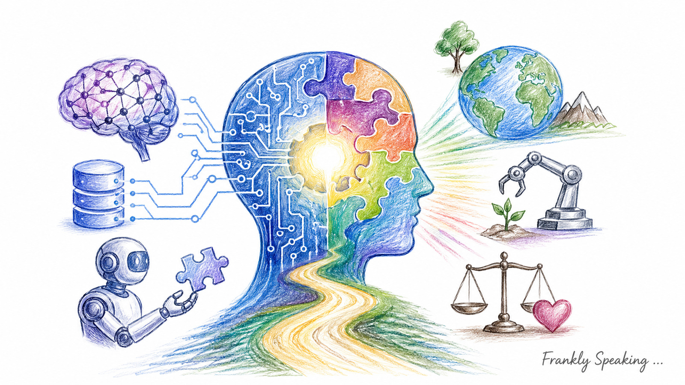
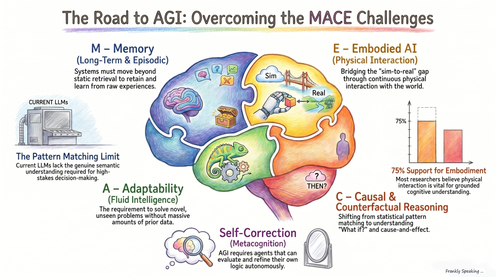

_Since 1956 one of the central goals of AI is achieving Artificial General
Intelligence (AGI). Recently we have seen amazing advances in AI, but there are
still important challenges to solve before we get there. In this article, I draw
on the
[AAAI 2025 Presidential Panel report](https://aaai.org/wp-content/uploads/2025/03/AAAI-2025-PresPanel-Report-FINAL.pdf)
to outline what the AI community sees as the critical gaps that must be resolved
before AGI can be achieved._

AI is in a strange place right now. New benchmark results can make it seem as if
the field is nearly solved. Yet these systems still fail basic common-sense
tasks that humans manage with little effort. That gap is why true AGI still
feels a long way off. In this article, AGI means an AI that can perform as well
as a human across a wide variety of tasks, not just produce fluent text.

The big problem is what researchers call the "Reasoning Paradox." Today's Large
Language Models (LLMs) are very good at producing language that sounds like
reasoning, but that is not the same as reliable formal reasoning. In low-stakes
contexts that may be acceptable. In medicine, law, or engineering, it is not.
The challenge is closing the gap between plausible output and verifiable logic.

This distinction matters because today's systems are still narrow. They can be
impressive within specific domains, but AGI would need to transfer knowledge
across fields, adapt to unfamiliar situations, and solve new problems without
being retrained from scratch.

The first major gap is memory, especially the ability to accumulate real
experience over time.

Current AI systems have a major blind spot: they don't have true, long-term
memory. Right now, most models just pull information from a massive, static
library when asked. They don't remember their past interactions like we do,
which means they struggle to understand how things change over time.

To fix this, researchers are trying to build systems that learn from "raw
experiences" as they go. Projects like [Google Research's Titans
architecture](https://research.google/blog/titans-miras-helping-ai-have-long-term-memory/)
and work from the [TrustAGI Lab](https://trust-agi.github.io/) at Griffith
University are pushing in this direction. The goal is to let AI models update
their knowledge in real-time, learning from experience rather than just looking
up old facts.

In short, for AGI to work, it needs a memory that lets it explore, remember what
happened, and genuinely learn—just like we do.

Beyond memory, AGI also depends on adaptability, including the ability for
systems to check and improve their own work.

When faced with unfamiliar problems, modern AI systems often struggle. They rely
so heavily on training data that they can find it difficult to build new
solutions on the fly. As a result, they still need substantial human correction
and can become incoherent during longer tasks.

This is where benchmarks like the [ARC Prize](https://arcprize.org/) come in.
They measure how efficiently an AI can learn new things. Researchers are now
focusing on systems that can evaluate, critique, and refine their own
outputs—catching mistakes before they compound.

Self-correction is not optional if these systems are to operate safely with
reduced human supervision.

Even with better adaptability, progress will remain limited without stronger
causal reasoning and the ability to ask "What if?"

Today's AI is basically a super-powered pattern matcher. It is fantastic at
spotting trends, but terrible at explaining _why_ things happen. This means it
struggles with understanding cause and effect.

Being able to ask "What if?" and imagine different outcomes is crucial for
important decisions in business, law, and medicine. Inspired by experts like
[Judea Pearl](https://amturing.acm.org/award_winners/pearl_2658896.cfm), groups
like the
[Causal Reasoning Lab at causaLens](https://www.causalens.com/causal-reasoning-lab/)
are trying to give AI the ability to understand cause and effect. Without it, AI
is just guessing based on correlations, rather than truly understanding the
world.

One reason causal reasoning is so hard for disembodied systems is that causal
knowledge requires intervention—acting on the world and observing the result.
That points toward a deeper question: whether AGI needs a physical body to
acquire genuine causal understanding at all.

A large share of AI researchers think true intelligence requires a physical body
interacting with the real world. The problem is that AI trained in a computer
simulation often falls apart in the real world—the gap between a tidy virtual
environment and a messy physical one is much larger than it looks.

Unlike text-based AI, robots need massive amounts of physical data, which is
rare and hard to get. Projects like
[DeepMind’s Genie 3](https://deepmind.google/discover/blog/genie-3-a-new-frontier-for-world-models/)
are trying to solve this by building general-purpose virtual worlds for AI
agents to operate in. The idea is that true intelligence comes from being
embodied, embedded in an environment, and learning through interaction.

At the same time, none of this is enough if systems cannot reliably separate
confident language from factual accuracy.

Current AI systems essentially reconstruct answers on the fly—assembling
fragments from across their training data rather than looking up a single
verified fact. This means a model can produce confident, well-formed prose while
getting basic facts wrong.

The [SimpleQA benchmark](https://openai.com/index/introducing-simpleqa/) from
OpenAI makes this concrete. As of April 2026, the best models without tools or
extended thinking from OpenAI, Anthropic, and Google scored below 60% on
straightforward factual questions. Most researchers are not optimistic that this
will be resolved through model scale alone. The more promising direction is
combining neural networks with structured, verifiable knowledge sources—which
leads directly to the neuro-symbolic path discussed below.

Taken together, these challenges—unreliable reasoning, shallow memory, poor
causal understanding, and factual inconsistency—point toward a single
conclusion: neither neural networks nor classical symbolic AI is enough on its
own.

Neural networks are good at pattern recognition and fluency; symbolic systems
bring verifiable logic and structured knowledge. The most credible path forward
combines the two—sometimes called neuro-symbolic AI—and that hybrid approach is
increasingly seen as the missing piece.

Yet technical progress alone is not enough. As
[Francesca Rossi](https://research.ibm.com/people/francesca-rossi) puts it:

_How do we ensure that as AI gets closer to AGI, it stays aligned with human
values and actually helps humanity?_

That question may matter more than any benchmark. An AI that passes every test
but cannot be trusted or directed well is not AGI—it is a liability.

## Resources

- [ARC Prize Foundation](https://arcprize.org/)
- [AAAI 2025 Presidential Panel Report (FINAL)](https://aaai.org/wp-content/uploads/2025/03/AAAI-2025-PresPanel-Report-FINAL.pdf)
- [A Definition of AGI](https://arxiv.org/pdf/2510.18212)
- [Why Scaling AI Won't Reach AGI (Podcast)](https://open.spotify.com/episode/30LDb3VJIPHomSZLHK5ImT?si=rYXAU3SpRg6Lx6_vFtTbNw)
