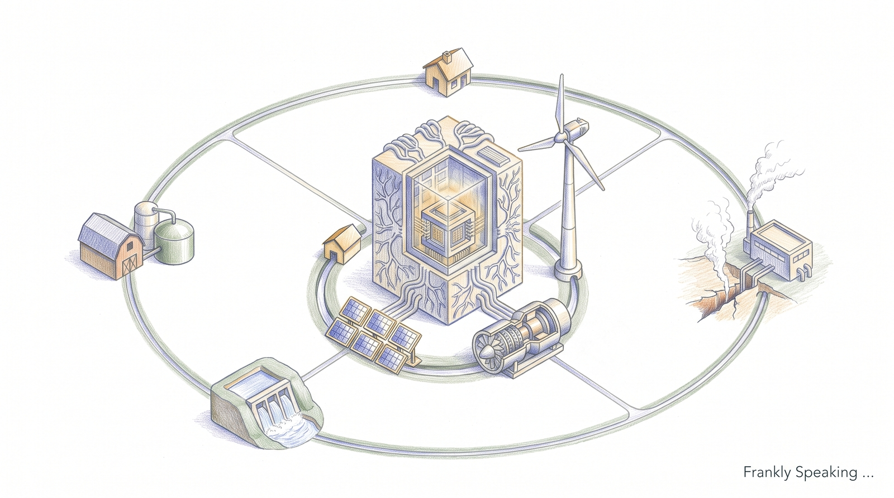

Anyone following the AI boom will have heard two arguments pulling in opposite
directions. The first says hardware and algorithms are improving so fast — chips
getting quicker per watt, models shrinking through quantisation and
distillation, software stacks tightening at every layer — that energy use should
eventually level off. The second says the opposite: tech giants are signing
multi-gigawatt power deals, bringing retired nuclear plants back online, and
forecasting demand curves that only go up. I wanted to work out which story
actually holds, so I went through the industry data myself. My conclusion is
that the second camp has it right. Efficiency keeps improving, but it is not
enough on its own. Total demand is going to keep accelerating for the rest of
the decade.

## Why Efficiency Doesn't Mean Less Energy

The reason the efficiency argument falls short has a name:
[Jevons' Paradox][jevons]. Back in 1865, the economist William Stanley Jevons
noticed something counterintuitive about James Watt's improved steam engine.
Watt's design used coal far more efficiently than earlier engines, so logic
would suggest England's coal consumption should have fallen. Instead, it took
off. Cheaper, more practical power meant coal got used in far more places for
far more purposes, and the efficiency gain was swallowed many times over by
growth in total use.

I think we are watching the same mechanism play out with AI, just compressed
into a much shorter timeframe. The cost of running a single inference task, or
generating one token at a fixed level of quality, has been falling far faster
than most people realise — [Epoch AI][epoch-inference] puts the rate anywhere
from 9x to 900x per year depending on the benchmark, with a typical figure
closer to 40x — as chips, precision formats, and software stacks all improve
together. That falling cost does not sit still; it unlocks work that was not
economical before: background agents running continuously, multi-step reasoning
chains, real-time video generation, assistants embedded in everything. Each is a
new source of demand that did not exist when running a model cost ten times as
much. Multiply the growing number of tasks by the number of queries each one
generates, and the resulting demand outpaces the efficiency curve by a wide
margin. Cheaper compute does not reduce total power draw; it expands the market
for compute, and the expanded market wins.

## What the Forecasts Actually Say

It is one thing to reason about a mechanism in the abstract, and another to see
whether the people who model energy grids for a living agree. When you look at
the major forecasts, the pattern holds up consistently across the board.

The International Energy Agency modelled global data centre electricity demand
under several scenarios, including ones assuming aggressive efficiency gains
across chips and cooling. Even in those optimistic cases, demand does not
plateau. The IEA's central projection has worldwide data centre power roughly
doubling from about 415 terawatt-hours (TWh) in 2024 to more than 940 TWh by
2030 — accounting for around 3% of all global electricity generation.

McKinsey looked specifically at the United States, where the shift is even
starker. In 2023, American data centres drew about 147 TWh, or roughly 3.7% of
the national grid. By 2030, McKinsey projects that figure will reach 606 TWh —
nearly 12% of total US electricity demand. That is the data centres' share of
national power more than tripling in just seven years.

Gartner's research tracks where that power goes. Its most recent forecast shows
AI-optimised servers overtaking all conventional server workloads combined by
2027, drawing roughly 258 TWh that year[gartner-2026]. An earlier Gartner report
warned that the physical grid cannot keep pace either way: power availability is
projected to operationally constrain 40% of existing AI data centres by
2027[gartner-2024], a concern echoed by the OECD's own analysis of AI's grid
impact[oecd-power].

## Why This Isn't a Repeat of the Cloud Story

There is an obvious objection to all this: didn't we already go through an
efficiency-versus-growth story once before, and come out fine? During the 2010s,
global data centre compute capacity grew by more than 500%, yet total
electricity consumption barely moved[masanet-2020]. That split was real. The
industry was moving from inefficient, on-premises server rooms scattered through
every company basement to centralised hyperscale facilities with power usage
effectiveness ratings around 1.1 to 1.2 — about as efficient as a data centre
gets.

The AI build-out cannot repeat that trick, because the underlying physics have
changed. A typical hyperscale cloud rack drew around 5 to 15 kW, cooled by
ordinary perimeter air conditioning. A modern AI rack, built around NVIDIA's
H100, H200, and Blackwell chips — each drawing 700 to more than 1,000 watts —
routinely pulls 30 to more than 100 kW and needs direct-to-chip liquid cooling
or immersion to control the heat. The workload has changed too, from CPU-driven
web services and databases to GPU- and ASIC-driven parallel computation. The
binding constraint has shifted from land and real estate to power generation and
grid interconnection. Hyperscale cloud already captured the easy efficiency
wins. What is left is raw electrical load, concentrated into a much smaller
physical footprint than anything the industry has built before.

## The Real Constraint Is the Grid, Not the Chip

If data centre growth does stall out over the next few years, I do not think it
will be because anyone ran out of demand, or because some efficiency
breakthrough made further scaling pointless. It will be because of what sits
between the power station and the rack.

Three separate bottlenecks are compounding each other. First, securing grid
approval and transmission interconnects for large campuses now takes three to
seven-plus years in key hubs like Northern Virginia, Texas, Frankfurt, and
Dublin. Second, the physical supply chain — high-voltage transformers,
switchgear, and backup generators — is backlogged three to four years. Third,
regional grids are running near peak reserve margins, prompting utilities and
regulators to scrutinise or halt major new connection requests.

Put those three together and it is not surprising that around 40% of planned AI
data centre projects are facing energisation delays. That pressure is exactly
why operators are increasingly turning to co-located generation, on-site
microgrids, and long-term power purchase agreements with nuclear and geothermal
providers — not because those are the cheapest options, but because they are the
only way to get guaranteed power on a timeline that matches the build.

## Where I've Landed

Pulling this together, here is the argument as I now see it. Efficiency really
is improving, and that is not a mirage — per-token costs are falling fast, and
that is genuine progress. But Jevons' Paradox means falling cost is exactly what
drives total consumption up, because it makes an entire tier of workloads viable
that could not have existed at the old price point. Layer the forecasts on top
of that mechanism — global demand roughly doubling by 2030, data centres
claiming double-digit shares of major grids, and AI hardware claiming the lion's
share of that load — and the trajectory is clearly accelerating, not flattening.

The genuine limiting factor from here is not silicon. It is gigawatts —
specifically, how quickly civil infrastructure can deliver high-voltage power to
the rack. That is a civil engineering and regulatory challenge as much as a
technological one, and it is the one that will determine how far AI can scale.

## Sources and Further Reading

* **International Energy Agency (IEA):**
  [Energy and AI — Electricity forecasts][iea-energy-ai]
* **McKinsey & Company:**
  [AI's Power Binge — charting US data centre demand to 2030][mckinsey-power]
* **Gartner Research:** [Data centre electricity demand to grow 26% in 2026, AI
  servers to overtake conventional by 2027][gartner-2026], and
  [power shortages will restrict 40% of AI data centres by 2027][gartner-2024]
* **OECD Economics Department:**
  [Wired for power — the energy behind the AI revolution][oecd-power]
* **Masanet et al. (2020), *Science*:**
  [Recalibrating global data center energy-use estimates][masanet-2020]
* **Epoch AI:** [LLM inference prices have fallen rapidly but unequally across
  tasks][epoch-inference]

[jevons]: https://en.wikipedia.org/wiki/Jevons%27_paradox
[iea-energy-ai]: https://iea.blob.core.windows.net/assets/de9dea13-b07d-42c5-a398-d1b3ae17d866/EnergyandAI.pdf
[mckinsey-power]: https://www.mckinsey.com/featured-insights/charts/ais-power-binge
[gartner-2026]: https://www.gartner.com/en/newsroom/press-releases/2026-06-10-gartner-says-data-center-electricity-demand-to-grow-26-percent-in-2026
[gartner-2024]: https://www.gartner.com/en/newsroom/press-releases/2024-11-12-gartner-predicts-power-shortages-will-restrict-40-percent-of-ai-data-centers-by-20270
[oecd-power]: https://oecdecoscope.blog/2026/01/29/wired-for-power-the-energy-behind-the-ai-revolution/
[masanet-2020]: https://www.science.org/doi/10.1126/science.aba3758
[epoch-inference]: https://epoch.ai/data-insights/llm-inference-price-trends
