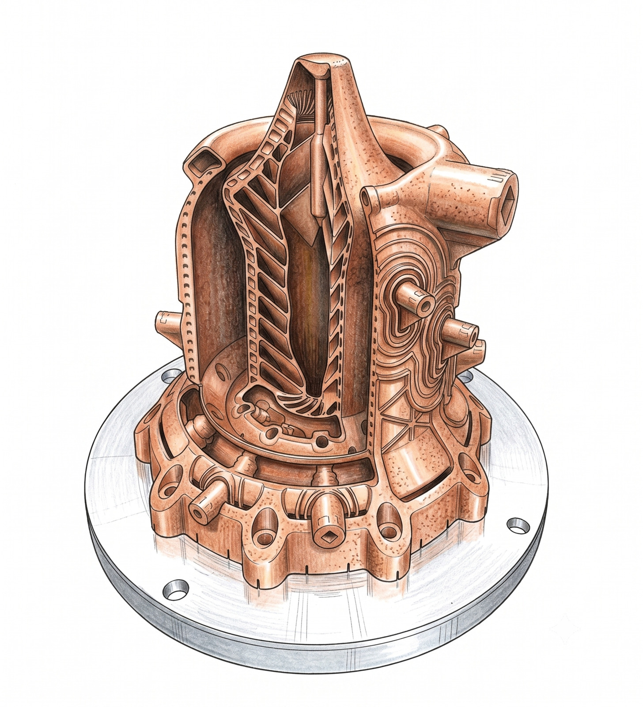

It is a comfortable belief: AI is just a mirror. Critics often dismiss large AI
systems, especially large language models, as statistical parrots that reflect
our words, images, and ideas without any deeper agency. They argue that such
systems cannot come up with new ideas.

I think that is wrong. The question is not whether AI has consciousness or
human-style understanding. The question is whether it can see associations and
links that humans often miss. Human civilisation also advances through copying
and recombination. We build on what came before. AI does something related,
though in a different manner. It notices connections across vast bodies of data
and turns those relationships into outputs that can feel surprising to us.

In this essay I will look at several examples — a Go match, a mathematical
proof, a rocket engine, a strange portrait, and a drug candidate — where I think
AI has done something novel and interesting.

## Move 37: A Strategy That Broke Human Intuition

In March 2016, during the second game of the historic Go match between
DeepMind's [AlphaGo][alphago] and world champion Lee Sedol, AlphaGo played Move
37, a [shoulder hit][shoulderhit] on the fifth line. To human Go masters, the
move looked wrong. Traditional theory tells players to avoid opening plays on
that line, so many commentators first treated it as a mistake.

It was not a mistake. I see Move 37 as a sign that AlphaGo could recognise a
pattern of play that human intuition had not seen. It was not simply memorising
grandmaster games. It had found a structure in the game that was hidden in the
space of possible moves.

## Verified Reasoning: A Preview of the Collaboration Ahead

Mathematics is where the shape of human-AI collaboration is clearest. In 2024,
[DeepMind's AlphaProof and AlphaGeometry 2][deepmind-math] reached a
silver-medal standard at the International Mathematical Olympiad. [DeepMind's
FunSearch][deepmind-funsearch] went further, producing new constructions for the
decades-old [cap set problem][cap-set] that mathematicians then checked and
built on. What makes this special is that the results were verified, not just
admired. In AlphaProof's case, proof assistants such as [Lean][lean] let a proof
be checked line by line, so a claim either holds or it does not. FunSearch's cap
set constructions were verified differently: their properties could be checked
computationally, and mathematicians could then inspect and build on the result.
That distinction matters, because it answers the standard worry about AI: that a
fluent answer can quietly be wrong.

This is a sign of where the gap is widening. No mathematician can master all
domains — the field is too large for any one person, and the same is true of
law, medicine, and materials science. AI does not share that limit, and because
it is multimodal and multidisciplinary, it can move between fields in a single
session. I think that gap between what human specialists can do and what AI
systems can achieve will only widen.

## Organic Engineering: Building Rockets from Physics

I also see this pattern outside formal domains, in engineering, where the
verification is physical rather than logical: a rocket engine either fires or it
does not. Traditional computer-aided design depends on human draughtsmanship,
geometric symmetry, and familiar manufacturing rules. [LEAP 71][leap71] is
changing that.

Using their Noyron Large Computational Engineering Model, LEAP 71 generated a
fully functional copper-alloy liquid rocket engine from code alone. Instead of
starting from a human blueprint, the software works more like a physics-based
compiler. It grows hardware from the first principles of fluid dynamics and
thermal physics. The result looks strange: skeletal, fluid, and organic
structures that humans would rarely design by hand.

[Hyperganic][hyperganic], a Munich company co-founded by [Lin Kayser][lkayser] —
who also co-founded LEAP 71 — has used a similar approach to generate its own
3D-printed rocket engine directly from performance requirements. That makes me
think AI is not just accelerating design. It is making connections across
physics, manufacturing constraints, and geometry in a way that is less bound by
human habit.

## Latent Space Anomaly: The Discovery of Loab

In 2022, AI artist and musician Supercomposite uncovered a strange
phenomenon in latent space. By asking an image generator to find the opposite of
a given concept, she discovered a recurring figure she called [Loab][loab].

Loab kept appearing across many prompts and styles: a gaunt woman with a
corpse-like complexion, heavy dark eyes, and unnaturally reddened cheeks. I find
that striking because the figure was not directly requested and not copied from
one known artwork. It emerged from the model's capacity to connect visual
features across many associations and pull them into a recurring form.

## Molecular Discovery: Speeding Up Pharmacology

I also see this non-human intelligence in the medical sciences. AI tools can
predict complex molecular structures and run massive virtual screens. One of
the clearest cases is [baricitinib][baricitinib], an arthritis drug that
AI-driven analysis flagged as a candidate for COVID-19 in 2020, ahead of the
clinical trials that later confirmed it. That does not mean the human
scientist vanishes. It means the process becomes faster, broader, and
sometimes less dependent on traditional trial and error.

## Embracing Alien Intelligence

Taken together, the five examples point to the same pattern: in each case, the
result was surprising, not just because it worked, but because it lay outside
what specialists in the field would usually think to try. Move 37 was a shape
professional players had trained themselves to avoid. AlphaProof matched a
silver-medal standard under contest conditions, and FunSearch went further,
finding a construction for the cap set problem that [Terence Tao][ttao] and
other mathematicians then checked and built on — genuinely new, not just fast.
LEAP 71's engine geometry looks nothing like a human draughtsperson would
produce, yet it fires. Loab kept surfacing from a request for the opposite of
an image, not the image itself. Baricitinib had been sitting in the
pharmacopoeia as an arthritis drug for years before an AI screen connected it to
a virus. In each case, the result sat outside the set of answers a human would
have reached for first.

I think we miss the point when we judge AI only by human standards. Historian
[Yuval Noah Harari][noema] has used the term "alien intelligence" to describe AI
precisely because it does not share our biology or our history — though he
means the phrase mostly as a warning about a force we may not be able to
control. I want to borrow his term but not his conclusion. I think the same
alien quality that worries him is also what produced the Go move, the proof, the
engine, the portrait, and the drug candidate above.

That matters because AI does not share our biological history, our emotional
biases, or our cultural blind spots. It can combine patterns, constraints, and
possibilities in ways that do not come naturally to human specialists shaped by
training and habit. I see that as a reason to move from fear of imitation
towards collaboration and discovery.

[alphago]: https://deepmind.google/research/alphago/
[baricitinib]: https://doi.org/10.1016/S0140-6736(20)30304-4
[cap-set]: https://en.wikipedia.org/wiki/Cap_set
[deepmind-funsearch]: https://deepmind.google/blog/funsearch-making-new-discoveries-in-mathematical-sciences-using-large-language-models/
[deepmind-math]: https://deepmind.google/blog/ai-solves-imo-problems-at-silver-medal-level/
[hyperganic]: https://www.voxelmatters.com/hyperganic-3d-printed-rocket-engine-using-ai/
[lean]: https://lean-lang.org/
[leap71]: https://leap71.com/2025/12/11/leap-71-hot-fires-two-orbital-class-methalox-engines-designed-autonomously-by-noyron/
[loab]: https://en.wikipedia.org/wiki/Loab
[lkayser]: https://leap71.com/team/
[noema]: https://www.noemamag.com/al-will-take-over-human-systems-from-within/
[shoulderhit]: https://gomagic.org/go-term/katatsuki/
[ttao]: https://teorth.github.io/tao-web/bio.html
