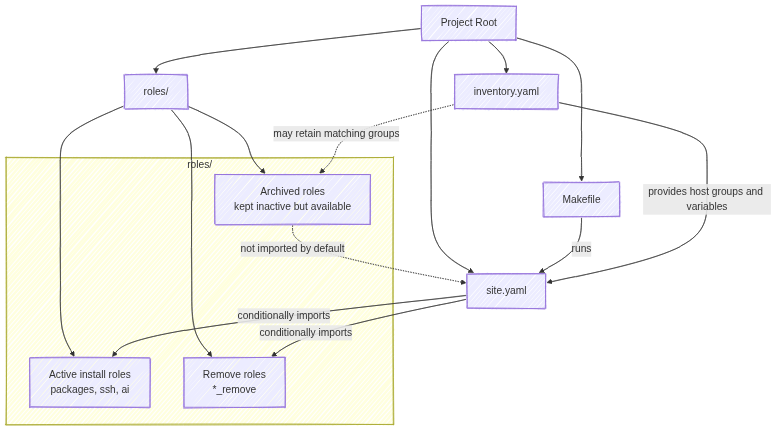

Years ago, as a DevOps engineer, I managed systems using various automation
tools. However, for managing my own workstations, I chose [Ansible] and found a
streamlined way to keep my [Debian] systems consistent without turning the whole
exercise into another full-time job.

What I like most about Ansible in this context is that it gives me structure
without much friction. I can keep a clear separation between work and home
machines; I can decide exactly which [roles] belong on which hosts through the
[inventory]; and I get useful safeguards such as [ansible-lint] and dry runs
before I touch a live system. I also find the tooling approachable. The command
line is simple, the module ecosystem is broad, and the documentation is good
enough that I rarely feel like I am fighting the tool.

The project itself is organised around small, isolated roles. Each role lives in
its own directory under `roles/`, with its own tasks, files, and variables, so a
change to something like `vim` does not leak into `docker` or another part of
the machine. That separation matters once the role count starts climbing,
because it keeps the system understandable even when the overall setup becomes
fairly broad.

I do not enable every role on every host. Most of the control comes from
`inventory.yaml`, which defines machines such as `carbonx1` or `geekom` and
groups them by capability. In `site.yaml`, the playbook then imports roles with
conditions based on those group memberships. That means a host can gain a
feature simply by joining the relevant group, and it can lose that feature just
as cleanly when it leaves.

That is where the `remove` roles earn their keep. Alongside installation roles
such as `zoom`, I keep companion roles such as `zoom_remove` whose job is to
uninstall packages, remove configuration, and clean up components that are no
longer needed. I find that especially useful when I stop using a feature and
want the machine returned to a leaner state rather than carrying old software
and stray configuration indefinitely. I also keep some roles in an archived
state. These archived roles remain in the repository, and their corresponding
inventory groups can remain defined, but they are not imported by `site.yaml`.
That keeps them inactive during normal runs while still making them easy to
reintroduce later if I decide a feature is worth bringing back.

The `site.yaml` file acts as the entry point for all of this. It defines the
order in which roles are considered, gathers facts, and establishes a few shared
assumptions so the same playbook behaves consistently across different Debian
systems. Around that, the [Makefile] gives me a more convenient command surface
for day-to-day use. Instead of typing the full `ansible-playbook` invocation
each time, I can run `make` for the normal local configuration,
`make tags tags=git,vim` when I only want a subset of roles,
`make resume task="Install git packages"` when I need to continue from a failed
task, and `make lint` when I want a quick quality check.

That combination of modular roles, inventory-driven selection, explicit remove
roles, and a small Make-based interface has made the setup practical to live
with. It gives me enough control to keep each machine purposeful, while still
making it easy to add, remove, or revisit features as my workstation needs
change.

[ansible-lint]: https://docs.ansible.com/projects/ansible/latest/playbook_guide/playbooks_intro.html#ansible-lint
[Ansible]: https://www.ansible.com/
[Debian]: https://www.debian.org/
[inventory]: https://docs.ansible.com/projects/ansible/latest/getting_started/basic_concepts.html#inventory
[Makefile]: https://www.gnu.org/software/make/manual/
[roles]: https://docs.ansible.com/projects/ansible/latest/getting_started/basic_concepts.html#roles
