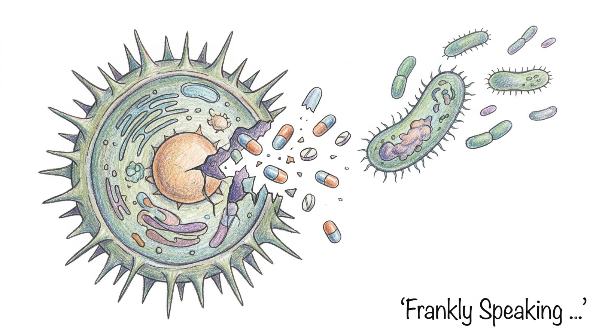
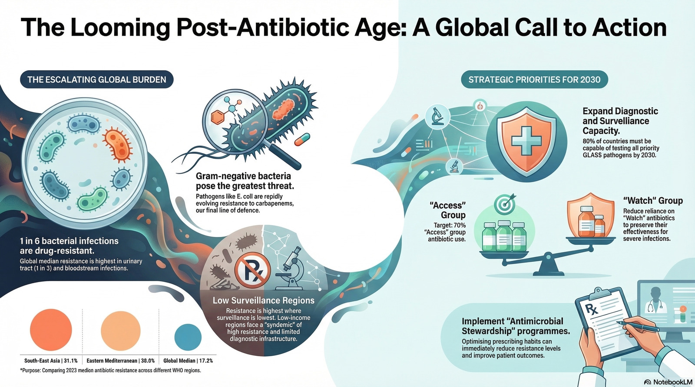

_Imagine a future where a routine surgery or a simple infection becomes
life-threatening—that is the risk antimicrobial resistance (AMR) poses. Informed
by warnings that antimicrobial resistance could become the next major global
health crisis, I dug into WHO and Scientific American reporting to understand
more..._

## Introduction: The Shift in Modern Medicine

Since the clinical debut of
[penicillin](https://en.wikipedia.org/wiki/Penicillin) in the 1940s, modern
medicine has operated under a luxury: the "guaranteed" cure. For nearly a
hundred years, antibiotics have underpinned the risky work of routine surgeries,
cancer therapies, and transplants. We have lived in an era where the primary
risk of an infection was a week of discomfort, not a death sentence.

However, we are now witnessing a fundamental collapse of these defences. As the
historical record shows, there has always been a delicate "seesawing" balance
between the drugs humans develop and the bugs that evolve to survive them. For
decades, medical innovation managed to keep that balance from tipping too far,
but today the seesaw is coming down on the side of the bacteria. We are not
merely facing "stronger germs"; we are entering an era where our "last-resort"
defences—the medications held in reserve for the most dire circumstances—are
being systematically dismantled by bacterial evolution.

## The Gram-Negative Threat

In the world of microbiology, there is a hierarchy of danger that defines which
threats deserve our immediate attention. All bacteria are divided into two
groups, [Gram-positive](https://en.wikipedia.org/wiki/Gram-positive_bacteria)
and [Gram-negative](https://en.wikipedia.org/wiki/Gram-negative_bacteria), based
on their reaction to a stain developed by Hans Christian Joachim Gram. While
both can be deadly, Gram-negative bacteria (such as _Klebsiella pneumoniae_ and
pathogenic strains of _E. coli_, unlike harmless gut varieties) pose a threat on
an entirely different scale.

These pathogens are built for survival. They possess a double-layered membrane
that acts as a physical fortress. Beyond this wall, they employ
[efflux pumps](https://en.wikipedia.org/wiki/Efflux_pump) to literally spit out
antibiotics that manage to enter, and they produce enzymes that attack drug
molecules _before they can even cross the inner membrane_. Furthermore, they are
biologically "promiscuous," frequently exchanging bits of DNA across different
species.

Resistance genes like
[NDM-1 (New Delhi metallo-beta-lactamase)](https://en.wikipedia.org/wiki/New_Delhi_metallo-beta-lactamase_1)
or
[KPC (Klebsiella pneumoniae carbapenemase)](https://en.wikipedia.org/wiki/Klebsiella_pneumoniae)
allow resistance to "jump" with relative ease. A resistance factor originating
in a hospital-acquired _Klebsiella_ infection can migrate to _E. coli_, moving
the threat from a specialist ICU bedsore to the everyday world of urinary tract
infections (UTIs). When these genes enter the community, they turn routine
maladies into untreatable crises.

> It raised another possibility as well: that the delicate, seesawing balance
> between bugs and drugs, set into motion in 1928 with the discovery of
> penicillin, was about to come down for good on the side of the bacteria. —
> Maryn McKenna, _Scientific American_

## The Surveillance Gap

The [2025 GLASS report](https://www.who.int/publications/i/item/9789240116337)
highlights a counter-intuitive "surveillance paradox": countries with the lowest
levels of surveillance coverage often report the highest median resistance. This
is evidenced by a strong inverse correlation between a country's Antimicrobial
Resistance (AMR) surveillance coverage and its reported resistance levels.

This pattern is driven by a specific
[sampling bias](https://en.wikipedia.org/wiki/Sampling_bias). In
resource-limited settings, data are often gathered only from a small number of
[tertiary hospitals](https://en.wikipedia.org/wiki/Tertiary_referral_hospital).
These are facilities where the sickest patients—those who have already failed
multiple rounds of treatment—are concentrated. This creates a "red alert" in the
data, even as the true scope of the problem in the wider community remains a
blind spot. The infrastructure gap is stark: in
[sub-Saharan Africa, only 1.3%](https://www.scientificamerican.com/blog/lab-rat/the-viruses-that-spread-antibiotic-resistance/)
of labs are designated for bacteriological testing, and only 18% of those have
access to automated
[AST (antimicrobial susceptibility testing)](https://en.wikipedia.org/wiki/Antibiotic_sensitivity_testing)
systems.

## The "Last Resort" Is No Longer a Safety Net

For years, clinicians relied on
[carbapenems](https://en.wikipedia.org/wiki/Carbapenem) as the "drugs of last
resort." Today, these drugs are failing at an alarming rate. The 2023 global
resistance level for carbapenems in _Acinetobacter spp._ reached 54.3%. When
these last-line defences fail, doctors are forced to return to older, "toxic"
drugs like [colistin](https://en.wikipedia.org/wiki/Colistin), which was largely
abandoned decades ago because it causes severe kidney damage.

The human cost of this clinical failure is devastating. In Nigeria, an infant
named Eniyoha suffered from sepsis; when the first rounds of antibiotics failed,
her parents were forced to abandon her at the hospital, unable to pay the
mounting bills for "stronger" drugs. In Pakistan, 22-year-old Bilal faced a bout
of drug-resistant typhoid that could only be treated with
[meropenem](https://en.wikipedia.org/wiki/Meropenem), a "Reserve" antibiotic
sold at a price families like his struggle to afford. When the choice is between
financial ruin and an untreatable infection, the crisis moves from the lab to
the family.

## AMR as an Inequality Multiplier

Antibiotic resistance does not strike in a vacuum; it acts as an _inequality
multiplier_, creating a "syndemic" where weak health systems and poverty form a
perfect storm for resistant pathogens. There is a strong inverse correlation
between a country’s
[Universal Health Coverage (UHC) index](https://www.who.int/data/gho/data/indicators/indicator-details/GHO/uhc-index-of-service-coverage)
and its resistance rates.

The World Health Organization (WHO) targets that 70% of human antibiotic use
should come from the
["Access" group](https://www.who.int/publications/i/item/WHO-MHP-HPS-EML-2023.04)
(first-line, narrower-spectrum drugs). However, in many Low- and Middle-Income
Countries (LMICs), use of
["Watch"](https://www.who.int/publications/i/item/WHO-MHP-HPS-EML-2023.04) group
antibiotics—broader-spectrum drugs that drive resistance—frequently exceeds 70%.
This is often a precautionary measure born of necessity; without precise
diagnostics, clinicians must use the "biggest hammer" available, inadvertently
accelerating the very resistance they fear.

## The 20-Minute vs. 10-Year War

The fight against AMR is a biological mismatch. Bacteria can produce a new
generation in just _20 minutes_, while it takes _10 years or more_ to develop a
new drug. While the clinical pipeline for the most dangerous threats has been
remarkably stagnant—with zero antibiotics capable of treating highly resistant
Gram-negative bacteria approved between 1998 and 2008—the "war" is increasingly
being fought with information as much as chemistry.

Modern counter-measures, such as rapid molecular diagnostics and genomic
surveillance, are beginning to narrow the gap. By identifying resistance
patterns in hours rather than days, clinicians can avoid using broad-spectrum
"Watch" group drugs prematurely, preserving their effectiveness. Furthermore,
global surveillance networks now allow researchers to track the migration of
resistance genes in real-time, providing early warnings before a local outbreak
becomes a global pandemic.

As Nobel laureate
[Venki Ramakrishnan](https://en.wikipedia.org/wiki/Venki_Ramakrishnan) notes, we
must be cautious about claims of "no resistance," as natural selection has a way
of defeating even our most powerful tools. Even "proper use" of antibiotics
contributes to the problem by creating selective pressure. This "law of
diminishing returns" has driven pharmaceutical companies toward more profitable
chronic-illness medications, requiring governments to treat antibiotic
development as a "social good"—akin to roads or police—rather than a purely
private enterprise.

## How Wastewater Spreads Resistance

But while we focus on the struggle within clinics and labs, a silent front in
this war is opening up right beneath our feet. One of the most surprising
findings in recent years is that resistance spreads through our infrastructure
as much as through human contact. Hospital wastewater acts as a potent "swapping
ground" for resistance genes. When medical antibiotics are present in hospital
effluent, they create a pressurised environment where clinical microbes and
harmless environmental microbes commingle.

This environment allows resistance to move from the clinic back into the natural
world, often carried by
[bacteriophages](https://en.wikipedia.org/wiki/Bacteriophage) (viruses that
infect bacteria) that act as DNA delivery vehicles.

> The problem is not really that antibiotic resistance genes exist—they've been
> around for millions, perhaps billions of years... The arms-race between
> anti-microbial compounds and resistance to those compounds has been going on
> long before we came along. — Kevin Bonham, _Scientific American_

## Conclusion: The Roadmap to 2030

The scale of this environmental and clinical challenge has finally forced a
global reckoning. The
[2024 UN Political Declaration on AMR](https://www.who.int/news/item/26-09-2024-world-leaders-commit-to-decisive-action-on-antimicrobial-resistance)
sets a clear direction to reverse the trend by _2030_ through coordinated
national action and shared international accountability. Rather than treating
AMR as a narrow clinical issue, the declaration frames it as a system-wide
challenge that links clinical care, public health infrastructure,
agriculture, and environmental stewardship.

The UN's roadmap centres on four key pillars: strengthening surveillance
systems, particularly in low-resource settings; accelerating access to rapid
diagnostics to reduce inappropriate antibiotic use; ensuring equitable access to
existing antibiotics while incentivising new drug development; and improving
infection prevention in healthcare facilities and agricultural settings. As
citizens, we should be aware that antibiotic resistance is not solely a medical
issue—it is shaped by agricultural practices, water treatment infrastructure,
and even the medications we flush down our toilets. The choices made in
hospitals, farms, and policy chambers over the next few years will determine
whether the wonder drugs of the twentieth century remain effective tools in the
twenty-first.

## References

- [Antibiotic Resistance Is Taking Out "Last-Resort" Drugs Used to Combat Worrisome Category of Germs](https://www.scientificamerican.com/article/resistance-antibiotic-defeating-drugs-combat-worrisome-germs/)
(01 Apr 2011)
- [WHO fact sheet: Antimicrobial resistance](https://www.who.int/news-room/fact-sheets/detail/antimicrobial-resistance)
  (21 Nov 2023)
- [Can We Stop the End of Effective Antibiotics?](https://www.scientificamerican.com/article/can-we-stop-the-end-of-effective-antibiotics/)
  (05 Mar 2014)
- [End of the Antibiotic Age: You've Been Warned](https://www.scientificamerican.com/blog/observations/end-of-the-antibiotic-age-youe28099ve-been-warned/)
  (01 May 2014)
- [Global antibiotic resistance surveillance report 2025](https://www.who.int/publications/i/item/9789240116337)
  (2025)
- [Global antibiotic resistance surveillance summary report 2025](https://doi.org/10.2471/B09585)
  (2025)
- [How to Solve the Problem of Antibiotic Resistance](https://www.scientificamerican.com/article/how-to-solve-the-problem-of-antibiotic-resistance/)
  (29 Jan 2015)
- [Manure Fertilizer Increases Antibiotic Resistance](https://www.scientificamerican.com/article/manure-fertilizer-increases-antibiotic-resistance/)
  (06 Oct 2014)
- [Microplastics Could Be Creating Dangerous Antibiotic-Resistant Bacteria](https://www.scientificamerican.com/article/microplastics-could-be-creating-dangerous-antibiotic-resistant-bacteria/)
  (26 Aug 2025)
- [Resistance from the Rear – Hospital Effluent and the Growing Antibiotic Crisis](https://www.scientificamerican.com/report/antibiotic-resistance-bacteria-in-depth/)
  (20 Jul 2014)
- [The Enemy within: A New Pattern of Antibiotic Resistance](https://www.scientificamerican.com/article/the-enemy-within/)
  (01 Apr 2011)
- [The viruses that spread antibiotic resistance](https://www.scientificamerican.com/blog/lab-rat/the-viruses-that-spread-antibiotic-resistance/)
  (11 Aug 2014)
- [Spotify: How armoured superbugs defeat modern medicine](https://open.spotify.com/episode/2xJXrHAikIqc6PrAtF32Io)
  (07 Mar 2024)
