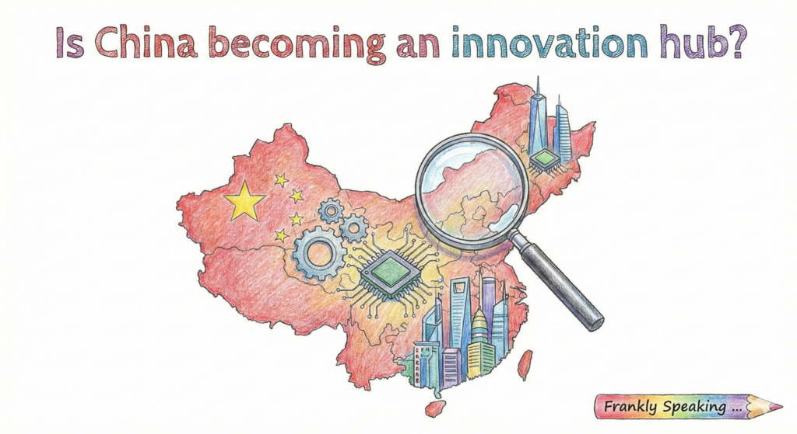

## Dispelling the Myth that China Does Not Innovate

The idea that China is merely a "copycat" nation, lacking originality, is
increasingly outdated. While its economic rise did involve adapting foreign
technologies, this narrative ignores both a long history of invention and a
present-day transformation into a global innovation leader.

Historically, China produced world-changing inventions such as paper-making,
printing, gunpowder, and the compass-the "Four Great Inventions." These were not
isolated breakthroughs but part of a sustained tradition of technological
advancement. Other contributions, including the wheelbarrow, umbrella, abacus,
and cast iron, highlight a culture of ingenuity that predates modern
globalisation.

In recent decades, China has shifted from imitation to independent innovation,
driven by a deliberate, government-led strategy for technological self-reliance.
The country has massively increased research and development (R&D) funding, now
second only to the United States, and employs more researchers than the U.S. and
EU combined. Its vast pipeline of STEM graduates further strengthens this
capacity. Resources are concentrated in strategic sectors such as AI,
biotechnology, and quantum computing, producing rapid advances and global
leadership.

This investment is reflected in outcomes. According to the World Intellectual
Property Organisation (WIPO), China leads the world in patent applications,
particularly in emerging technologies like generative AI and 5G. Innovations are
visible in high-speed rail, drone technology (with DJI dominating the global
market), renewable energy, and commercial applications such as facial
recognition payments and dockless bike-sharing. These represent not just
adaptation but new forms of large-scale technological deployment.

China’s rise is not simply about catching up but, in many areas, surpassing
competitors. Its state-directed model creates a "national innovation chain" that
accelerates development and commercialisation. Nowhere is this clearer than in
the electric vehicle (EV) industry. While Western firms focused on combustion
engines, Chinese policymakers prioritised EVs, pairing investment with
supportive policies. The result: China leads the world in EV production, sales,
and battery manufacturing—critical for the green energy transition.

Other sectors show similar momentum. In AI, a coordinated national strategy
enables Chinese firms to advance quickly. In 5G, China has deployed more base
stations than the rest of the world combined, laying the foundation for smart
cities and industrial automation.

In summary, the perception of China as a technological imitator is incomplete.
With deep historical roots in invention and a modern, state-driven strategy
focused on critical sectors, China has emerged as an innovation powerhouse. Its
dominance in EVs, AI, 5G, and renewable energy, coupled with world-leading
patent activity and rapid commercialisation, demonstrates a distinct innovation
ecosystem. At "China speed," the country is not only reshaping industries but
also redefining the global technological landscape.

## Videos

* [China Is Out-Innovating the West: Faster, Cheaper, Smarter](https://youtu.be/cg4Zyb7hfiE)
* [China: Copycat to Competitor](https://youtu.be/5BpbIj-zDtg)