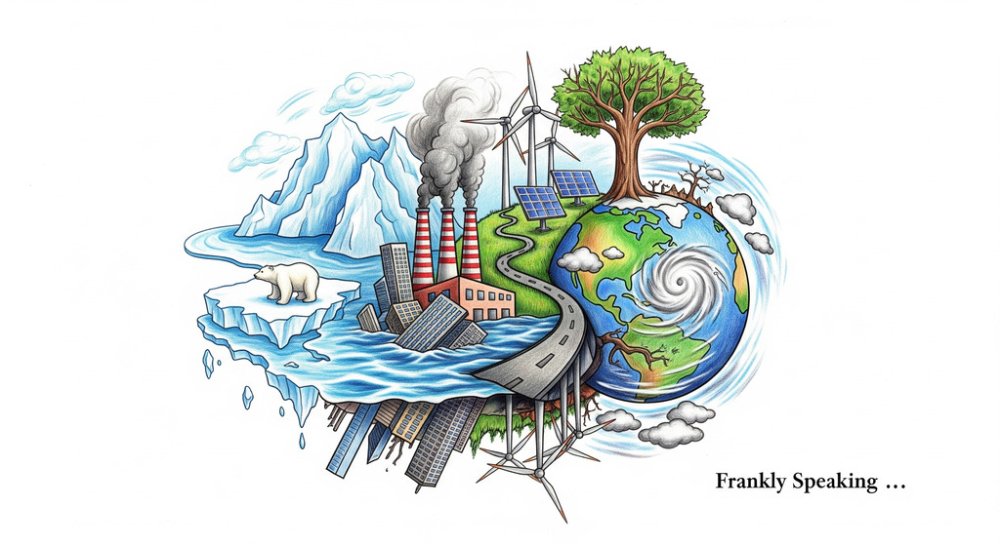
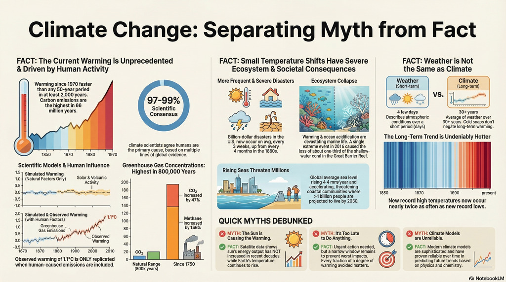

*To understand our changing world, start with a simple idea: the atmosphere is a
blanket that holds in heat. Under normal conditions, the Earth’s atmosphere acts
like a cosy blanket, retaining just enough heat to sustain the delicate balance
of life. However, our rapid burning of fossil fuels and widespread deforestation
have effectively added an "extra-thick blanket" to the planet. This
human-induced layer is trapping excessive heat, fundamentally altering the
climate reality we once took for granted.*

*For previous generations, the climate was a background stability—a predictable
cycle of seasons. For today’s youth, climate change is no longer a theoretical
concept; it is a "lived experience" defined by orange skies and the persistent
scent of wildfire smoke. While the latest major assessments—including the Fifth
National Climate Assessment (NCA5) and the IPCC Sixth Synthesis Report
(AR6)—provide blunt warnings, they also offer a pivot point. By looking past the
"doom" narrative, we find six surprises that redefine our path forward through
economics, justice, and innovation.*

## (1) The "Billion-Dollar" Disaster Clock is Accelerating

The sheer rhythm of climate-driven destruction has reached a startling new pace.
Data synthesized in recent federal reports reveal a dramatic shift: in the
1980s, the United States experienced a "billion-dollar disaster" (an extreme
weather event causing at least $1 billion in damage) roughly once every four
months. Today, that frequency has accelerated to once every three weeks.

This shift transforms our perception of "extreme" from a rare, generational
event into a persistent, rhythmic part of modern life. Extreme weather now feels
routine. That pace is reshaping urban planning, shifting focus from emergency
response to resilient infrastructure. As we move toward what former White House
National Climate Adviser
[Ali Zaidi](https://en.wikipedia.org/wiki/Ali_Zaidi_(lawyer)) calls "brick by
brick" deployment, the emphasis is on building proactively.

> "They \[the youth\] have not just intellectually started to appreciate the
> concept of this crisis—it is their lived experience to see the sky turn
> orange, to breathe in the smoke from wildfires hundreds of miles away, to see
> lives and livelihoods washed away by floods and the fury of hurricanes." —
> **Ali Zaidi, former White House National Climate Adviser ("Climate Change
> Threatens Every Facet of U.S. Society, Federal Report Warns," published by
> Scientific American (reprinted from E&E News) on 15 November 2023)**

## (2) The Hidden Mental Health Toll (It’s Not Just Physical)

In a landmark shift, the Fifth National Climate Assessment (NCA5) and the IPCC
AR6 have elevated mental health to the same level of urgency as physical
infrastructure. The data highlights a profound psychological burden: a survey of
1,000 U.S. adolescents found that 60% report significant climate anxiety, and
nearly half feel that humanity is doomed.

By including these statistics in formal reports, scientists are acknowledging
that a "climate impact" is not just a flooded road or a charred forest—it is the
erosion of human hope. Recognizing these non-physical risks is a crucial step in
defining the full scope of the crisis. The specific health risks identified
include:

* **Extreme Heat Mortality:** Increased deaths and illness from heat, now the
  largest weather-related killer in the U.S.
* **Vector-Borne Disease:** The expansion of "mosquito seasons," increasing the
  risk of malaria and dengue fever.
* **Trauma and Displacement:** Long-term psychological scars from the
  destruction of homes, schools, and communities.
* **Resource Scarcity:** Mental health burdens linked to the loss of traditional
  livelihoods and food security.

## (3) The Economic Flip: Renewables are Now the "Budget" Option

The most surprising shift in the last decade isn't just scientific—it's
market-driven. Between 2010 and 2019, the unit cost of solar energy and
lithium-ion batteries plummeted by 85%, while the cost of wind energy dropped by
55%.

The traditional argument that climate policy requires "economic sacrifice" has
officially dissolved. In many regions, building new renewable infrastructure is
now cheaper than simply *operating* existing fossil fuel plants. This reality
removes the primary financial barrier to global policy. We are no longer
choosing between the planet and the economy; the market has already decided that
a low-carbon future is the most cost-effective path.

> "Every watt that we can shift from fossil fuel to renewables like wind power >
> or solar power is a step in the right direction." — **The Nature Conservancy
> (TNC) Australia. (2020, November 28). Climate Change Questions & Answers.**

## (4) Multi-Sectoral Mitigation: Pathways to Deep Decarbonization

To secure a livable future and meet the Paris Agreement’s goal of limiting
warming to 1.5°C, global greenhouse gas (GHG) emissions must peak before 2025
and be reduced by 43% by 2030. This requires a "system transition"—rapid and
far-reaching changes across every sector of the global economy.

* **Energy Systems:** The most critical pillar involves a substantial reduction
  in fossil fuel use. This transition is increasingly feasible as the unit costs
  of solar energy, wind energy, and lithium-ion batteries fell by 55–85% between
  2010 and 2019. In many regions, renewable electricity is now cheaper than that
  from fossil sources.
* **Industry and Transport:** Mitigation in these sectors includes widespread
  electrification, improving material efficiency, and adopting circular material
  flows. For "hard-to-abate" sectors like heavy industry and aviation, solutions
  such as low-emission hydrogen and carbon capture and storage (CCS) are
  essential but require accelerated deployment.
* **Demand-Side Solutions:** Lifestyle and behavioral changes—such as shifting
  to sustainable healthy diets, reducing food waste, and increasing the use of
  public transport—can reduce global GHG emissions in end-use sectors by 40–70%
  by 2050.
* **Land and Ecosystems:** Conservation and restoration of forests, peatlands,
  and coastal ecosystems offer significant economic mitigation potential. These
  "natural climate solutions" provide the dual benefit of removing carbon from
  the atmosphere while protecting biodiversity.

While low-cost solutions are available, a massive upscaling of climate
finance—increasing by three to six times current levels—is needed to close the
implementation gap and ensure an equitable global transition.

## (5) The Map of Inequality: A 15x Higher Mortality Rate

The latest reports underscore a staggering "vulnerability gap." While climate
change is a global phenomenon, its lethality is concentrated. Human mortality
from floods, droughts, and storms is 15 times higher in highly vulnerable
regions—such as Small Island Developing States and parts of Africa—despite these
areas contributing the least to historical emissions.

We see this inequality in the forced relocation of Taro, the provincial capital
of a Solomon Islands province, which is being moved due to rising sea levels.
This reality reinforces the "Justice and Equity" narrative championed by
scientists like Katharine Hayhoe, who argues that climate solutions are
ineffective unless they also function as solutions for justice.

> "Vulnerable communities who have historically contributed the least to current
> climate change are disproportionately affected." — **IPCC AR6 Synthesis
> Report**

## (6) The Shift to Transformative Adaptation

While previous reports focused on incremental changes—like slightly higher sea
walls—the latest assessments call for "transformative adaptation." This means
fundamentally rethinking how we live, build, and eat. The data shows that while
we are currently facing an "implementation gap" between our goals and our
actions, the tools for this transformation are already in our hands.

The Biden administration emphasized that these reports should provide a "sense
of hope and possibility" rather than despair. The transition is being deployed
"brick by brick," moving us toward a future of cleaner air, new jobs, and
increased resilience.

## Conclusion: The Future is in Our Hands

The data from our latest global reports is blunt, but it is not a death knell.
We now possess the technology, the economic incentives, and the moral clarity to
act. The mystery of *what* to do has been solved; the challenge that remains is
*how* we implement these changes in our own communities.

As we look toward the future, we must ask: what does transformative adaptation
look like in our own backyards? Whether through supporting natural solutions
like biochar or advocating for the mental health of the next generation, the
path forward is clear.

## For more

* [Climate Change: The Science (YouTube)](https://youtu.be/59VLkK4Ajp4?si=d_sHUhYadZN043lW)
* [Climate Change: Dispelling the Myths (Spotify)](https://open.spotify.com/episode/2Mdyt8DBwijrUr2EjP0hzi?si=YFS1cSv0TQClU3VnvwhiRA)