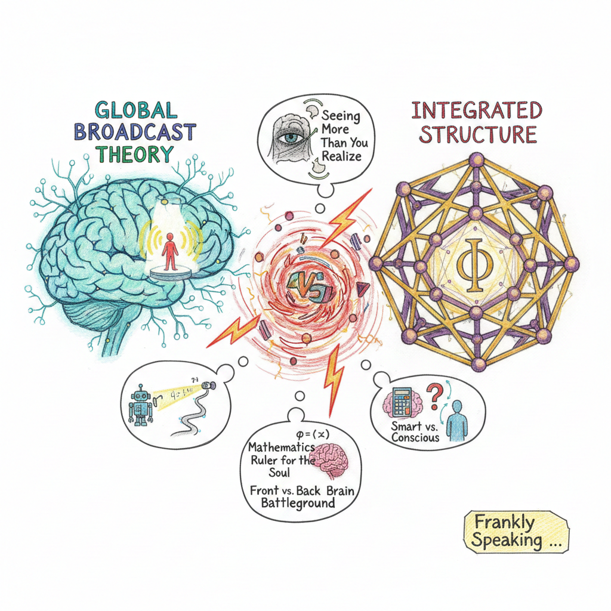
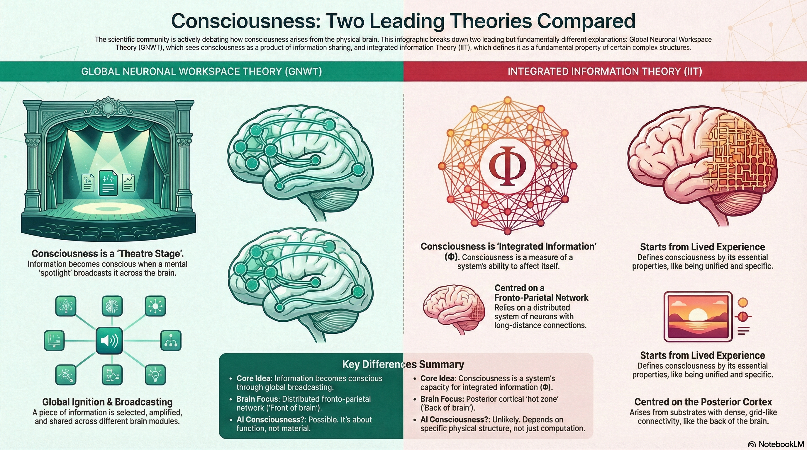

*You are standing on a street corner when a sub-zero wind gusts against your
face. You feel the sharp, biting sting $-$ a raw, undeniable presence. Yet, from
the perspective of neurobiology, there is only the dry arithmetic of sodium ions
and neurotransmitters. This chasm between the objective "firing" and the
subjective "feeling" is what philosophers call the "Hard Problem," and for
decades, it has remained the ultimate stalemate of science.*

*In an effort to break this deadlock, the world's leading theorists gathered in
2022 at the Association for the Scientific Study of Consciousness (ASSC) for
what was essentially a debate on the nature of experience. The exchange revealed
a field in crisis: experts no longer disagree merely on data, but on what
phenomena require explanation. Are we looking for a broadcast, a mathematical
structure, or a sophisticated 'best guess' $-$ and can any single theory capture
it?*

*What emerged were the following provocative shifts in how we understand the
nature of consciousness.*

## You Might Be "Seeing" More Than You Realise

The Recurrent Processing Theory (RPT), championed by Victor Lamme, gambles on a
radical premise: your brain is constantly "seeing" a rich, textured world that
your conscious mind never actually reports.

According to RPT, visual processing begins with a Fast Feedforward Sweep $-$ a
deep, sophisticated wave of information that can identify faces and objects
entirely in the dark of the unconscious. The "missing ingredient" required to
turn this signal into a qualia (a feeling) is not attention, but local
recurrence. This recurrence represents a back-and-forth dialogue between higher
and lower visual areas.

The surprise? RPT contends that this "feeling" is independent of your ability to
talk about it. It challenges our "folk psychology" $-$ the common-sense belief
that if we can't report seeing something, we didn't experience it. RPT suggests
our internal reports are often wrong; we have a rich "phenomenal" life that our
cognitive centres simply fail to capture.

"The local recurrence might already be sufficient for us to have a conscious
visual percept, to have a phenomenal experience… local recurrence is independent
of attention, access, and report." $-$ _Victor Lamme_

## Your Mind is a Theatre with a Narrow Spotlight

While RPT looks for a hidden "glow" in the back of the brain, the Global
Neuronal Workspace Theory (GNWT) posits that consciousness is a matter of
"Global Ignition." In this view, the brain is a collection of specialised,
unconscious modules working in parallel. Consciousness only occurs when a
specific piece of information is plucked from the darkness and broadcast across
the entire system.

Using the "Theatre Metaphor" developed by Bernard Baars, the workspace is the
stage. While many unconscious processes (represented as 'invisible people') work
behind the scenes as directors or playwrights, only the material illuminated by
the "attentional spotlight" becomes conscious. Crucially, Stanislas Dehaene
notes that this workspace is not just the Prefrontal Cortex (PFC); it is a
redundant, highly distributed system that spans the parietal and frontal
regions. To navigate this architecture, GNWT uses a three-tier taxonomy:

* **C0: Nonconscious computations.** The vast majority of the brain's work, from
  motor reflexes to semantic priming, occurs here.
* **C1: Conscious access.** Information is ignited and globally broadcast,
  making it available for verbal report and long-term memory.
* **C2: Self-representation.** The system monitors itself, "knowing" what it
  knows and what it doesn't.

"What's conscious is like the bright spot cast by a spotlight on to the stage of
a theatre. What's unconscious is everything else: all the people sitting in the
audience are unconscious components… getting information from consciousness."
$-$ _Bernard Baars_

## Mathematics Might Be the Ruler for the Mind

The most controversial contender, Integrated Information Theory (IIT), refuses
to "squeeze" consciousness out of matter. Instead, it starts with the "0th
axiom": the certain truth that experience exists. From there, it moves to the
math.

IIT posits that consciousness is an intrinsic property of a system's causal
structure. It is measured by $\Phi$ (Phi). This has led to the Perturbational
Complexity Index (PCI), a "brain ping" used in clinics to detect a flicker of
life in unresponsive patients.

However, IIT's mathematical purity leads to provocative, even absurd,
conclusions. Critics like Scott Aaronson have pointed out that under IIT, a
sufficiently complex but inactive grid of logic gates $-$ essentially a silent,
unmoving lattice $-$ could theoretically possess more consciousness than a
human. Though counter-intuitive, IIT proponents argue this is a strength: it
suggests consciousness is about how a system is built, not what it does.

"The starting point of IIT is the existence of experience (0th axiom). This
truth is not the result of an inference. It is immediate and irrefutable." $-$
_Integrated Information Theory Excerpt_

## Being "Smart" and Being "Conscious" Are Not the Same Thing

The clash between GNWT and IIT reveals a deep divide between Functionalism and
Structuralism. This is best understood through the "Smartphone Metaphor."

Under the functionalist view (GNWT), your phone is currently unconscious because
its apps are "silos." If you created a "global workspace" where the camera app
could flexibly share data with the calendar and the map to achieve a complex
goal, that phone would, in principle, be conscious. Consciousness is the process
of sharing.

IIT, however, dismisses this as pseudo-consciousness. A self-driving car might
be "smart" $-$ it can functionally recognise a stop sign and brake $-$ but
because its hardware lacks a highly integrated, intrinsic causal structure, it
is a "zombie." It performs the function but feels nothing. For the
structuralist, an AI only simulates consciousness; it doesn't replicate it.

## The "Front vs. Back" Brain Battleground

The theories are currently locked in an anatomical war. GNWT and Higher-Order
Thought (HOT) theories focus on the Prefrontal Cortex (PFC) $-$ the "front" of
the brain $-$ believing consciousness requires high-level monitoring and global
sharing. Conversely, RPT and IIT look to the "back" $-$ the sensory grids of the
posterior cortex-where they believe the rich "structure" of experience resides.

Predictive Processing (PP) serves as a sophisticated "bridge" in this conflict.
PP views the brain as an "inside-out" machine. Instead of passively receiving
the world, the brain is constantly generating a "best guess" about what is
happening.

Consciousness, in this view, is the Bayesian posterior $-$ the result when
predictions match incoming sensory data. We don't see the world as it is; we see
our brain's most successful hypothesis.

## Conclusion: The Maturation of a Mystery

The 2022 "Great Consciousness Debate" signaled a shift from simply mapping
neural correlates to identifying the mechanisms that explain experience. While
the field currently exhibits "more controversy than agreement," this friction
marks its maturation into a rigorous science.

As we move past the era of simply identifying where consciousness resides, the
field faces its most transformative questions:

* **Matter vs. Function**: Is sentience a computational property replicable in
  silicon, or a biological property unique to living matter?

* **Rich vs. Sparse**: Is our internal life a "rich" experience that overflows
  our ability to describe it, or a "sparse" representation limited to what we
  can broadcast and report?

* **The Measurement Problem**: How can we verify consciousness in others without
  relying on subjective word or behavioral cues?

The path forward lies in adversarial collaborations designed to move theories
from abstract frameworks to testable, mechanistic models. By bridging the gap
between objective neural geometry and subjective "what-it-likeness," we are
moving toward a future where we can "jump-start" consciousness in the injured
and identify it in the non-human. These answers will ultimately redefine the
ethical and legal boundaries of the "self".

## Sources

* Mudrik et al. (2025): "Unpacking the complexities of consciousness: Theories
  and reflections." Neuroscience and Biobehavioral Reviews. (Source of detailed
  theory breakdowns and the 2022 ASSC debate).
* Lewis (2023):
  ["An Overview of the Leading Theories of Consciousness"](https://www.psychologytoday.com/au/blog/finding-purpose/202308/an-overview-of-the-leading-theories-of-consciousness)
  Psychology Today. (General overview of theories and the hard problem).
* Stanford Encyclopedia of Philosophy:
  ["Consciousness"](https://plato.stanford.edu/entries/consciousness/)
* ["Global workspace theory."](https://doi.org/10.1016/S0079-6123(05)50004-9)
  Baars, B. J. (2005)
* ["Integrated information theory."](https://www.researchgate.net/publication/303551101_Integrated_information_theory_From_consciousness_to_its_physical_substrate)
   Tononi, G. (2004)
* Parshall (Scientific American): "The Hardest Problem." (Narrative regarding
  the adversarial collaboration, the Chalmers/Koch bet, and current field
  tensions).

## Other Resources

* [GitHub: Article on Consciousness](https://github.com/frankhjung/article-consciousness)
* [Podcast: The Failed Search For Consciousness](https://open.spotify.com/episode/2YezQ6nntHt1NFCvv9HZdI?si=6ugjTvQATQGbCEI8FRjeBg)
* [YouTube: Consciousness The Final Frontier](https://youtu.be/HPZL-CTnDU0)
