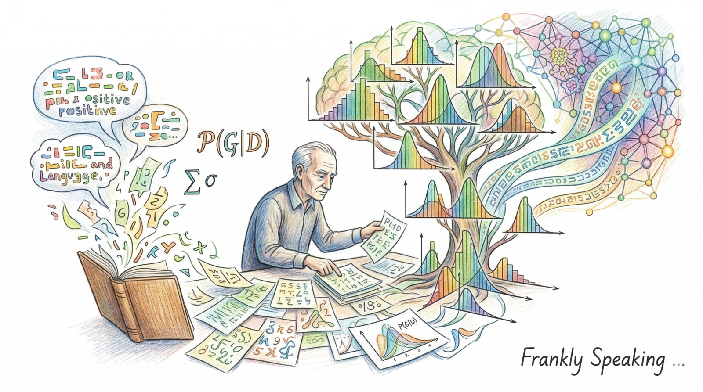
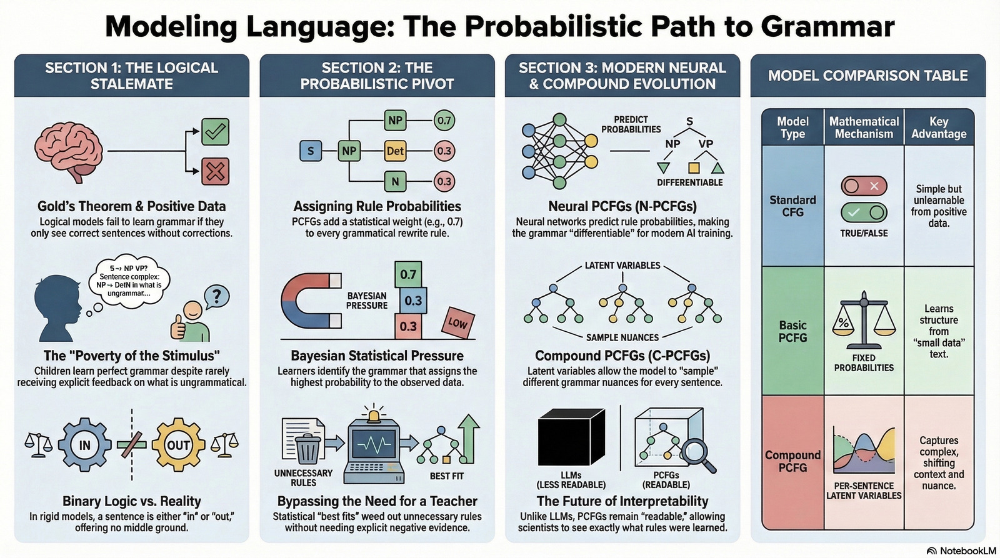

_In 1969, computational linguistics was at an impasse. A powerful theorem
suggested that neither machines nor humans could learn language without explicit
instruction. J.J. Horning, with a brilliant application of statistics, shattered
that assumption. His breakthrough laid the conceptual groundwork for how modern
artificial intelligence, from Google Translate to ChatGPT, processes the
structure of human speech._

## The Problem: Gold's Pessimism

To understand the weight of Horning's contribution, we must first look at the
"pessimism" he confronted. Before Horning, E.M. Gold had published **Gold's
Theorem**, arguing that even simple languages could not be "identified in the
limit" (learned) if the learner _only_ saw positive examples.

In Gold's model, "positive examples" are simply correct sentences ("The
astronomer saw stars"). To learn which sentences are _incorrect_ ("Saw
astronomer the stars"), Gold argued that a learner _needed_ negative evidence:
either corrections from a teacher or explicit statements that a structure was
ungrammatical.

This logical stalemate posed a massive philosophical and practical problem:
children rarely receive explicit negative feedback, yet they learn the complex
rules of language perfectly. Did this mean language was purely innate, baked
into our DNA? Or was there a flaw in the model?

## The Breakthrough: Horning's Probabilistic Pivot

Horning realised that Gold's model was too rigid. It treated grammar as purely
logical—a sentence was either perfectly "in" the language or perfectly "out."
Horning replaced binary logic with the nuanced world of
[probability](https://en.wikipedia.org/wiki/Probability).

Instead of a simple
[Context-Free Grammar](https://en.wikipedia.org/wiki/Context-free_grammar),
Horning introduced the
[Probabilistic Context-Free Grammar (PCFG)](https://en.wikipedia.org/wiki/Probabilistic_context-free_grammar).
In a PCFG, every grammatical rule is assigned a probability, a statistical
weight reflecting how often that rule is used.

> Horning's major discovery was proving that these statistical weights can be
> learned efficiently from positive examples alone.

If a system hears enough sentences generated by a grammar, the learner can use
[Bayesian statistics](https://en.wikipedia.org/wiki/Bayesian_statistics) to
infer the probabilities. Any one sentence might be ambiguous, but after
observing thousands, the learner can identify the grammar that assigns the
**highest probability** to the data already seen. This statistical pressure
steps in for the "teacher" in Gold's model, weeding out any rule that isn't
needed to explain the sentences the learner has heard.

## Impacts and Overturned Results

Horning's work did not _disprove_ Gold's Theorem, but it elegantly bypassed it
by changing the fundamental mathematical assumptions.

### The Challenge to Innateness

The most significant impact was in
[psycholinguistics](https://en.wikipedia.org/wiki/Psycholinguistics). Horning
suggested that children might not need a "rich innate genetic endowment" to
master language. Instead, the human brain might simply be an incredible pattern
recognition engine—one that quietly reverse-engineers the rules of grammar by
finding the mathematical "best fit" for everything it hears.

### Birth of Unsupervised Parsing

In computer science, Horning's discovery validated the quest for [unsupervised
learning algorithms](https://en.wikipedia.org/wiki/Unsupervised_learning). It
meant we could build AI systems that could ingest raw, unannotated text—entire
libraries or the Internet—and infer the latent grammatical structure of language
without a human having to explicitly tag every noun and verb.

## The Modern Connection: From PCFGs to LLMs

If you use a Large Language Model (LLM) like Claude, GPT, or Gemini, you are
using a direct technological descendant of Horning's idea.

LLMs do not use rigid context-free grammars; they use much more complex,
neural-network-based models (specifically Transformers). However, the
_fundamental mechanism is identical: they use a probabilistic objective learned
from a massive dataset of positive examples (pure text)._

An LLM is a statistical system trained to estimate the conditional probability
of the next word in a sequence. It can generate syntactically correct Python
code or a nuanced sonnet in English, not because it was programmed with explicit
rules, but because it inferred the statistical structure of those languages from
billions of examples. Horning proved this style of "statistical inference" was
mathematically possible; LLMs are the industrial-scale application of that
mathematical truth.

More specifically, Horning's key mathematical engine was
[Bayesian inference](https://en.wikipedia.org/wiki/Bayesian_inference): updating
beliefs about competing grammars as more positive examples arrive.

## Recent Developments

The core ideas J.J. Horning pioneered continue to evolve.

### Neural PCFGs

Neural PCFGs took the first leap. Rather than hand-assigning a fixed probability
to each grammatical rule, researchers led by Yoon Kim used a neural network to
_predict_ those probabilities from vector representations of the symbols. This
made the grammar "differentiable"—trainable using the same gradient descent
methods that power modern deep learning, while still preserving the explicit,
inspectable structure Horning had in mind.

### Compound PCFGs

Compound PCFGs have pushed further still. Standard PCFGs assume every sentence
obeys the same global rules. Compound PCFGs break that assumption by introducing
a latent variable for each sentence: in effect, the model samples a slightly
different grammar for every sentence it encounters, giving it the flexibility to
capture subtle contextual nuances—such as subject-verb agreement across a long
nested clause—that Horning's original model simply could not reach.

### PCFGs Today

More recently, the field has accelerated. In 2023, mathematicians optimised the
underlying computations so that PCFGs can run on modern GPUs at speeds
comparable to large language models, opening the door to scaling across
thousands of grammatical rules. A year later, visually grounded PCFGs went a
step further, learning grammar not from text alone but by simultaneously
watching video and hearing its description—a striking move toward AI that
acquires language the way a child does, by seeing and hearing the world
together. The newest wave, in 2026, pushes beyond syntactic correctness
entirely, forcing the learned grammar to align with the _meaning_ of sentences.
The result is a new state-of-the-art in unsupervised parsing, achieved without a
single manually labelled training example.

In an era defined by neural networks, J.J. Horning's 1969 proof remains a vital
reminder that modern AI language capability rests on a solid bedrock of
classical statistics and a single, powerful pivot from logic to probability.

## Further Reading

* Gold's Theorem: Language Identification in the Limit (1967)
  (<https://www.cs.famaf.unc.edu.ar/~gabriel/files/gold67limit.pdf>)
* Gold's Theorem: Language identification in the limit (Wikipedia)
  (<https://en.wikipedia.org/wiki/Language_identification_in_the_limit>)
* J.J. Horning's Thesis: A Study of Grammatical Inference (1969)
  (<https://scispace.com/papers/a-study-of-grammatical-inference-3y2zoql5lg>)
* PCFG Definition: Probabilistic Context-Free Grammar (Wikipedia)
  (<https://en.wikipedia.org/wiki/Probabilistic_context-free_grammar>)
* Innate Language: Poverty of the Stimulus (Stanford Encyclopedia of Philosophy)
  (<https://plato.stanford.edu/entries/innateness-language/>)
* Compound PCFGs: Compound Probabilistic Context-Free Grammars for Grammar
  Induction (Kim et al., ACL 2019) (<https://aclanthology.org/P19-1228/>)
* Podcast: The Probabilistic Context-Free Grammars (2026)
  (<https://spotifycreators-web.app.link/e/7R885z22H1b>)
