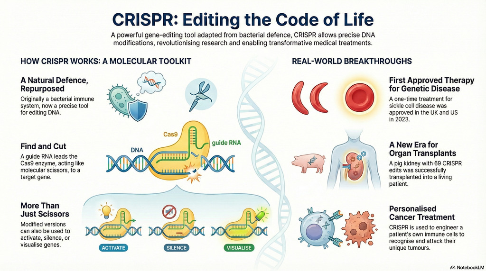

## CRISPR: The Tiny Tool Changing Everything

Every now and then, a scientific breakthrough comes along that feels like it’s
been plucked from science fiction. For the past decade, that breakthrough has
been **CRISPR**.

At its core, CRISPR is a gene-editing tool—short for *Clustered Regularly
Interspaced Short Palindromic Repeats* (yes, a mouthful). It started out as a
defence system in bacteria, but scientists figured out how to repurpose it for
editing DNA. Imagine having a pair of molecular scissors that can snip, tweak,
or rewrite the genetic code. That’s CRISPR. And it’s powerful enough that its
discoverers, Emmanuelle Charpentier and Jennifer Doudna, were awarded the Nobel
Prize in Chemistry back in 2020.

## How Does CRISPR Actually Work?

Think of CRISPR as a tag-team:

* A **guide RNA**, like the GPS coordinates, tells the system where to go.
* The **Cas9 protein**, acting as scissors, makes the cut in the DNA.

Once the cut is made, the cell rushes in to repair it. That repair step is where
the magic happens—scientists can use it to silence genes, fix mutations, or even
swap out one DNA “letter” for another. There’s also a version of CRISPR that
doesn’t cut at all but instead turns genes on or off, like flipping a switch.

## From the Lab to Real-Life Cures

This isn’t just theory—it’s already saving lives.

* **Blood disorders:** In the U.S. and U.K., doctors can now treat sickle cell
  disease and β-thalassaemia with
  *[Casgevy](https://en.wikipedia.org/wiki/Exagamglogene_autotemcel)*, the first
  CRISPR therapy. Patients’ bone marrow cells are edited so they start producing
  healthy fetal haemoglobin again. Early results are stunning—many patients no
  longer suffer from the painful episodes that once defined their lives.
* **Cancer:** Doctors are experimenting with using CRISPR to reprogram a
  patient’s immune cells so they can better recognise and attack tumours.
* **Antidotes:** Believe it or not, CRISPR even helped uncover a potential
  antidote to the deadly death cap mushroom. By screening how the toxin affects
  human cells, researchers found a way to block it.

## Beyond Medicine

CRISPR isn’t stopping at healthcare.

* **Controlling pests:** With “gene drives,” scientists could spread traits
  through entire populations of mosquitoes to wipe out malaria—or even tackle
  invasive species like cane toads.
* **Organ transplants:** Pigs are being genetically edited so their organs can
  be safely transplanted into humans. This could someday ease the shortage of
  donor organs.
* **Science at turbo speed:** Tools like Google’s *AlphaFold*, which predicts
  protein structures, are teaming up with CRISPR to speed up everything from
  drug discovery to climate research.

## The Big Questions

Of course, with great power comes… a lot of responsibility. DNA editing isn’t
foolproof, and mistakes can cause unintended side effects. The ethics of editing
genes that can be passed on to future generations remain hotly debated.

There’s also the financial reality: treatments like Casgevy can cost upwards of
$2 million per patient. Who gets access, and who doesn’t?

And here’s something that really gives me pause: CRISPR isn’t locked up in
high-tech government labs. The tools are so accessible that **bio-hackers
working in DIY community labs—or even small setups in a garage—could, in theory,
experiment with gene editing**. That raises uncomfortable questions about
safety, oversight, and how to prevent misuse while still encouraging innovation.

## Video

* [The CRISPR Revolution](https://youtu.be/WEC2Xvucjag)