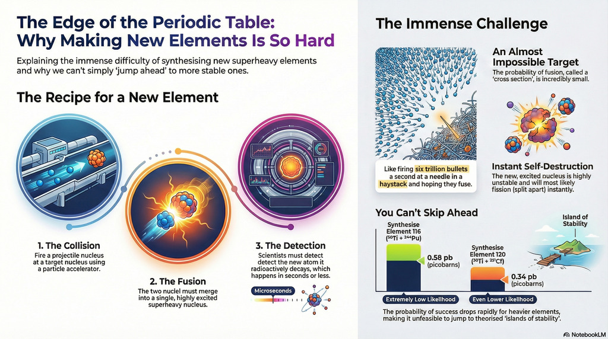

_Cross-sections were frequently mentioned in the [Superheavy: Making and
Breaking the Periodic Table by Kit
Chapman](https://www.goodreads.com/book/show/40653150-superheavy). I felt the
explanation of what a cross-section was could have been better. So I put
together this summary explaining what they mean in the context of creating new
elements._

## Nuclear Cross Sections

In nuclear physics, a cross-section is a measure of the probability that a
specific nuclear reaction (like fusion) will occur. When scientists say the
cross-sections get smaller as the atomic number (Z) increases, they mean that it
becomes exponentially harder and less likely for two nuclei to successfully fuse
and survive as a new, super-heavy element.

Think of the cross-section as the "size of the target" you are trying to hit. As
you try to create heavier elements, that target shrinks from the size of a barn
door to the size of a needle's eye.

### Why the Cross-Section Decreases

The production of a super-heavy element is a three-step process, and each step
becomes more difficult as the atomic number increases:

1. **The Capture Stage (Getting Together):** To fuse, two nuclei must overcome
   the Coulomb barrier—the massive electrostatic repulsion between their
   positively charged protons. As Z increases, this "wall" gets much higher,
   requiring more energy to overcome.
2. **The Fusion Stage (Staying Together):** Even if the nuclei touch, they often
   undergo quasifission, where they stick together for a tiny fraction of a
   second ($10^{-20}$ s) and then fly apart again before ever forming a single
   "compound nucleus." The heavier the system, the more likely it is to just
   bounce off or break apart immediately.
3. **The Survival Stage (Cooling Down):** If they do manage to fuse, the
   resulting nucleus is "hot" (highly excited). It wants to release that energy,
   usually by spitting out neutrons. However, for super-heavy elements, the most
   likely way to release energy is by fissioning (splitting in half). As Z
   increases, the probability of surviving without fissioning drops toward zero.

### The Scale of the Challenge

To put the "shrinking" in perspective, scientists use a unit called the
[barn](https://en.wikipedia.org/wiki/Barn_\(unit\)) ($10^{-24} cm^2$).

* Light elements might have cross-sections in the range of barns or millibarns.
* Super-heavy elements (like
  [Oganesson](https://en.wikipedia.org/wiki/Oganesson), Z=118) have
  cross-sections measured in picobarns ($10^{-12}$ barns ).

| Element | Approx. Cross-Section | Success Rate |
| :---- | :---- | :---- |
| Lower Z | Millibarns ($10^{-3}$ b) | Many atoms per second |
| Element 112 | 1 Picobarn ($10^{-12}$ b) | \~1 atom per week |
| Element 118 | \~0.5 Picobarn | \~1 atom per month |
| Element 120+ | Femtobarns ($10^{-15}$ b) | Predicted \~1 atom per year |

### Impact on Research

Because the "target" is so small, researchers have to bombard the target with
trillions of ions per second for months at a time just to see a single
successful event. This is why discovering a new element now takes years of "beam
time" and multi-million dollar particle accelerators.

### Video [Nuclear Cross Section Explained](https://youtu.be/R0tdsaFJ4vg)

This video provides a foundational explanation of what a nuclear cross-section
is and how it represents the probability of interaction between particles.

### Sources

* [Superheavy element](https://en.wikipedia.org/wiki/Superheavy\_element)
* [Google Gemini share](https://gemini.google.com/share/622bc1cdfcb6)
* [GitHub: article-cross-sections](https://github.com/frankhjung/article-cross-sections)
