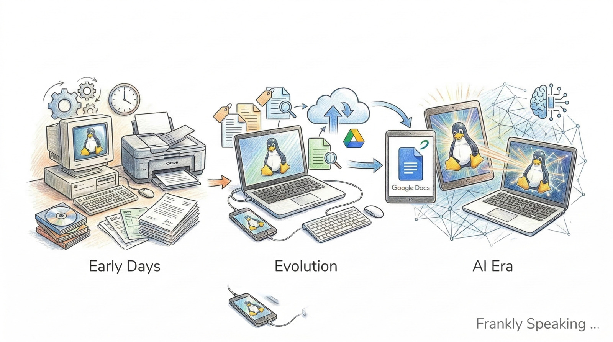

_Back in 1999 I decided to go paperless. This was a significant challenge then
as many bills were still being sent via post, and few offered digital
alternatives. The challenge was doubly hard as I was (and am still) running
Linux as my only operating system. These are a few of the things I had to do to
make a digital office work and how things have evolved since then._

## The Early Days

The choice of a Linux desktop meant that I had to find tools that were
compatible with my operating system. This limited my options, but I was able to
find open-source tools that met my needs. I used [GIMP](https://www.gimp.org/)
for image editing, [LibreOffice](https://www.libreoffice.org/) for document
editing, and [PDFtk](https://www.pdflabs.com/tools/pdftk-the-pdf-toolkit/) for
PDF manipulation. My Canon printer had a built-in scanner, which I used to
digitise paper documents. Canon printers and scanners are well supported by
Linux. I used [XSane](http://www.sane-project.org/) for scanning documents. I
also used [rsync](https://rsync.samba.org/) to maintain a continuous backup of
my digital files.

Saving these scanned documents and bills as PDFs on my computer was a manual
process that often led to large document sizes. (Disk space was more expensive
back then.) OCR (Optical Character Recognition) was available, but not accurate,
particularly as bills often used tables. I couldn't reliably search PDF images,
so I had to rely on file names to find what I needed. At the same time, I
started using [GNUCash](https://www.gnucash.org/) to manage my finances. All my
transactions are recorded there, which helps me keep track of my expenses while
also serving as an index to the scanned documents. Bills were managed monthly in
a directory, the previous bill going into an archive directory. As my system was
being backed up regularly using [rsync](https://rsync.samba.org/), I had a
backup of all my bills and financial records. Each financial year I would record
that year's transactions and tax documentation using
[R Markdown](https://rmarkdown.rstudio.com/) with extracts from GNUCash. That
financial year directory would also be archived onto a DVD and stored offsite.
My accountant would send me a PDF of the tax return that required my input. For
that purpose I would use [LibreOffice](https://www.libreoffice.org/) to edit the
PDF and add the required information. That often meant splitting the PDF into
multiple pages, adding the information, and then merging it back together.

So I had a process that, while manual and time-consuming, worked. I had a
digital office, albeit a very basic one.

## Evolution of the Digital Office

More services transitioned to digital formats, and I adapted my processes
accordingly. I started receiving bills via email, which simplified how I managed
and stored them. I store these locally rather than leaving them on the email
server. In addition, I could more easily annotate PDFs and add metadata
([exiftool](https://exiftool.org/)). While cloud storage was becoming more
popular, I preferred to keep my documents local for privacy and control reasons.

While GNUCash offered invoicing capabilities, I found it more practical to use
[templates](https://www.libreofficetemplates.net/) from
[LibreOffice](https://www.libreoffice.org/).

As more documents are received digitally, I can easily search and organise them
using metadata. This has made specific documents much quicker to find when
needed. Fewer receipts and documents are now sent via post, but I still have to
scan some documents that I receive in paper form. However, the process has
become far less cumbersome with the advent of mobile scanning. Using my
smartphone, I can quickly scan documents and save them as PDFs. OCR technology
has also improved significantly, allowing me to extract text from scanned
documents. This can then be added as metadata to the PDF, making specific
information simpler to locate within it.

I prefer using [Google Drive](https://drive.google.com/) for collaborative work
and sharing documents with others. This allows me to easily share and access
documents from anywhere. For instance, my favourite recipes are online, easily
accessible while shopping or to share with friends and family. Sharing and
collaborating with my reading group members is done with
[Google Docs](https://docs.google.com/), for surveys and keeping notes of the
books I've read and our recommendations.

Google Drive also has strong spreadsheet features for importing and analysing
data. As I would expect, it also excels at searching for specific documents.
Google Drive also has version control, which allows me to keep track of changes
to documents over time. Its PDF management tools are also good. It is now far
more straightforward to edit PDFs and add signatures if required. I have written
a few scripts to automate the process of uploading documents to Google Drive.

However, I still prefer to keep my financial documents local for privacy and
control reasons. Working with PDFs now is well supported by Linux, with tools
like [PDFtk](https://www.pdflabs.com/tools/pdftk-the-pdf-toolkit/),
[exiftool](https://exiftool.org/) and
[LibreOffice](https://www.libreoffice.org/), which allow me to easily edit and
manipulate PDFs as needed.

[rsync](https://rsync.samba.org/) continues to be an essential tool for backing
up my digital office. I have a regular backup schedule that ensures all my
documents are safely stored.

## Moving into the AI Era

AI is taking my digital office to the next level. I use
[Gemini](https://gemini.google.com/) not only for coding but also for managing
my digital office. AI can help with tasks like searching through documents and
extracting relevant information, making it possible to search multiple document
types at once. I've only begun to explore the possibilities, but I can see how
AI could help with tasks like summarising documents, extracting key information,
and even generating content based on stored documents.

Google Drive is also getting an AI boost, providing better help and more
advanced document interactions. There are many more features for me to explore
here. Can I automate account reconciliation in GNUCash using AI? Can I use AI to
analyse my financial data and provide insights? The possibilities are exciting,
and I'm looking forward to exploring them further.
