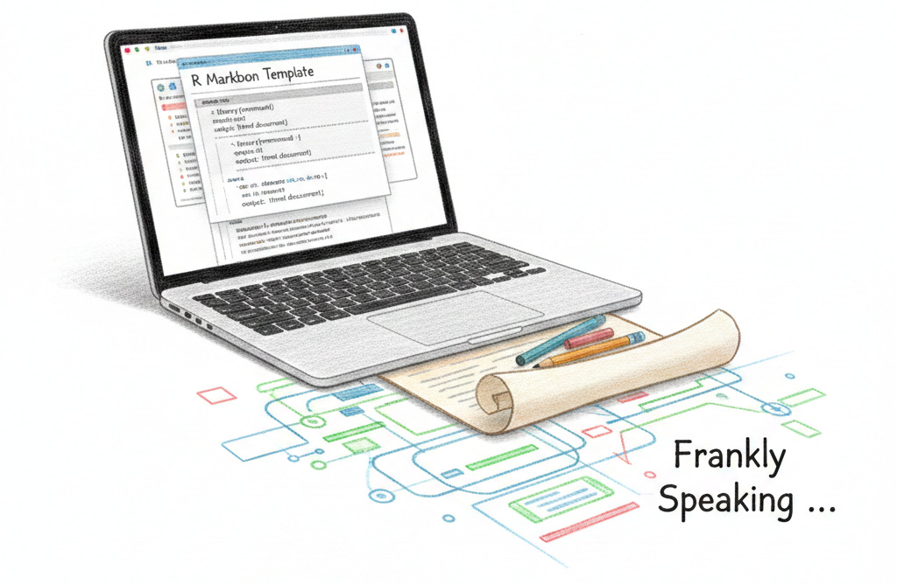

I'm preparing a blog titled: "Maintaining a private wiki"

Suggest structure and content based on my comments below:

For years I've maintained a private wiki. Private, as I spent years as a
consultant, moving from client-to-client. Keeping it private rather than on
clients infrastructure meant that I could take it with me. Often clients are
behind firewalls, so I could not rely on online resources. The wiki was a way to
have a personal knowledge base that I could access regardless of the client's
infrastructure. I could add useful technical hints, how-tos and solutions to
common problems. The other motivation is that the tools I used would change from
client to client. This meant that hard earned skills one year, might not recur
until months - if not years later at another client. While some of the
information does get superseded, core tips and information rarely does. If
anything, the tools become more refined with improved functionality, but the
core concepts remain the same. The wiki can easily be updated or adapted to new
tools, but the core information remains relevant.

As my role changed, so did the wiki. I started as a developer, then moved into
DevOps and later into more of a data engineer before finally mentoring
graduates. In this last case, the same questions would come up repeatedly, and
the wiki was a way to have a single source of truth for the answers. This meant
I could share it easily with my team.

The wiki also served as a way to document solutions to problems I encountered.
When I solved a tricky issue, I would document the solution in the wiki. This
way, if I encountered the same problem again, I could quickly find the solution
without having to go through the troubleshooting process again. It also meant
that if a colleague encountered the same problem, they could find the solution
in the wiki without needing to ask me directly.

I still maintain my wiki, but AI has changed the way I use it. I now use AI to
help me find information quickly, but I still rely on my wiki as a trusted
source of information. I can use AI to critique a page, ensure it the page
follows my style and tone, and check for errors. I can also use AI to help me
update the wiki with new information.

The AI is also a great search tool over my wiki. I can ask it to find
information on a specific topic, and it can quickly scan through the wiki to
find relevant pages. This saves me a lot of time compared to manually searching
through the wiki.

As AI grows increasingly powerful, I may not need to maintain a wiki in the
future. However, for now, it remains a valuable tool for me to keep track of my
knowledge and share it with others. It has been a great way to document my
learning journey and to have a personal knowledge base that I can access
whenever I need it.
