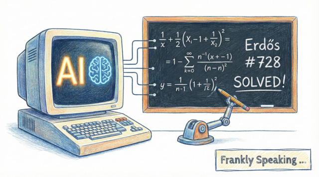
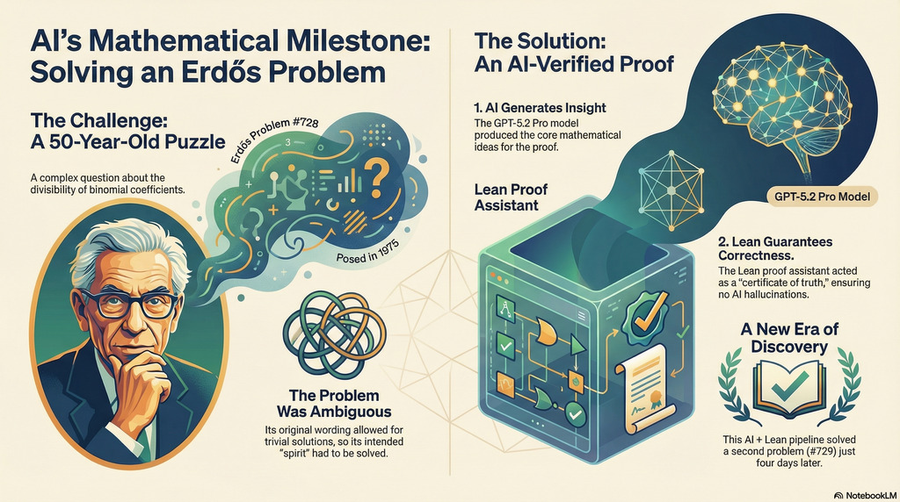

*On **January 6, 2026**, the mathematical community reached a significant
milestone: the resolution of [Erdős problem
\#728](https://www.erdosproblems.com/728). While mathematical problems are
solved daily, this breakthrough marks the first time an open Erdős
problem—historically the domain of human intuition—was documented as resolved
through the collaboration of artificial intelligence and formal verification.*

## The Problem: Gaps in Factorials

Originally posed in 1975 by [Paul
Erdős](https://en.wikipedia.org/wiki/Paul_Erd%C5%91s) and colleagues, problem
\#728 explores the deep architecture of prime factorisations within binomial
coefficients.

* **The Technical Goal**: The problem asks if there are infinitely many integers
  $a, b,$ and $n$ that satisfy a complex divisibility condition: $a!b! \mid
  n!(a+b-n)!$ under specific constraints.

* **The "Spirit" of the Challenge**: The original wording was noted by
  mathematician [Terence Tao](https://en.wikipedia.org/wiki/Terence_Tao) as
  being slightly "misformulated," allowing for trivial solutions if the
  variables were allowed to be extremely large.

* **The Fix**: To respect Erdős's original intent, researchers added a
  constraint ensuring $a$ and $b$ remained proportional to $n$ ($a, b \leq (1 -
  \epsilon) n$) to avoid trivial solutions with extremely large values.

## How AI Cracked the Code

The solution was a collaboration between a student (AcerFur), [GPT-5.2
Pro](https://platform.openai.com/docs/models/gpt-5.2-pro), and a verification
tool called [Aristotle](https://aristotle.harmonic.fun/).

1. **AI Insight**: GPT-5.2 Pro generated the core mathematical arguments and
   creative leaps needed to bridge the gap in the proof. The AI proposed
   candidate strategies and arguments, which were then refined and completed
   through iterative formalisation.

2. **Lean Formalisation**: These arguments were translated into
   [Lean 4](https://lean-lang.org/), a proof assistant where every object is
   defined as a "type" and every step must follow rigid logical rules.

3. **Automated Verification**: The **Aristotle** system (developed by Harmonic)
   acted as a bridge, taking the AI's "messy" ideas and iteratively fixing
   logical gaps—known in Lean as "sorrys" (placeholders for unfinished proof
   steps)—until the proof was verified by Lean’s trusted kernel.

Terence Tao described this Lean verification as the **"certificate of truth,"**
ensuring that the AI’s solution was a genuine discovery rather than a
sophisticated hallucination. He
[summarised the significance](https://mathstodon.xyz/@tao/115855852706322322) of
this breakthrough:

> "… the more interesting capability revealed by these events is the ability to
> rapidly write and rewrite new versions of a text as needed, even if one was
> not the original author of the argument."

## What This Means for the Future

However, the success of problem \#728 was not an isolated event. On January 10,
2026, the same team used this "AI + Lean" pipeline to solve [Erdős problem
\#729](https://www.erdosproblems.com/729). These successes suggest several
shifts in the future of mathematics:

* **The Shift to "Continuous Verification"**: The traditional model of
  mathematics relies on human peer review, which is slow and occasionally prone
  to overlooking subtle errors. The use of Lean 4 and the Aristotle system
  introduces a "certificate of truth" that is machine-verified.

  * _Long-term implication:_ We are moving toward an era of machine-checked
    certainty. Instead of a paper being "probably correct" because experts read
    it, mathematical results will increasingly require a formal code-based proof
    to be accepted.

  * _Infrastructure growth:_ This accelerates projects like mathlib, which aims
    to digitise all pure mathematics, providing a rigorously verified foundation
    for future research to build upon without duplicating effort.

* **The Democratisation and Fluidity of Proofs**: As Terence Tao noted, a
  significant capability here is the ability to rapidly rewrite mathematical
  texts.

  * _Personalised Mathematics:_ AI can help translate dense, research-level
    proofs into more accessible versions for students or experts in different
    subfields.

  * _Refining Elegance:_ Beyond just finding a solution, AI-assisted pipelines
    can iteratively refine proofs to be more efficient or reveal deeper
    connections between disparate mathematical areas.

* **Clearing the "Long Tail" of Mathematical Debt**: Mathematics has a massive
  "long tail" of problems that are significant enough to be posed by legends
  like Erdős but perhaps too specialised for top-tier mathematicians to spend
  years solving.

  * _Efficiency:_ The "AI + Lean" pipeline allows for the rapid clearing of this
    backlog, as seen with the resolution of problem \#729 shortly after \#728.

  * _Scalability:_ This turns mathematical discovery into a scalable process,
    where the bottleneck shifts from "finding the logic" to "defining the
    problem" and "verifying the output".

* **Cross-Disciplinary Convergence: Math as Code**: The boundary between "pure
  math" and "software engineering" is blurring. The same tools used to solve
  Erdős problems are already being used by companies like
  [AWS to formally verify](https://aws.amazon.com/blogs/opensource/lean-into-verified-software-development/)
  security policies and critical code.

  * _Reliability Beyond Math:_ This level of rigour is moving into aerospace,
    medicine, and automotive technology, where "safety-critical" systems can be
    mathematically proven to be correct rather than just tested for bugs.

  * _AI Safety:_ By using formal verification to check AI outputs, companies
    like Harmonic are aiming to eliminate "hallucinations" in mathematical and
    technical reasoning, making AI a reliable partner in high-stakes
    environments.

## More

* [Wes Roth: we just arrived at the "WTF" moment in AI](https://youtu.be/N8I2wYXt4m8?si=lIbT0FDzMDT7ReAq)
* [Erdős Problem \#728](https://www.erdosproblems.com/728)
* [Erdős Problem \#729](https://www.erdosproblems.com/729)
