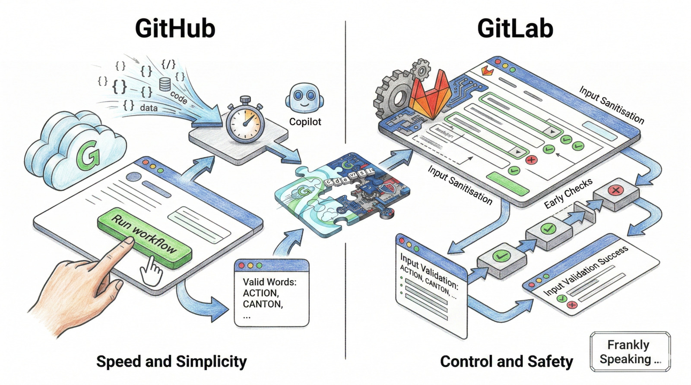
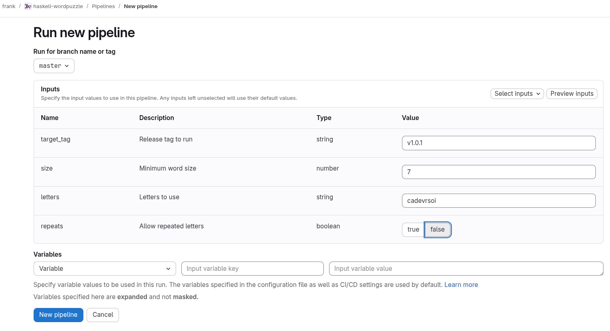
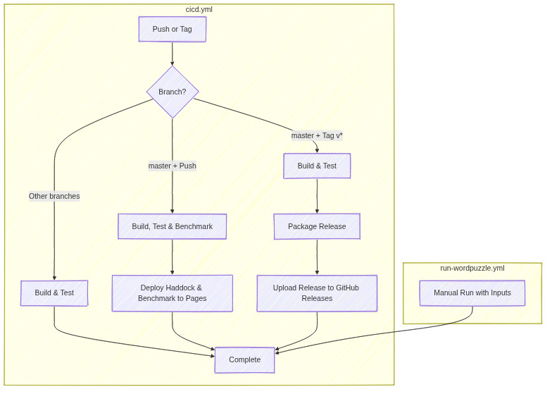
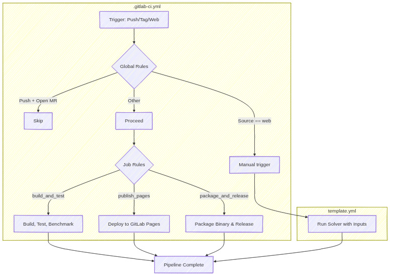

_Building a specialised tool such as a word-puzzle solver needs more than
automated builds. The real value is letting users run the solver from their
browser—enter letters, press a button, and get results without a command line._

_For example, given letters like "mitncao", users should find every valid word
without leaving the UI. That requires a simple run method: press a button, type
the letters, and receive results quickly. By implementing this on both GitHub
and GitLab I learned how each platform compares in setup effort, input
sanitisation, and user experience._

## Takeaway 1: GitHub is Fast and Simple

### An Easy Start: GitHub's Straightforward Setup

For those who want to move from an idea to a working tool in minutes, GitHub is
a strong choice. Setting up a manual start button for the solver was
straightforward, largely due to the integration between the platform and AI
tools like GitHub Copilot.

Instead of digging through manuals, I could describe the required inputs (puzzle
size, letters) and iterate quickly.

The user interface is equally smooth. Once the setup is added to the main
project folder, a "Run workflow" button appears. The interface handles the
information you type in clearly, and the tool runs in a fresh, clean setup. It
is an ideal choice if you prioritise speed and a simple "click-and-run"
experience.

> A manual run can download the already-built solver and run it on demand. You
> start it from the Actions tab, and tools like Copilot make the first setup
> quick.

GitHub’s approach focuses on removing the obstacles between the person and the
"Run" button.

## Takeaway 2: GitLab Offers More Control and Safety

### Detailed Control: Why GitLab is Better for Complex Tasks

While GitHub prioritises speed, GitLab prioritises careful structure.
Implementing the solver on GitLab required a more detailed look at the
platform's settings, but the result was more reliable and more likely to catch
mistakes early.

The main advantage is how GitLab allows you to define clear rules for what a
user can enter. Compared with GitHub’s simpler fields, GitLab can be much
stricter from the start:

* **Clear entry rules:** You can guide people towards the correct type of
  information.
* **Early checks:** If someone types something invalid, GitLab can stop the
  process immediately, before it wastes time.

While GitHub often follows a "run and then fail" approach—where the system
checks the information while it is running—GitLab provides stronger safety
checks at the moment you type the details.

> GitLab can reject unexpected information before the process even starts. The
> trade-off is that you need to learn more about GitLab’s settings.

For the word puzzle solver, this means the platform itself ensures the letters
are valid before anything begins.

## Takeaway 3: Comparing the Workflow

### A Side-by-Side View

The differences are clearest in how each platform isolates manual runs. Both
avoid rebuilding by downloading a pre-built artefact, but they organise and
reuse those artefacts differently.

**GitHub Path:** On GitHub, isolation comes from separate workflow files. The
main pipeline handles build and publish, while a standalone manual workflow
downloads the release artefact and runs inputs without rebuilding.

**GitLab Path:** On GitLab, a single entry point routes to a template. The main
pipeline checks the trigger source and, for manual web runs, skips standard
build jobs and calls the manual job template.

## Takeaway 4: Where Files are Stored

### Storing Your Software

For manual runs, the solver and dictionary must be packaged together. Both
platforms handle this well, but they manage storage differently.

**GitHub: Release-Driven Storage** GitHub stores the package as a release asset
tied to a tagged version.

* **User Experience:** It is easy to find on the "Releases" page, and automated
  runs can download it securely in the background.
* **Management Implications:** Artefacts are linked to releases and tags. If a
  release is deleted, its artefacts are deleted too.

**GitLab: Registry-Driven Storage** GitLab publishes the package to the **GitLab
Generic Package Registry**, which acts as a dedicated artefact store.

* **User Experience:** Pipelines fetch packages with standard tools like `curl`
  via the GitLab API, and users can browse them in the Package Registry UI.
* **Management Implications:** You can choose package access rules separately
  from source code access, while automated runs still access files securely.

## Conclusion: Choosing the Right Tool

Ultimately, the choice between these two platforms for manual runs depends on
your priorities.

* **GitHub** is excellent for **speed and ease of use**. With its simple
  interface and helpful AI tools, it is the easiest way to create a working "run
  now" button.
* **GitLab** is better for **careful settings and safety**. It makes it easier
  to add strong checks, which can prevent errors before they start.

Do you value the "Ease of Use" that lets you build quickly, or the "Detailed
Control" that helps you avoid mistakes?

## Resources

I developed this pipeline workflow for the Clojure & Haskell projects. The code is available on:

* **GitHub:**
  * [frankhjung/haskell-clojure](https://github.com/frankhjung/haskell-clojure)
  * [frankhjung/haskell-wordpuzzle](https://github.com/frankhjung/haskell-wordpuzzle)
* **GitLab:**
  * [frankhjung1/haskell-clojure](https://gitlab.com/frankhjung1/haskell-clojure)
  * [frankhjung1/haskell-wordpuzzle](https://gitlab.com/frankhjung1/haskell-wordpuzzle)
