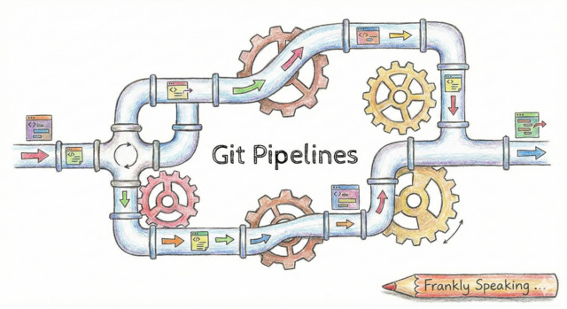
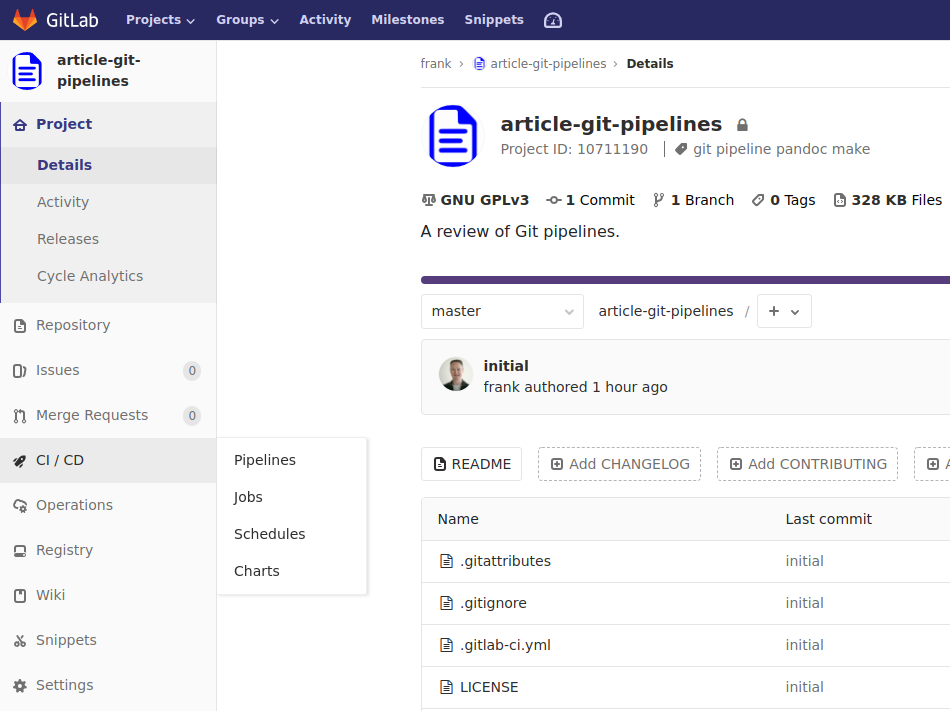
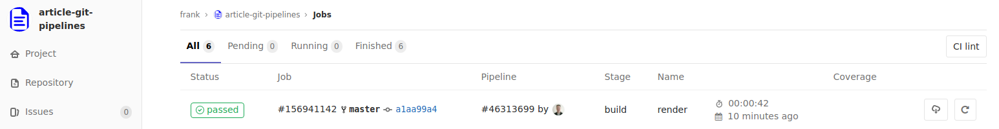
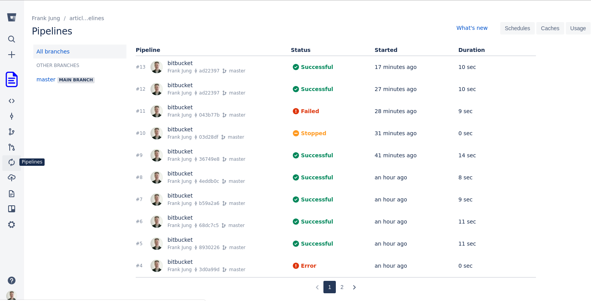
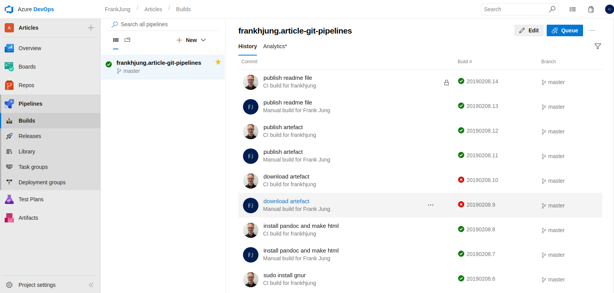
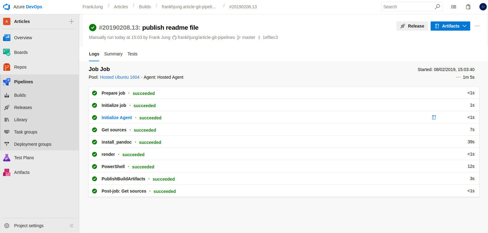
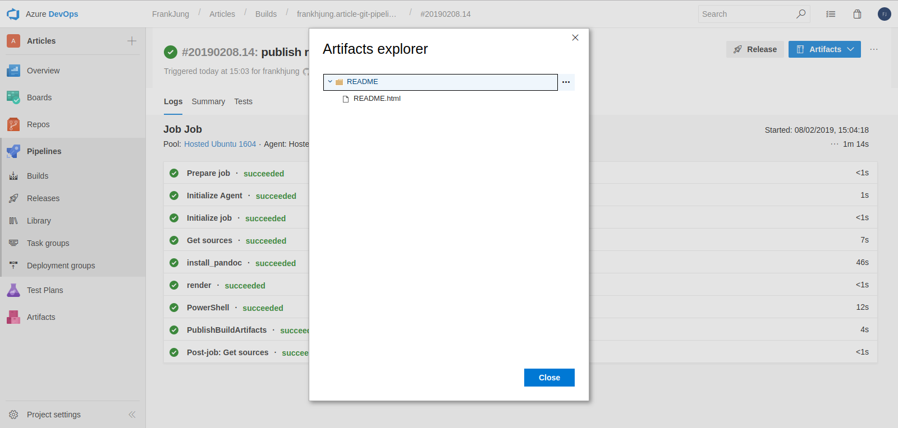

## Introduction

Git has become the *de facto* standard for version control, but until recently
you needed external tools such as [Jenkins](https://jenkins.io) or
[GoCD](https://www.gocd.org) to manage Continuous Integration / Continuous
Delivery (CI/CD) pipelines.

Now, though, we're seeing vendors like [GitLab](https://gitlab.com) and others
providing pipeline features with extensible suites of tools to build, test and
deploy code. These integrated CI/CD features greatly streamline solution
delivery and have given rise to whole new ways of doing things like
[GitOps](https://queue.acm.org/detail.cfm?id=3237207).

In this article we examine and compare some of the current pipeline features
from three popular Git hosting sites: [GitLab](https://gitlab.com/),
[Bitbucket](https://bitbucket.org) and [GitHub](https://github.com/), and ask
the question: "Is it time to switch from your current CI/CD toolset?"

## Example Pipeline

Let's use pipelines to render the [Git
Markdown](https://guides.github.com/features/mastering-markdown/) version of
this article into an HTML document.

The pipeline features we are using:

* using Docker images to execute build tasks
* customising the build environment
* pipeline stages
* archiving generated artefacts - in this case a document, but in real life you
  might be archiving a built Docker image

The pipeline workflow is:

1. install [GNU Make](https://www.gnu.org/software/make/)
1. install [pandoc](https://pandoc.org/) - we are using this to render Markdown
   to HTML
1. render the HTML document from Markdown
1. archive rendered document

## GitLab

[GitLab](https://gitlab.com/)'s Community Edition pipelines are a
well-integrated tool, and are our current pipeline of choice.

### GitLab Example Pipeline

The CI/CD pipelines are easily accessed from the sidebar:



Viewing jobs gives you a pipeline history:



The [YAML](https://docs.gitlab.com/ce/ci/yaml/) configuration file
`.gitlab-ci.yml` for this pipeline is:

```yaml
image: conoria/alpine-pandoc

variables:
  TARGET: README.html

stages:
  - build

before_script:
  - apk update
  - apk add make

render:
  stage: build
  script:
    - make $TARGET
  artifacts:
    paths:
      - $TARGET
```

Where:

* `image` - specifies a custom Docker image from Docker Hub (can be custom per
  *job*)
* `variables` - define a variable to be used in all *jobs*
* `stages` - declares the jobs to run
* `before_script` - commands to run before all *jobs*
* `render` - name of *job* associated with a stage. Jobs in the same stage are
  run in parallel
* `stage` - associates a *job* with a stage
* `script` - commands to run for this *job*
* `artitacts` - path to objects to archive, these can be downloaded if the *job*
  completes successfully

What this pipeline configuration does is:

* load an Alpine Docker image for [pandoc](https://pandoc.org/)
* invoke the build stage which
  * initialises with alpine package update and install
  * runs the `render` job which generates the given target HTML
  * on successful completion, the target HTML is archived for download

### GitLab Features and Limitations

There are many other features including scheduling pipelines and the ability to
configure jobs by branch.

One useful feature for Java / Maven projects is caching of the `.m2` directory.
This speeds up the build as you don't have a completely new environment for each
build, but can leverage previous cached artefacts instead. GitLab also provides
a *clear cache* button on the pipeline page.

GitLab also supports hosting of static
[pages](https://about.gitlab.com/product/pages/). This is simple to set up and
use, requiring only an additional `pages` job in the deployment `stage` to move
static content into a directory called `public`. This makes it easy to host a
project's generated documentation and test results.

Finally, GitLab provides additional services that can be integrated with your
project. For example: [JIRA](https://www.atlassian.com/software/jira) tracking,
[Kubernetes](https://kubernetes.io/), and monitoring using
[Prometheus](https://prometheus.io/).

### GitLab Summary

Overall, GitLab is easy to configure and easy to navigate, and provides us with
our current preferred Git pipeline solution.

## [Bitbucket](https://bitbucket.org)

Atlassian's [Bitbucket](https://bitbucket.org) pipeline functionality and
configuration is similar to GitLab.

### Bitbucket Example Pipeline

Again, pipelines and settings are easy to find from the sidebar.



But there are some important differences. Below is the configuration file
`bitbucket-pipelines.yml` for this pipeline:

```yaml
pipelines:
  branches:
    master:
      - step:
          name: render
          image: conoria/alpine-pandoc
          trigger: automatic
          script:
            - apk update && apk add make curl
            - export TARGET=README.html
            - make -B ${TARGET}
            - curl -X POST --user "${BB_AUTH_STRING}" +
                "https://api.bitbucket.org/2.0/" +
                "repositories/${BITBUCKET_REPO_OWNER}/" +
                "${BITBUCKET_REPO_SLUG}/downloads " +
                --form files=@"${TARGET}"
```

Here the pipeline will be triggered automatically (`trigger: automatic`) when
you commit to the master branch.

You can define a Docker image (`image: conoria/alpine-pandoc`) to provision at
the level of the pipeline `step`.

Variables (`${BB_AUTH_STRING}`, `${BITBUCKET_REPO_OWNER}` and
`${BITBUCKET_REPO_SLUG}`) can be defined and read from the Bitbucket settings
page. This is useful for recording secrets that you don't want to have exposed
in your source code.

Internal script variables are set via the script language, which here is Bash.
Finally, in order for the build artefacts to be preserved after the pipeline
completes, you can publish to a downloads location. This requires that a secure
variable be configured, see
[deploy build artifacts to bitbucket downloads](https://confluence.atlassian.com/bitbucket/deploy-build-artifacts-to-bitbucket-downloads-872124574.html).
If you don't, the pipeline workspace is purged on completion.

That you have to externally / manually configure repository settings has some
benefits. The consequence though, is that there are then settings that are
**not** recorded by your project.


Pipeline build performance is good; this step took around 11 seconds to
complete.

### Bitbucket Features and Limitations

One limitation is that the free account limits you to only 50 minutes per month
with 1GB storage.

A feature of being able to customise the Docker image used at the step level is
that your build and test steps can use different images. This is great if you
want to trial your application on a production-like image.

## [GitHub](https://github.com/)

GitHub was recently [acquired by
Microsoft](https://blogs.microsoft.com/blog/2018/10/26/microsoft-completes-github-acquisition/).

When you create a GitHub repository, there is an option to include [Azure
Pipelines](https://azure.microsoft.com/en-au/services/devops/pipelines/).
However this is not integrated to GitHub directly, but is configured under
[Azure DevOps](https://dev.azure.com/).

Broadly, the steps to set up a pipeline are:

* sign up to Azure pipelines
* create a project
* add GitHub repository to project
* configure pipeline job



Builds are managed from the Azure DevOps dashboard. There appears to be no way
to manually trigger a build directly from the GitHub repository. Though, if you
commit, it will happily trigger a build for you. But, again, you need to be on
the Azure DevOps dashboard to monitor the pipeline jobs.

### GitHub Example Pipeline

The following
[YAML](https://docs.microsoft.com/en-us/azure/devops/pipelines/yaml-schema)
configuration uses an [Ubuntu](https://ubuntu.com) 16.04 image provided by
Azure. There are a limited number of images, but they are well maintained with
packages kept up-to-date. They come with [many pre-installed
packages](https://github.com/Microsoft/azure-pipelines-image-generation/blob/master/images/linux/Ubuntu1604-README.md).

Below is the Azure pipeline configuration `azure-pipelines.yml` for this
pipeline:

```yaml
trigger:
  - master

pool:
  vmImage: 'Ubuntu-16.04'

steps:

  - script: |
      sudo apt-get install pandoc
    displayName: 'install_pandoc'

  - script: |
      make -B README.html
    displayName: 'render'

  - powershell: |
      gci env:* |
      sort-object name |
      Format-Table -AutoSize |
      Out-File $env:BUILD_ARTIFACTSTAGINGDIRECTORY/environment-variables.txt

  - task: PublishBuildArtifacts@1
    inputs:
      pathtoPublish: '$(System.DefaultWorkingDirectory)/README.html'
      artifactName: README
```

If the package you need is not installed, then you can install it if available
from the Ubuntu package repositories. The default user profile is not `root`, so
installation requires the use of `sudo`.



To create an archive of artefacts for download, you need to invoke a specific
[PublishBuildArtifacts](https://docs.microsoft.com/en-us/azure/devops/pipelines/artifacts/build-artifacts?view=azure-devops&tabs=yaml)
task.



Azure is fast because it uses images that Microsoft manages and hosts. The above
job to install [pandoc](https://pandoc.org/) and render this page as HTML takes
only 1 minute.

### GitHub Features and Limitations

The biggest negative to Azure Pipelines is its limited integration to the GitHub
dashboard. Instead, you are strongly encouraged to manage pipelines using the
[Azure DevOps](https://docs.microsoft.com/en-us/azure/devops/report/dashboards)
dashboard.

### GitHub Update

Since the first draft of this article, GitHub announced support for pipeline
automation called [GitHub Actions](https://github.com/features/actions/). I was
engaged in the beta program and we will have some new information to post here
shortly.

## GitHub Summary

In our DevOps practice we are constantly looking at ways to increase our
productivity and effectiveness in solution delivery. Of the three Git pipelines
looked at here, we found GitLab the easiest to adopt and use. Its YAML-based
syntax is simple, but functionality broad. Our developers have quickly picked up
and implemented pipeline concepts.

Git pipelines will not be suitable in every circumstance, for example, Ansible
infrastructure provisioning projects. However, there are clear advantages to
using a hosted pipeline that ensures that your project builds somewhere other
than on your machine. It also removes the cost of building and maintaining your
own infrastructure. This could be of great benefit to projects where time
constraints limit one's ability to prepare an environment.

The pipeline configuration augments your project's documentation for build, test
and deployment. It is an independent executable description for your project
that explicitly lists dependencies.

Since the first draft of this article was written, there has been increasing
competition and continuous innovation amongst Git repository vendors:

* GitHub has introduced [GitHub Actions](https://github.com/features/actions/).
* GitLab has announced
  [Directed Acyclic Graphs](https://about.gitlab.com/2019/08/22/gitlab-12-2-released/#directed-acyclic-graphs-dag-for-gitlab-pipelines)
  for their pipeline.
* Even [Docker Hub](https://hub.docker.com) now has an automated pipeline that
  is triggered by changes to Git repositories.

So, yes: it *is* a great time to switch to a Git pipeline toolset!

## Links

There are many more repository hosting sites that offer pipelines. You may like
to explore:

* [Kaggle](https://www.kaggle.com/)
* [DigitalOcean](https://www.digitalocean.com/)
* [Travis CI](https://travis-ci.org/)
