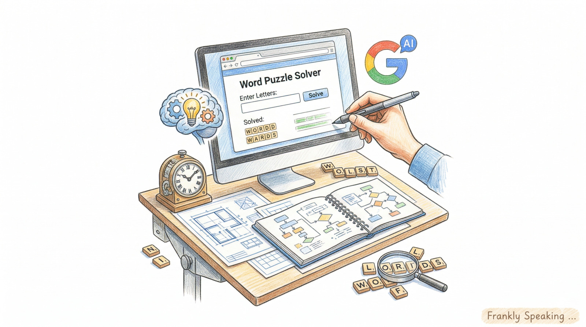
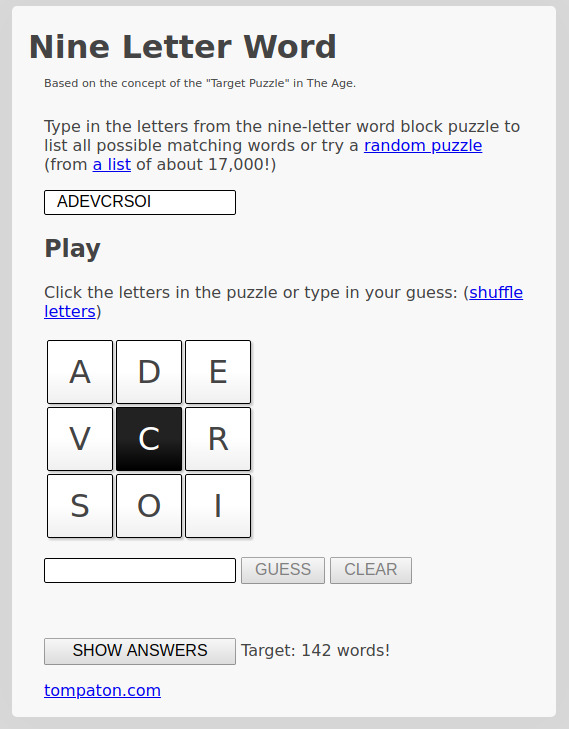
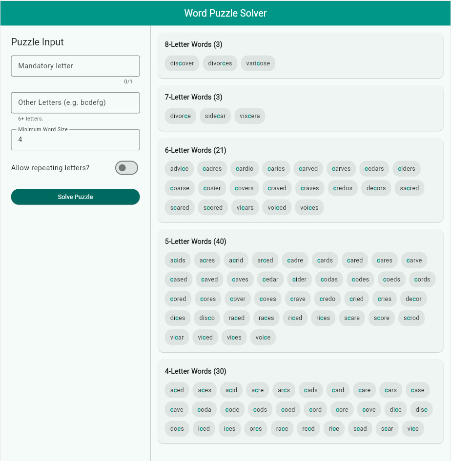

## Introduction

This week, I experimented with Google AI Studio. The objective was to see how
difficult it would be to create a web front-end for a word puzzle solver
targeting games like the
[Nine Letter Word](https://nineletterword.tompaton.com/), NYT
[Spelling Bee](https://www.nytimes.com/puzzles/spelling-bee), and Scientific
American [Spellements](https://www.scientificamerican.com/game/spellements/).

## Developing the Requirements

I had several [command line programs](#solvers) that solved the problem. Now I
want a web front-end. I had used [Flutter](https://flutter.dev/) before and knew
it could deliver not only a web front-end but also native desktop and mobile
apps. I drafted a requirements document in Markdown and asked Copilot and Gemini
to review and suggest improvements. The document covered puzzle-solver inputs,
examples, expected behaviour, and UI style. For this solution, I expected a
client-server architecture. You can see the initial application
[requirements document](#requirements) on GitHub. Once satisfied, I submitted
these requirements to AI Studio.

## First Iteration

The first iteration produced a functional website. AI Studio provided a mock
solver and a clean, usable interface. You can export the generated code to
GitHub, but AI Studio is effectively a project generator: it scaffolds a
runnable project that isn't intended for ongoing edits outside the AI Studio
environment. As a result, local changes require manual transfer back to AI
Studio—a practical limitation for some workflows.

## Hosting and Deployment

AI Studio will set up a Google Cloud project for you, and you can run the code
there. This is a great way to quickly test the generated code and see how it
works. However, it also means managing a Google Cloud project. This dependency
on Google Cloud for hosting and running your code may not be ideal. It was
overkill for a simple static website.

AI Studio was able to perform some refactoring, namely replacing the mock solver
with a real solver. I also used it to evaluate alternative hosting options. It
was able to suggest that since this was a static website, I could even host it
on GitHub Pages. I preferred this option as it was free and I could easily
integrate it with my GitHub repository. It also meant I didn't need to maintain
a web server on Google Cloud. In addition, I could implement a CI pipeline to
validate and build the project.

## Local Iteration and Refactoring

The other benefit of exporting the code to [GitHub repository]((#repo-main)),
was that I could use my local development environment to iterate on the code.
The [refactoring](#refactoring) was significant. I orchestrated these changes
using Google's [AntiGravity IDE](https://antigravity.google/)—an experimental,
AI-orchestrated development environment—and reviewed the results in Visual
Studio Code with GitHub Copilot. The refactoring was successful, and the code
was significantly improved. From a mixed Flutter / TypeScript codebase, I now
had pure Flutter code. The UI was improved to be more user-friendly: adding a
mandatory letter, providing input feedback, and enhancing overall usability. I
also added a CI pipeline to validate, build and deploy the website to GitHub
Pages whenever changes were pushed.

The following image shows the final solver UI:

## Summary of Manual Effort

  The manual effort for this project was remarkably low, totalling about three
  days of work: one day to generate the prototype and roughly two days for
  refactoring and CI setup. For example, integrating the initial UI with the
  solver took a few hours, while the refactor and CI pipeline took the bulk of
  the remaining time. Having already solved the core logic in a command-line
  program, my primary tasks were drafting requirements and reviewing the
  generated code across iterations. I used AI Studio to generate a rapid
  prototype, then switched to my local tools to refactor and polish the code
  into a production-ready solution.

## Conclusion

Overall, my experience with Google AI Studio was positive. It quickly generated
a functional web front-end for my word puzzle solver and provided useful
suggestions for improving the code and hosting options. However, its
limitations, such as the inability to edit the generated code outside of the AI
Studio environment and the dependency on Google Cloud for hosting, may not be
ideal for all developers. Despite these limitations, AI Studio can still be a
valuable tool for rapidly generating functional code and practical improvement
ideas, especially for developers who are new to web development or who want to
quickly prototype a web front-end for existing code.

## Actionable Takeaway: When to use AI Studio

Use AI Studio when:

- You need to quickly prototype a functional UI for existing logic.
- You want a managed environment to test and run your project instantly.
- You are exploring hosting and architectural suggestions.

Switch to local tooling when:

- You need full control over the codebase for long-term maintenance.
- You want to integrate with specific CI/CD pipelines outside the Google Cloud
  ecosystem.
- The project requires complex, manual logic that exceeds AI generation
  capabilities.

## Project links

-  GitHub repository:
  [Flutter Word Puzzle Solver](https://github.com/frankhjung/flutter-wordpuzzle)
- 
  [My other Word Puzzle Solvers](https://github.com/frankhjung/haskell-wordpuzzle/blob/master/README.md#my-wordpuzzle-solver-implementations)
- 
  [Application Requirements](https://github.com/frankhjung/flutter-wordpuzzle/blob/main/docs/app-requirements.md)
- 
  [Refactoring Requirements](https://github.com/frankhjung/flutter-wordpuzzle/blob/main/docs/refactor-requirements.md)
