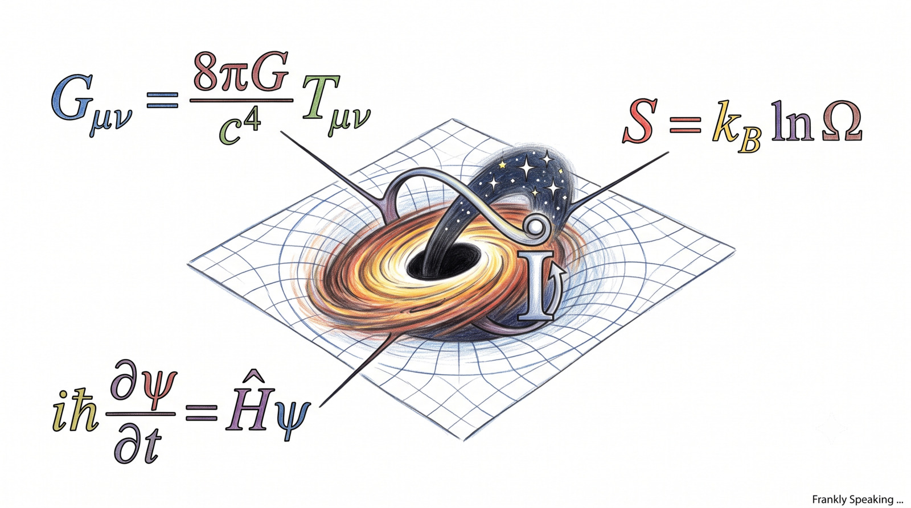

## Why This Debate Matters

Contemporary physics faces a quiet but profound crisis. Our picture of the
universe rests on two extraordinary frameworks that do not fit neatly together.
[General Relativity][general-relativity] (GR) describes spacetime as a smooth
continuum curved by mass and energy. [Quantum Mechanics][quantum-mechanics] (QM)
describes reality as discrete quanta governed by probabilities. Both are
remarkably successful, yet they speak different mathematical languages.

That tension sits alongside another stubborn cosmological puzzle: how can an
expanding universe give rise to ordered, complex structures—galaxies, stars,
planets, and life—while remaining strictly bound by the second law of
thermodynamics? Standard approaches often attribute cosmic acceleration to a
static cosmological constant or undetected hypothetical particles.

[Gravity from Entropy][gfe] (GfE), developed by mathematician [Ginestra
Bianconi][gbianconi], offers a fresh perspective. Rather than searching for
missing matter or modifying GR arbitrarily, GfE treats gravity as an emergent,
thermodynamic consequence of microscopic geometry interacting with matter.

## The Core Claim: Gravity as an Equation of State

Consider the hydrodynamic analogy: microscopic particle collisions and
macroscopic fluid pressure are both valid descriptions operating at different
scales. Fluid temperature does not belong to individual molecules, but emerges
as a macroscopic statistical average over countless unseen interactions. You do
not ask for the "temperature of a single atom"; temperature is a collective,
statistical descriptor.

The same logic applies to gravity under GfE. In this theory, Einstein's field
equations are not microscopic first principles, but macroscopic equations of
state. The GfE framework posits that spacetime geometry adjusts to maintain
thermodynamic balance as information flows between matter fields and geometric
degrees of freedom.

In short, what we perceive as gravitational force may be a large-scale
thermodynamic response maintained by underlying geometric degrees of freedom.

## The GfE Mechanism: Volumetric Entropy and Structure

Unlike earlier entropic gravity models that relied solely on black hole horizon
surfaces, GfE introduces a local, volumetric measure: Geometric Quantum Relative
Entropy (GQRE).

GQRE quantifies the information-theoretic tension between two metrics: the
physical spacetime metric and an induced metric incorporating matter fields and
curvature. From this interplay, an emergent field—the G-field—naturally dresses
the metric.

Crucially, in an expanding Friedmann-Robertson-Walker (FRW) universe, GfE
reveals a striking thermodynamic dual behaviour:

1. The **total entropy** of the universe ($S$) increases monotonically over
   time, satisfying the second law of thermodynamics.
2. The **local entropy per unit volume** ($\delta s / \delta v$) decreases over
   time as spatial volume expands.

This local entropy decay resolves the long-standing cosmological paradox. While
the cosmos as a whole grows more disordered, local regions experience a drop in
entropy density, leaving ample thermodynamic room for local ordering, cosmic
structure formation, and complexity to emerge naturally.

## Emergent Dark Energy and Metric Temperatures

A notable mathematical feature of GfE is that its modified field equations
naturally generate an emergent dynamical dark energy term, $\Lambda_G$. This
term is not inserted by hand as an arbitrary cosmological constant; it arises
directly from the non-linear structure of the G-field.

Furthermore, GfE assigns intrinsic physical temperatures ($\theta_k \propto
H^2$) and pressures ($\pi_k$) to local geometric degrees of freedom (scalar,
vector, and bivector components). These $k$-temperatures satisfy a strict first
law of GfE thermodynamics:

$$\delta \epsilon_k = \theta_k \delta s_k - \pi_k \delta v$$

where $\delta \epsilon_k$ is the energy change of the $k$-th geometric degree of
freedom, $\theta_k \delta s_k$ is the heat term (temperature times the entropy
change), and $\pi_k \delta v$ is the work term (pressure times volume change).

Because these thermal quantities belong to the spacetime metric itself rather
than quantum background fields, GfE suggests that spacetime possesses an
inherent thermal nature—a foundation that may guide future quantum gravity
formulations using contact geometry.

## Opinion: Promising, But It Needs Hard Tests

GfE replaces a substance-first cosmological ontology with an
information-theoretic one. Gravity becomes macroscopic thermodynamic
bookkeeping, explaining both the GR limit at low energies and the emergence of
cosmic structure.

The strength of Bianconi's formulation lies in its theoretical coherence and
falsifiability. In the low-energy limit, GfE reduces smoothly to General
Relativity, ensuring compatibility with solar-system tests. At cosmological
scales, however, its dynamical dark energy term and metric temperature scalings
yield distinct signatures.

To validate GfE, researchers must test its specific predictions against
high-redshift galaxy dynamics, early-universe expansion rates, and precision
cosmological data from observatories like the [James Webb Space
Telescope][jwst] (JWST). If GfE's parameter-free predictions fail under rigorous
statistical comparisons against standard $\Lambda$-CDM, the idea must be refined
or abandoned. If they hold, GfE offers an elegant bridge between thermodynamics,
cosmology, and quantum geometry.

## Context: Entropic Gravity and Alternative Frameworks

While Bianconi's GfE focuses on volumetric quantum relative entropy and emergent
dark energy, it forms part of a broader landscape of alternative quantum and
emergent gravity theories:

- **[Jacobson's Spacetime Thermodynamics][jacobson]:** Derives Einstein's
  equations from horizon entropy and the Clausius relation ($dQ = T dS$).
- **[Verlinde's Emergent Gravity][verlinde]:** Interprets gravity as an entropic
  force arising from holographic screen boundaries, aiming to explain galactic
  rotation curves without particle dark matter (MOND phenomenology).
- **[Loop Quantum Gravity (LQG)][lqg] & [String Theory][string-theory]:**
  Primary quantum gravity candidates that quantise geometry directly or unify
  forces via fundamental strings.
- **[Asymptotic Safety][as] & [Causal Dynamical Triangulations][cdt]:**
  Non-perturbative approaches exploring scale-dependent gravitational couplings
  and spacetime discretisation.

Gravity from Entropy stands out within this landscape by providing a
local, volumetric statistical mechanics framework that reconciles cosmological
structure growth with the global [Second Law][second-law].

## Sources

1. Original paper by Ginestra Bianconi: [Thermodynamics of the gravity from
   entropy theory][gfe] (*Physical Review D*, 2026).
2. Phys.org coverage: [How Gravity from Entropy theory connects the second law
   of thermodynamics with the emergence of cosmic structure][physorg-article].

## Other Resources

- [Gravity from Entropy Theory Resolves Century-Old Clash Between Structure and Entropy][techtimes-article]
- [This Physicist (Just) Found A New Origin For Gravity (YouTube)][curt-jaimungal]

[as]: https://en.wikipedia.org/wiki/Asymptotic_safety
[cdt]: https://en.wikipedia.org/wiki/Causal_dynamical_triangulation
[curt-jaimungal]: https://www.youtube.com/watch?v=ydzuuJU93Xo
[gbianconi]: https://en.wikipedia.org/wiki/Ginestra_Bianconi
[general-relativity]: https://en.wikipedia.org/wiki/General_relativity
[gfe]: https://journals.aps.org/prd/abstract/10.1103/26kn-thgp
[jacobson]: https://pirsa.org/06090001
[jwst]: https://en.wikipedia.org/wiki/James_Webb_Space_Telescope
[lqg]: https://en.wikipedia.org/wiki/Loop_quantum_gravity
[physorg-article]: https://phys.org/news/2026-07-gravity-entropy-theory-law-thermodynamics.html
[quantum-mechanics]: https://en.wikipedia.org/wiki/Quantum_mechanics
[second-law]: https://en.wikipedia.org/wiki/Second_law_of_thermodynamics
[string-theory]: https://en.wikipedia.org/wiki/String_theory
[techtimes-article]: https://www.techtimes.com/articles/320996/20260720/gravity-entropy-theory-resolves-century-old-clash-between-structure-entropy.htm
[verlinde]: https://en.wikipedia.org/wiki/Entropic_gravity#Erik_Verlinde's_theory
