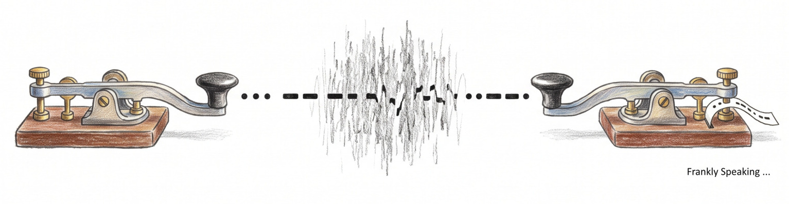

```{r setup, include=FALSE, echo=FALSE, message=FALSE, warning=FALSE}
knitr::opts_chunk$set(echo = TRUE)
```



## Introduction: The Informational Universe

We typically perceive our world through the lens of tangible matter and flowing
energy. We see a landscape of atoms, forces, and heat. However, modern science
is beginning to realise that these physical properties might merely be the
surface of a deeper architecture. At its most fundamental level, the universe
appears to be composed of "bits" of information. Consider the extraordinary feat
of a single microscopic cell: how does it "know" how to construct a complex
human being? The answer lies not just in chemistry but in the sophisticated
processing of data. By shifting our perspective to information theory, we can
begin to decode the underlying software of existence and see ourselves as nodes
within a vast, self-optimising system.

## Information Theory: Claude Shannon and the Mathematics of Meaning

Before any of this can make sense, it helps to ask a deceptively simple
question: what actually counts as "information"? In his 1948 paper [*A
Mathematical Theory of Communication*][shannon-1948], Claude Shannon gave a
precise, mathematical answer — one that had nothing to do with the meaning or
importance of a message, and everything to do with how surprising it is.

Shannon defined the information content of a signal in terms of its
[entropy][information-entropy]: a measure of the uncertainty inherent in
the range of possible outcomes. For a set of outcomes with probabilities
$p(x_i)$, entropy is given by:[^entropy-properties]

$$H(X) = -\sum_{i=1}^{n} p(x_i) \log_2 p(x_i)$$

measured in bits. A signal that is entirely predictable — one you could
guess perfectly in advance — has an entropy of zero, and so carries
precisely zero bits of information, no matter how long or elaborate it
looks. Entropy is highest, and information content greatest, when every
outcome is equally likely and the result stays genuinely uncertain until
it's observed. This gave engineers, for the first time, a rigorous way to
answer whether a given signal contains any information at all: measure how
much uncertainty it resolves, not what it appears to say.

One striking consequence: Shannon estimated that ordinary English text carries
only around one bit of information per letter, even though each letter is drawn
from an alphabet that would naively need almost five bits to represent. Much of
language, in other words, is redundant — predictable enough from context and
grammar that a large share of it could be stripped away without losing the
message. This same idea — entropy as the true measure of information, redundancy
as its opposite — is the foundation everything else in this piece builds on,
from the bits stored in your DNA to the channel capacity of a nation's public
discourse.

## Biology: Storing, Copying, and Reading the Genome

In the realm of biological replication, a cell functions less like a simple
chemical reaction and more like a highly efficient information processing
system. The human genome consists of roughly 3.2 billion base pairs. Since there
are four possible chemical bases (A, T, C, G), each pair represents exactly 2
bits of information. In total, replicating a single human cell requires the
faithful copying of 6.4 billion bits — approximately 800 megabytes of data.

To manage this massive payload without hitting informational bottlenecks, the
cell relies on kinetic and thermodynamic optimisation. While the movement of
biochemical machinery along a single strand is governed by the [Shannon–Hartley
theorem][shannon-hartley], the cell bypasses single-strand rate limits through
spatial parallelisation. It utilises thousands of replication origins
simultaneously, allowing the entire 800 MB genome to be duplicated in about 8
hours despite a raw biochemical transmission speed of only 50 base pairs per
second per fork.

Beyond copying, cells also regulate gene expression through epigenetics. These
molecular tags modify how genetic information is read without altering the
underlying sequence, acting as structural controls on genomic access.

## Chemistry: Maximum Entropy and the Shape of a Spectrum

Real laboratory instruments never hand chemists a clean signal — every [Nuclear
magnetic resonance (NMR)][nmr] spectrum, mass spectrum, or X-ray diffraction
pattern arrives tangled up with noise, and only partially sampled at that. The
question chemists face is a direct descendant of Shannon's: given incomplete,
noisy data, which of the many possible "true" spectra should you actually
believe?

The [Maximum Entropy Method][maxent-method] answers this by applying Shannon's
entropy directly as a reconstruction principle. Among all the candidate spectra
consistent with the measured data, it selects the one with the highest entropy —
in other words, the one that assumes the least additional structure beyond what
the data can actually justify. Any spectrum with lower entropy would be quietly
smuggling in extra assumptions the measurement never supported.

This isn't a metaphor borrowed from information theory; it's Shannon's
mathematics used as a working laboratory tool. Maximum entropy reconstruction is
routine in modern NMR spectroscopy and mass spectrometry, where it lets chemists
recover sharp, reliable spectra from measurements that would otherwise be too
sparse or noisy to interpret with confidence.

## Thermodynamics: The Physical Cost of Information Erasure

Reading and copying information turns out to be the easy part. Information is
not an abstract concept; it is a physical property with concrete thermodynamic
consequences. This was formalised by [Landauer's Principle][landauer-principle],
which established that processing data has a mandatory physical cost.
Specifically, erasing a single bit of information releases a precise amount of
physical heat into the environment, defined by the formula:

$$W = k_B T \ln 2$$

Here, $W$ represents the minimal work or heat energy released, $k_B$ is the
Boltzmann constant ($1.38 \times 10^{-23} \text{ J/K}$), $T$ is the absolute
temperature in Kelvin, and $\ln 2 \approx 0.693$ reflects the natural logarithm
of the two binary states ($0$ and $1$). At room temperature ($T = 298 \text{
K}$), this equation yields roughly $2.9 \times 10^{-21} \text{ J}$ per bit — a
tiny amount, yet multiplied across billions of bits it becomes a measurable
energy budget for cellular maintenance.

This discovery resolved the long-standing "[Maxwell's Demon][maxwells-demon]"
paradox, where a hypothetical being could decrease entropy by sorting molecules
without doing work. The solution lay in the demon's memory limits: because it
cannot store infinite data, it must eventually erase information. That act of
erasure generates heat, preserving the [Second Law of
Thermodynamics][second-law]. Information is not a ghost in the machine; it is a
physical currency.

## Physics: Gravity as an Emergent Informational Phenomenon

In theoretical physics, gravity is increasingly explored not as a fundamental
force, but as an "emergent" phenomenon. Erik Verlinde's proposal of [Entropic
Gravity][entropic-gravity] (which models gravitational attraction as an entropic
force) suggests gravity may be similar to the elasticity of a rubber band. A
single molecule isn't "stretchy", but a collection of them statistically prefers
higher-entropy states. (See also [*Gravity from Entropy: Is Gravity Just
Spacetime's Temperature?*][gravity-from-entropy])

While still a subject of active debate and theoretical refinement, the logic is
purely informational: when matter moves, it shifts the underlying microscopic
data distribution of the universe. Gravity is the macroscopic representation of
the universe adjusting itself to maintain maximum entropy. By tracking these
informational shifts, physicists have shown that Newton's laws and Einstein's
equations can be derived simply by assuming the universe is optimising its data
layout.

## Quantum Mechanics: Entanglement and Non-Local Information

If gravity and spacetime run on entanglement, quantum mechanics tells us
something more concrete and already confirmed by experiment: information itself
can be entangled between particles in a way no local, classical description can
explain. When two particles are entangled, measuring one instantly tells you
something about the other, regardless of the distance between them — famously
dismissed by Einstein as "spooky action at a distance". For decades it was an
open question whether this could be explained by some hidden, locally-stored
information carried by each particle from the outset, rather than genuine
non-local correlation.

[Bell's theorem][bells-theorem] settled the question mathematically: it showed
that any theory relying on such "local hidden variables" must obey a statistical
limit — a Bell inequality — that entangled quantum particles should not be able
to violate. In 2022, Alain Aspect, John Clauser, and Anton Zeilinger were
awarded the [Nobel Prize in Physics][nobel-2022] for decades of increasingly
rigorous experiments confirming that entangled particles do violate these
inequalities. In information-theoretic terms, this is a settled experimental
fact, not a hypothesis: the correlations between entangled particles cannot be
explained by information stored locally in each particle — the information
genuinely is shared, non-locally, between them.

One further, more speculative idea builds on this: the [Holographic
Principle][holographic-principle] and related proposals like [ER=EPR][er-epr]
suggest that spacetime itself, the fabric connecting one point to another, may
ultimately be built out of this same entanglement. Unlike Bell's theorem, this
remains an active, unconfirmed research direction rather than an experimentally
settled result — a compelling theoretical hint about where entanglement and
information might lead.

## Evolution: Viral Mutation and the Error Threshold

Where physics leverages quantum coherence, biology must constantly contend with
something far noisier: thermal entropy. Manfred Eigen's "[Error
Threshold][error-threshold]" defines the absolute limit of mutation a species
can tolerate. To survive, cells use "kinetic proofreading" — an error-correcting
algorithm that expends energy to drop error rates from 1 in 100 to 1 in 10
billion.

However, some biological agents weaponise noise. Viruses like HIV and Influenza
intentionally stay near the "[Error Catastrophe][error-catastrophe]" threshold.
By maintaining a high mutation rate that stops just short of an informational
meltdown, they evolve rapidly to outpace the immune system's feedback loops.

A contemporary example is [SARS-CoV-2][sars-cov-2], whose Spike protein
accumulated mutations at a rate that allowed the emergence of highly
transmissible variants (e.g., [Omicron][omicron-variant]) while avoiding
excessive deleterious mutations that would trigger error catastrophe.

If mutations exceed this threshold, the genetic code accumulates "noise" faster
than natural selection can weed it out. The data dissolves into random
gibberish, leading to a total collapse of the biological system.

## Political Science: Governance as Distributed Data Processing

Stretching the information-theoretic metaphor further into social architecture,
governance systems can be viewed as methods of data aggregation. A dictatorship
functions with narrow channel capacity — a single central processor (the ruler)
attempts to handle a nation's data, leading to catastrophic systemic blind
spots. Conversely, democracies and markets act as distributed networks, using
millions of "nodes" (citizens) to process societal data, making the system
resilient to noise.

If we hypothetically assign a rough bandwidth metric to public discourse, a
small nation of 5 million people might process 10 Mbps of collective feedback,
whereas a large nation like the United States (350 million participants) can
sustain hundreds of Mbps — providing a far richer data pipeline for policy
adaptation.

## Conclusion: The Informational Bedrock

Pulling these threads together, each field turns out to have its own
information-theoretic shadow:

```{r views-table, echo=FALSE}
knitr::kable(
  data.frame(
    Field = c(
      "Information Theory",
      "Biology",
      "Chemistry",
      "Thermodynamics",
      "Physics",
      "Quantum Mechanics",
      "Politics"
    ),
    `Traditional View` = c(
      "Meaning and messages",
      "Chemical systems",
      "Molecular structure",
      "Heat and entropy",
      "Energy and work",
      "Subatomic particles",
      "Power struggle"
    ),
    `Information-Theoretic View` = c(
      "Resolution of uncertainty",
      "Biochemical machinery running proofreading",
      "Maximum-entropy spectral reconstruction",
      "Mandatory physical cost of erasure",
      "Information as physical currency",
      "Non-local shared information resource",
      "Distributed societal data processing"
    ),
    check.names = FALSE
  )
)
```

This has been a brief survey of a handful of the domains where information
theory has left its mark — from the mechanics of a single cell, through
thermodynamics and gravity, to the noisy feedback loops of a virus or a nation.
It's a fascinating lens: one that keeps turning up in places you wouldn't
expect, and quietly reframes some of science's oldest questions as questions
about data.

A growing school of thought holds that information may be the bedrock of reality
itself. This perspective even redefines the end of time. The "[Heat
Death][heat-death]" of the universe is not just a loss of energy, but a state of
maximum [informational entropy][information-entropy] — a uniform state where no
new structures or data can be processed. Whatever the final verdict on that
question, one thing already seems clear: looking at the world through the lens
of information theory keeps uncovering the same hidden structure, in places as
different as a single cell and an entire galaxy — and that, on its own, is worth
sitting with for a while.

## Further Reading

For readers interested in exploring the foundational literature behind these
concepts:

- Shannon, C. (1948). [*A Mathematical Theory of Communication*][shannon-1948].
- Landauer, R. (1961). [*Irreversibility and Heat Generation in the Computing
  Process*][landauer-1961].
- Bell, J. S. (1964). [*On the Einstein Podolsky Rosen Paradox*][bells-theorem].
- Wheeler, J. A. (1989). [*Information, Physics, Quantum*][wheeler-1989].
- Verlinde, E. (2011). [*On the Origin of Gravity and the Laws of
  Newton*][verlinde-2011].

[^entropy-properties]: Where $X$ is a discrete random variable with possible
    outcomes $x_1, x_2; \dots, x_n$; $p(x_i)$ is the probability of outcome
    $x_i$ and $\log_2$ gives the result in bits. Three properties of this
    equation are worth noting: $H(X) = 0$ when one outcome has probability 1 (a
    fully predictable signal, carrying no information); $H(X)$ is maximised when
    all outcomes are equally likely (e.g. exactly 1 bit for a fair coin toss);
    and using $\log_2$ gives units of bits, while $\log_e$ gives nats and
    $\log_{10}$ gives hartleys — bits is the standard choice in information
    theory.

[bells-theorem]: https://en.wikipedia.org/wiki/Bell%27s_theorem
[entropic-gravity]: https://en.wikipedia.org/wiki/Entropic_gravity
[er-epr]: https://en.wikipedia.org/wiki/ER_%3D_EPR
[error-catastrophe]: https://en.wikipedia.org/wiki/Error_catastrophe
[error-threshold]: https://en.wikipedia.org/wiki/Error_threshold_(evolution)
[gravity-from-entropy]: https://frankhjung.blogspot.com/2026/07/is-gravity-just-spacetimes-temperature.html
[heat-death]: https://en.wikipedia.org/wiki/Heat_death_of_the_universe
[holographic-principle]: https://en.wikipedia.org/wiki/Holographic_principle
[information-entropy]: https://en.wikipedia.org/wiki/Entropy_(information_theory)
[landauer-1961]: https://en.wikipedia.org/wiki/Landauer%27s_principle
[landauer-principle]: https://en.wikipedia.org/wiki/Landauer%27s_principle
[maxent-method]: https://en.wikipedia.org/wiki/Maximum_entropy_spectral_estimation
[maxwells-demon]: https://en.wikipedia.org/wiki/Maxwell%27s_demon
[nmr]: https://en.wikipedia.org/wiki/Nuclear_magnetic_resonance_spectroscopy
[nobel-2022]: https://www.nobelprize.org/prizes/physics/2022/summary/
[omicron-variant]: https://en.wikipedia.org/wiki/SARS-CoV-2_Omicron_variant
[sars-cov-2]: https://en.wikipedia.org/wiki/SARS-CoV-2
[second-law]: https://en.wikipedia.org/wiki/Second_law_of_thermodynamics
[shannon-1948]: https://en.wikipedia.org/wiki/A_Mathematical_Theory_of_Communication
[shannon-hartley]: https://en.wikipedia.org/wiki/Shannon%E2%80%93Hartley_theorem
[verlinde-2011]: https://arxiv.org/abs/1001.0785
[wheeler-1989]: https://en.wikipedia.org/wiki/It_from_bit
