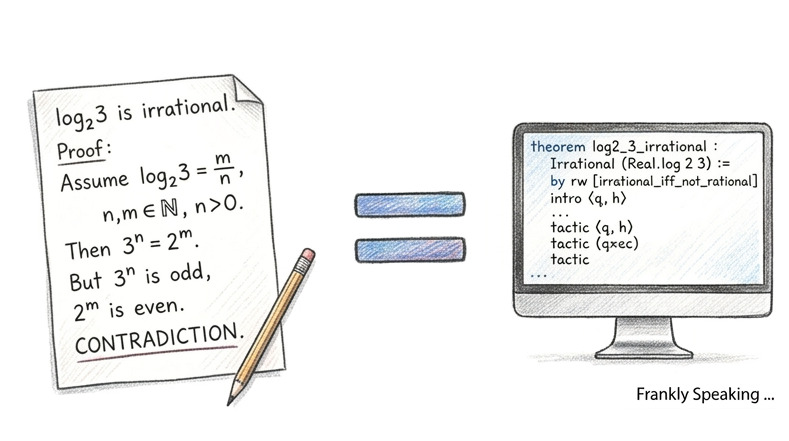

```{r setup, include=FALSE, echo=FALSE, message=FALSE, warning=FALSE}
knitr::opts_chunk$set(echo = TRUE)
```



In the [previous][previous] post, I explored Lean 4 as a functional
programming language. If you already know functional languages like Haskell,
you will recognise a lot of familiar ideas. Where Lean starts to feel
different is in its annotations and, especially, in its use of tactics with
dependent types.

To make that concrete, I will walk through a small mathematical proof in
Lean 4. The goal is to show an irrationality result. The classic classroom
example is that $\sqrt{2}$ is irrational, but that proof needs extra
machinery. Here, I will use a simpler example that only needs basic
arithmetic.

I will start with the maths proof, then translate the same idea into Lean 4.

I like this proof because it is compact. It is the classic "one side must be
even, the other must be odd" contradiction.

## Mathematics: Prove that $\log_2(3)$ is irrational

I start by assuming $\log_{2}(3)$ is rational. That means there exist positive
integers $a > 0$ and $b > 0$ such that:

$\log_{2}(3) = \frac{a}{b}$

Using the definition of [logarithms][logarithms], I can rewrite this as an
exponent:

$2^{\frac{a}{b}} = 3$

Next, I raise both sides to the power of $b$:

$2^{a} = 3^{b}$

Because $a$ is a positive integer, $2^{a}$ is $2$ multiplied by itself $a$
times, so the left side is even.

Because $b$ is a positive integer, $3^{b}$ is $3$ multiplied by itself $b$
times, so the right side is odd.

An even number cannot equal an odd number, so I have reached a contradiction.

Therefore, $\log_{2}(3)$ is irrational. $\blacksquare$

## Lean 4: Prove that $\log_2(3)$ is irrational

In Lean 4, the useful target is not the full irrationality statement at
first. It is the key lemma underneath it: if $a > 0$ and $b > 0$, then
$2^a \neq 3^b$. Once Lean has that arithmetic fact, it can rule out the
equation that would come from assuming $\log_2(3)$ were rational.

Before looking at the full script, it helps to outline the proof shape:

1. Assume, for contradiction, that $2^a = 3^b$.
2. Rewrite $a$ as $k + 1$ so the left-hand side visibly has a factor of 2.
3. Show the right-hand side cannot have a factor of 2, because powers of 3
   stay odd.
4. Combine those two facts to get a contradiction.

That is exactly the same idea as the pen-and-paper proof above. Lean just
makes each step explicit, one tactic at a time.

### What's actually being proved

The theorem name says "irrational", but the statement itself is a concrete
arithmetic fact:

$\forall a, b \in \mathbb{N},\ a > 0 \implies 2^a \neq 3^b$

This is the key lemma I would plug into a full irrationality proof for
$\log_2 3$: if $\log_2 3 = a/b$ for positive integers $a, b$, then
$2^a = 3^b$, which this lemma rules out. So even though the theorem name says
"irrational", the real work is this small [Diophantine][diophantine] fact.

One detail I like here is the hypothesis named `_ : b > 0`. Lean lets me use
`_` when I will not reference a hypothesis in the proof body, much like using
an ignored argument in Haskell. In this proof, I never use $b > 0$; the parity
argument still works when $b = 0$ because $3^0 = 1$ is still odd. I only need
$a > 0$, because I need $a = k+1$ to expose a factor of 2.

### Step-by-step

#### Turn $\ne$ into a proof by contradiction

The script starts the same way the handwritten proof does: I
assume that $2^a = 3^b$ for positive integers $a$ and $b$, then show that this
assumption leads to a contradiction:

```lean
intro h
```

$2^a \ne 3^b$ unfolds to $2^a = 3^b \to False$.

`intro h` gives me `h : 2^a = 3^b` and leaves the goal as `False`. From this
point on, I am just trying to derive `False` from `h`.

#### Rewrite `a` as `k + 1`

```lean
have ha_ne : a ≠ 0 := by omega
obtain ⟨k, rfl⟩ := Nat.exists_eq_succ_of_ne_zero ha_ne
```

The next step is to make the hidden factor of 2 visible on the left.

The [omega][omega] tactic handles the basic arithmetic step: `a > 0` implies
`a ≠ 0`. The `omega` tactic does this by converting the inequalities into a
linear programming problem and solving it.

`Nat.exists_eq_succ_of_ne_zero` has type `n ≠ 0 → ∃ k, n = k + 1`.
When I destructure with `⟨k, rfl⟩`, I extract the [witness][witness] `k` and
immediately substitute `a := k + 1` everywhere (in `h`, in the goal, and in
scope) through the [rfl][rfl] reflexivity pattern (`a = k + 1`).

Thus the two lines together turn the assumption `a > 0` into a concrete form
`a = k + 1`, making the hidden factor of `2` visible as `2^(k+1)` in the rest
of the proof.

#### Show $2^{k+1}$ is even

```lean
have h_left_even : 2 ∣ 2^(k + 1) := ⟨2^k, by ring⟩
```

Now that `a` is written as `k + 1`, Lean can expose the factor of 2 directly.

In [Mathlib][mathlib], `a ∣ b` (`a` divides `b`) unfolds to `∃ c, b = a * c`
(if `a` divides `b` there is a `c` such that `b` equals `a` times `c`), so here
I explicitly supply the witness `c = 2^k` and prove `2^(k+1) = 2 * 2^k` using
[ring][ring].

#### Show $3^b$ is odd

```lean
have h_right_odd : ¬ 2 ∣ 3^b := by
  intro h_div
  have h_2_dvd_3 : 2 ∣ 3 := Nat.Prime.dvd_of_dvd_pow Nat.prime_two h_div
  revert h_2_dvd_3
  decide
```

This is the matching step on the right-hand side: show that no power of 3 can
pick up a factor of 2.

I assume, for contradiction, that `2 ∣ 3^b`. `Nat.Prime.dvd_of_dvd_pow` says a
prime dividing a power also divides the base, so `2 ∣ 3^b` collapses to
`2 ∣ 3`. At that point, the goal is `False`, with `h_2_dvd_3 : 2 ∣ 3` in
context. `revert h_2_dvd_3` moves that hypothesis into the goal, changing it to
`2 ∣ 3 → False`. Then [decide][decide] proves this implication by computation,
because divisibility on concrete naturals is decidable and `2 ∣ 3` is false.

#### Transport evenness across the equation

```lean
have h_right_even : 2 ∣ 3^b := by
  rw [← h]
  exact h_left_even
```

At this point, both ingredients are ready. I know the left-hand side is
even, and I know the right-hand side cannot be even.

Since `h : 2^(k+1) = 3^b`, `rw [← h]` rewrites the goal `2 ∣ 3^b` into
`2 ∣ 2^(k+1)`, which is [exactly][exact] `h_left_even`.

#### Contradiction

```lean
exact h_right_odd h_right_even
```

The final line is as direct as it looks: applying
`h_right_odd : 2 ∣ 3^b → False` to `h_right_even : 2 ∣ 3^b` with the
[`exact`][exact] tactic closing the goal, yielding `False`.

This is just Lean's formal way of saying: "Look, I have a proof that `3^b` is
even, and a proof that it can't be even. This is a paradox, so the original
assumption is False."

So the proof is done.

### The shape of the argument

Structurally, the proof never gets more complicated than the school-level idea:
assume equality, expose a factor of 2 on the left, show the right-hand side
can never contain that factor, and conclude a contradiction. Lean's job is not
to change the argument, but to force each step to be stated precisely.

### Complete proof

With that structure in mind, the full Lean proof is much easier to read:

```lean4
import Mathlib

theorem log2_3_irrational (a b : ℕ) (ha : a > 0) (_ : b > 0) : 2^a ≠ 3^b := by
  -- Assume the opposite: 2^a = 3^b
  intro h

  -- Step 1: Because a is positive, a ≠ 0,
  -- meaning it can be written as k + 1
  have ha_ne : a ≠ 0 := by omega
  obtain ⟨k, rfl⟩ := Nat.exists_eq_succ_of_ne_zero ha_ne

  -- Because 2^a = 2^(k+1) = 2 * 2^k,
  -- the left side must be even (divisible by 2)
  have h_left_even : 2 ∣ 2^(k + 1) := ⟨2^k, by ring⟩

  -- Step 2: Since 3 is odd, any power of 3 is also odd (not divisible by 2)
  have h_right_odd : ¬ 2 ∣ 3^b := by
    intro h_div
    have h_2_dvd_3 : 2 ∣ 3 := Nat.Prime.dvd_of_dvd_pow Nat.prime_two h_div
    revert h_2_dvd_3
    decide

  -- Step 3: By substitution, since 2^a = 3^b, implies 3^b must be even
  have h_right_even : 2 ∣ 3^b := by
    rw [← h]
    exact h_left_even

  -- Step 4: Contradiction!
  -- It is impossible for left to be even and right to be odd.
  exact h_right_odd h_right_even
```

## Summary

In this post, I used the same argument twice: first as ordinary maths, then as
a Lean proof script. That side-by-side view is what I find most useful,
because it shows that Lean is not replacing mathematical thinking. It is asking
me to make each step explicit.

The proof itself is small, but it shows several tactics and patterns that come
up often: introducing a contradiction with [`intro`][intro], reshaping a natural
number with [`obtain`][obtain], rewriting with [`rw`][rw], and closing simple
goals with tools like [`omega`][omega] and [`decide`][decide]. The divisibility
step is also a handy template for other number-theory proofs.

That is the broader appeal for me. The same habit of making assumptions,
rewriting them into a more useful form, and checking each case carefully turns
up in ordinary Lean programs as well as formal proofs. As libraries like
[CSLib][cslib] continue to grow, that combination of programming and
machine-checked reasoning feels increasingly practical.

[cslib]: https://www.cslib.io/
[decide]: https://lean-lang.org/doc/reference/latest/Tactic-Proofs/Tactic-Reference/#decide
[diophantine]: https://en.wikipedia.org/wiki/Diophantine_equation
[exact]: https://lean-lang.org/doc/reference/latest/Tactic-Proofs/Tactic-Reference/#exact
[intro]: https://lean-lang.org/doc/reference/latest/Tactic-Proofs/Tactic-Reference/#intro
[logarithms]: https://mathinsight.org/logarithm_basics
[obtain]: https://lean-lang.org/doc/reference/latest/Tactic-Proofs/Tactic-Reference/#obtain
[mathlib]: https://mathlib-initiative.org/
[omega]: https://lean-lang.org/doc/reference/latest/Tactic-Proofs/Tactic-Reference/#omega
[previous]: https://frankhjung.blogspot.com/2026/06/comparing-lean-4-with-haskell.html
[rfl]: https://lean-lang.org/doc/reference/latest/Tactic-Proofs/Tactic-Reference/#rfl
[ring]: https://leanprover-community.github.io/mathlib4_docs/Mathlib/Tactic/Ring.html
[rw]: https://lean-lang.org/doc/reference/latest/Tactic-Proofs/Tactic-Reference/#rw
[witness]: https://lean-lang.org/doc/reference/latest/Basic-Propositions/Quantifiers/#--tech-term-witness
