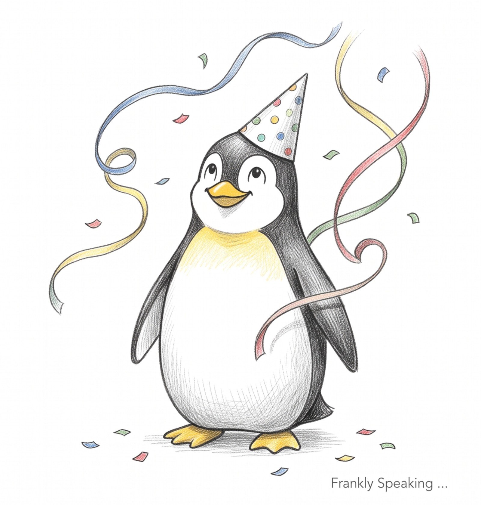

[Linux][linux] is celebrating its [35th birthday][history], and commentators are
once again asking if 2026 will finally be the "year of the Linux desktop". For
the broader industry, that phrase has been a running joke for decades. But for
me, the answer is much simpler: Linux has been the right environment for my work
for years, and I have never really looked back.

My own journey with Linux began in 1999, when I set out to build an open source
development environment. That was a decision driven by my professional work. In
those early days, I was focused on development tools and machine performance. I
tuned kernels, adjusted desktop settings, and stripped systems down to maximise
the performance of my modest hardware.

I moved between RPM- and DEB-based distributions, and I even spent a rewarding
period on FreeBSD. It was a good learning experience, and it was fun. That sense
of fun is often overlooked, but it matters. As a developer, having access to a
broad range of command-line tools and open source programming languages enriched
my work and expanded my skill set. Linux gave me room to experiment, to learn,
and to become more capable at what I did.

Over time, I grew to trust it. It supports me, and it gives me the freedom to
work in a way that feels natural. That trust became especially clear when I
tried a shiny new MacBook and was pleased to find many of the same tools
available, but the pleasure was short-lived. By then, Linux had shown me the
value of choice: I did not want Apple or Microsoft telling me how my workflow
should operate or how I should approach upgrades.

Linux satisfied my needs as a developer, and it made the transition into system
administration much easier. It adapted to my requirements and helped me grow. In
the later years of my career, I mentored and trained bright new cohorts in our
company. Again, Linux proved flexible enough to support my needs while I built
and refined my practice. I maintained a personal [wiki][dokuwiki] to record
ideas, solutions, and lessons from the professional challenges I faced. Its
close adherence to standards, mature development processes, and extensive
documentation gave me the foundation to keep learning and improving.

Now, in retirement, I still enjoy the freedom that Linux provides. I can tinker,
experiment, and work in the way I want to work. My [base][base] system is stable
and managed by [automation][ansible] tools that keep my machines consistent and
synchronised to the latest packages, without sacrificing my personalisations or
essential applications.

I spend less time managing my system and more time enjoying it. The
functionality keeps expanding, and importantly, I have never felt that I was
missing something important enough to force me onto another operating system.
Linux just works, and it has been doing so for a long time.

So, thank you to the open source community. Thank you, Linus Torvalds. You gave
me the freedom to grow, to be productive, and to enjoy the tools I use every
day. That is why Linux has never felt like a compromise to me; it has always
felt like the right environment for the work I wanted to do.

Happy birthday, Linux!

[ansible]: https://frankhjung.blogspot.com/2026/04/managing-my-debian-systems-with-ansible.html
[base]: https://wiki.debian.org/Xfce
[dokuwiki]: https://frankhjung.blogspot.com/2026/02/why-i-still-maintain-private-wiki-in.html
[history]: https://en.wikipedia.org/wiki/History_of_Linux
[linux]: https://www.linux.org/
