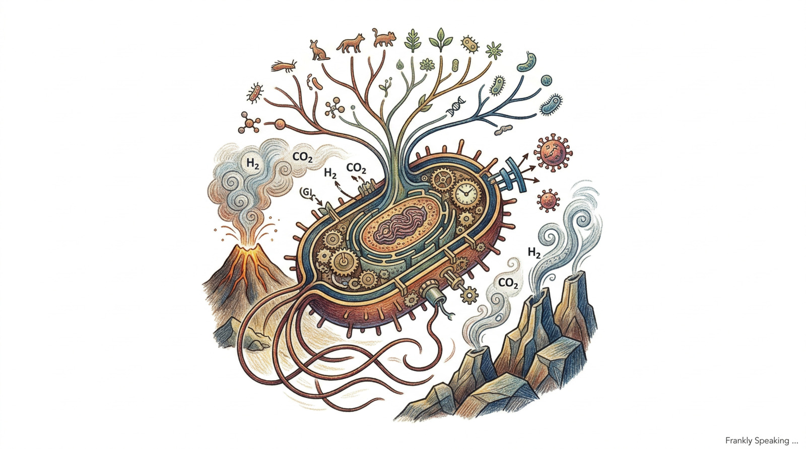
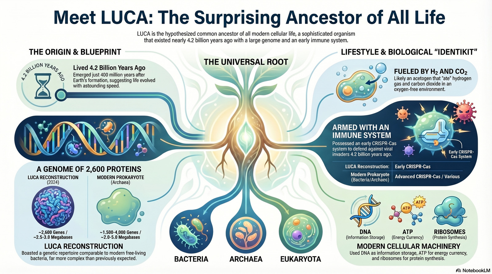

_For some time now, I’ve been following discoveries about our last universal
common ancestor, LUCA. I’ve drawn this article together from several sources,
especially the 2024 paper by Moody and colleagues, as a short introduction to
current thinking. What keeps drawing me back is the scale of the question: if
every living thing on Earth belongs to one immense family tree, then LUCA is the
deepest ancestor modern biology can meaningfully glimpse._

I think many of us picture the earliest life as fragile and barely formed, as if
evolution had to crawl for ages before it could produce a proper cell. But newer
evidence points in a very different direction. In particular, the 2024 work by
Moody and colleagues, using the ALE (Ancestral Lineage Estimation) approach,
suggests that LUCA was not some hazy halfway stage between chemistry and life.
It already seems to have been surprisingly sophisticated.

What strikes me first is just how capable LUCA appears to have been. Current
estimates suggest that it had a genome of about 2.75 megabases, with roughly
2,633 to 2,657 protein-coding genes. In other words, this was no primitive blob.
It seems to have been a complex
[anaerobic acetogen](https://en.wikipedia.org/wiki/Acetogen), already using
[ATP](https://en.wikipedia.org/wiki/Adenosine_triphosphate), already relying on
[iron-sulphur clusters](https://en.wikipedia.org/wiki/Iron%E2%80%93sulfur_cluster),
and already running an H₂-dependent
[Wood–Ljungdahl pathway](https://en.wikipedia.org/wiki/Wood%E2%80%93Ljungdahl_pathway)
to make a living from hydrogen and carbon dioxide. When I read these
reconstructions, I do not picture a biological beginner. I picture something
much closer to a recognisable, free-living microbe.

Just as striking is the timing. Current estimates place LUCA at about 4.2
billion years ago, with a likely range of 4.09 to 4.33 billion years. That is
astonishingly early. Since Earth probably became habitable around 4.3 to 4.4
billion years ago, life may have moved from prebiotic chemistry to something
remarkably complex in as little as 100 to 200 million years. I find that even
harder to grasp than the complexity itself, because it suggests that once the
conditions were right, life may have got going very quickly indeed.

And that quick start may have happened on a planet that was anything but calm.
If LUCA lived before or during the era we associate with the [Late Heavy
Bombardment](https://en.wikipedia.org/wiki/Late_Heavy_Bombardment), then early
life was not just emerging quickly; it was doing so under conditions that seem
almost absurdly hostile. To me, that makes life look less delicate than we often
assume. It starts to look resilient, opportunistic, and very hard to stamp out.

Another detail I keep returning to is the evidence that LUCA may already have
been dealing with viruses. Some reconstructions suggest the presence of a
primitive immune or defence system, perhaps
[CRISPR](https://en.wikipedia.org/wiki/CRISPR)-like or RNA-based. If that
picture is right, then the earliest biosphere was not a quiet little nursery. It
was already an arms race. Even at that depth in time, life was adapting not only
to the chemistry of its environment but also to pressure from other replicators
trying to exploit it.

Seen that way, LUCA starts to look less like a lone pioneer and more like part
of a community. The most plausible setting still seems to involve anaerobic
hydrothermal environments, though genes associated with UV protection hint that
shallower settings may also have played a part. Either way, LUCA probably lived
in an ecosystem in which one organism’s waste became another’s food. Acetate and
carbon dioxide could have fed other microbes, including early methanogens,
creating a small but functioning world of recycling and exchange. To me, that
feels far more realistic than the old image of a single heroic first cell
standing alone.

To understand how something this capable could arise so early, it helps to step
back to the ideas of FUCA and the progenote stage. FUCA, the first universal
common ancestor, is usually imagined as something earlier and less cell-like
than LUCA: a precursor associated with the origin of the genetic code and the
earliest forms of translation. Some researchers place a more fluid phase of life
between FUCA and LUCA, often called the progenote stage. In that picture,
genomes were unstable, mutation rates were high, and horizontal gene transfer
was rampant. Stable cellular life may have emerged not by becoming faster and
wilder, but by slowing down enough to preserve reliable inheritance.

This is where the debate becomes especially interesting. Massimo Di Giulio, for
example, has argued that the enormous difference between Bacteria and
[Archaea](https://en.wikipedia.org/wiki/Archaea) may be easier to explain if
LUCA was still somewhat progenote-like rather than fully modern in the way later
cells became. What seems increasingly clear, though, is that the earliest
chapter of life was not simple in any everyday sense of the word.

Taken together, these clues are why I find LUCA so fascinating. The closer we
look, the less it resembles a feeble first spark and the more it resembles a
capable organism embedded in a living world. If that picture is even roughly
right, its implications reach well beyond Earth’s own history. It may mean that
life can become established quickly on Earth-like planets once the chemistry and
environment line up. At the same time, LUCA leaves us with a deeper mystery:
what happened in the short but extraordinary interval before it?

If you want to explore the topic further, these are the sources I found useful:

1. Moody, C., Pisani, D., Lenton, T. M., et al. (2024). "The nature of the last
   universal common ancestor and its impact on the early Earth system." _Nature
   Ecology & Evolution_. <https://www.nature.com/articles/s41559-024-02461-1>

2. _Science and Culture_. (2024). "A Lot of Evolution: LUCA Required 2,600
   Genes."
   <https://scienceandculture.com/2024/08/that-is-a-lot-of-evolution-study-finds-luca-required-2600-genes/>

3. Di Giulio, M. (n.d.). "Progenote vs. Cellular LUCA Debate."
   <https://www.scribd.com/document/894805699/ssrn-4963029>

4. "The complex 4.2 billion year old LUCA." (2026). _Podcast_.
   <https://open.spotify.com/episode/0tXx7yVfdTO56V3qmaLXQ7?si=SBA13flWTbeu7igdQBKLOw>

5. _Wikipedia contributors_. "Last universal common ancestor." _Wikipedia_.
   <https://en.wikipedia.org/wiki/Last_universal_common_ancestor>

6. "The Search for the Origin of Life (Excerpt)." (2016). _Scientific American_.
   <https://www.scientificamerican.com/article/the-search-for-the-origin-of-life-excerpt/>
