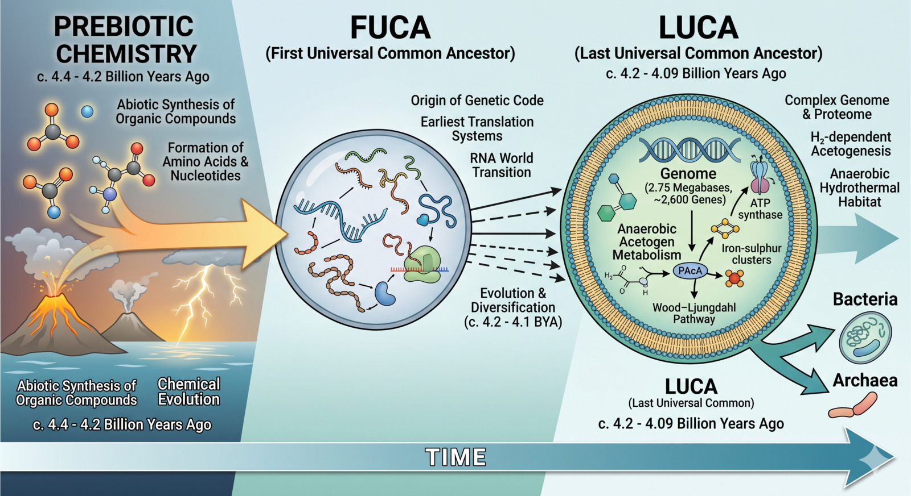

_For some time, I have been following research on LUCA—the last universal common
ancestor of all life on Earth. This short article draws mainly on recent work,
especially the 2024 paper by Moody and colleagues, as an introduction to current
thinking._

_What makes LUCA so compelling is the scale of the question it represents. This
is not just another organism in the history of life, but the most recent point
from which all modern biology descends. What seems increasingly clear is that
this starting point was not simple in any everyday sense of the word._

Many of us picture the earliest life as fragile and barely formed—a transitional
step between chemistry and biology. In that picture, complexity emerges slowly
over immense stretches of time.

Current evidence points in a different direction. LUCA appears to have been a
recognisable, free-living microbe rather than a primitive intermediate. It
likely possessed core systems we associate with modern cells, including:

- A genetic code and protein synthesis machinery
- Ribosomes and RNA-based information processing
- Basic metabolic pathways
- A cell boundary separating it from its environment

Rather than representing the beginning of biological complexity, LUCA already
reflects a system that had undergone substantial evolutionary refinement.

Looking more closely at metabolism and environment, reconstructed evidence
suggests that LUCA was an anaerobic organism, probably an
[acetogen](https://en.wikipedia.org/wiki/Acetogen), living in an environment
without oxygen.

It likely derived energy from simple chemical gradients, possibly in settings
such as hydrothermal vents.

These conclusions are based on genomic reconstruction and comparative biology,
so they remain informed inferences rather than settled facts. Even so, the
emerging picture is consistent: LUCA was metabolically capable and well adapted
to its environment.

Timing is another striking part of this story.

LUCA may have lived around 4.2 billion years ago, not long after the Earth
became habitable.

That is exceptionally early. It suggests that the transition from prebiotic
chemistry to organised, cellular life may have occurred more rapidly than
previously assumed.

Early Earth itself helps explain why this matters. It was a harsh environment,
shaped by intense heat, radiation, and frequent impacts. Despite this, LUCA
appears to have been resilient.

Another detail is that LUCA may already have been dealing with viruses. Some
reconstructions suggest the presence of a primitive defence system, perhaps
[CRISPR](https://en.wikipedia.org/wiki/CRISPR)-like or RNA-based. If that
picture is right, then the earliest biosphere was not a quiet little nursery. It
was already an arms race. Even at that depth in time, life was adapting not only
to the chemistry of its environment but also to pressure from other replicators
trying to exploit it.

This does not read as fragility. It reads as resilience.

The same pattern appears in LUCA's likely relationships with other organisms.

It is unlikely that LUCA existed in isolation. A more plausible picture is that
it was part of a broader microbial ecosystem in which different organisms
interacted and exchanged resources.

In such a system, one organism's waste could become another's resource. This
kind of interdependence is a defining feature of modern ecosystems, and it may
have been present from very early on.

Stepping further back, LUCA was not the first life form.

It sits at the point where modern lineages converge, but earlier stages must
have existed.

Researchers sometimes refer to FUCA—the first universal common ancestor—as a
hypothetical earlier state. Before LUCA, life may have consisted of loosely
organised entities, often called progenotes, in which genetic information was
not yet stably inherited.

In this view, early evolution involved a transition from flexible, error-prone
systems to more stable, reliable ones. Cellular life may have emerged not by
becoming more dynamic, but by becoming more consistent in how information was
stored and transmitted.

Taken together, these ideas suggest a different starting point.

The earliest chapter of life on Earth may already have been complex, structured,
and adaptive.

If that picture is roughly right, the implications extend beyond Earth's
history. It raises the possibility that, given suitable conditions, life
elsewhere might also emerge relatively quickly—and with a surprising degree of
sophistication.

Sources are listed below for further reading.

Primary research:

- [The nature of the last universal common ancestor (Moody et al.,
  2024)](https://www.nature.com/articles/s41559-024-02461-1) — Primary research
  paper in Nature Ecology & Evolution.

Secondary and explanatory sources:

- [LUCA Required 2,600 Genes (Science and Culture,
  2024)](https://scienceandculture.com/2024/08/that-is-a-lot-of-evolution-study-finds-luca-required-2600-genes/)
  — A breakdown of the genomic complexity of our ancestor.
- [Progenote vs. Cellular LUCA Debate (Di
  Giulio)](https://www.scribd.com/document/894805699/ssrn-4963029) — Exploration
  of the theoretical stages of early life (preprint).
- [Wikipedia: Last universal common
  ancestor](https://en.wikipedia.org/wiki/Last_universal_common_ancestor) — A
  comprehensive community-maintained overview.
- [The Search for the Origin of Life (Scientific
  American)](https://www.scientificamerican.com/article/the-search-for-the-origin-of-life-excerpt/)
  — An excerpt exploring the broader context of prebiotic chemistry.
- [Podcast: The complex 4.2 billion year old LUCA
  (2026)](https://open.spotify.com/episode/0tXx7yVfdTO56V3qmaLXQ7?si=SBA13flWTbeu7igdQBKLOw)
  — Audio discussion on the latest timeline estimates.
