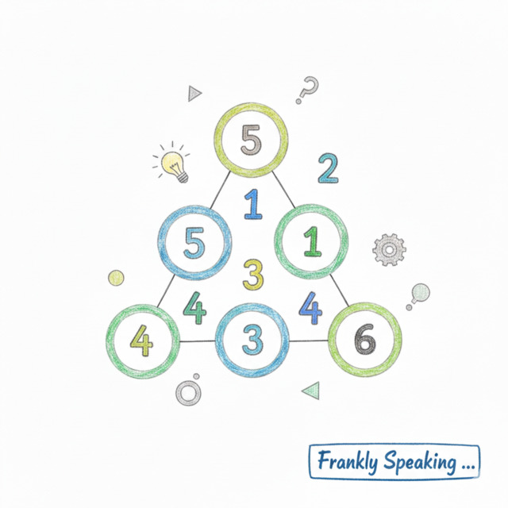
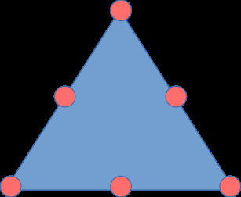
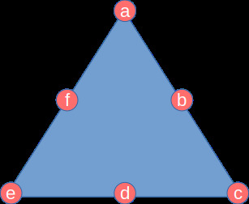
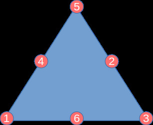
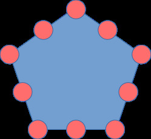
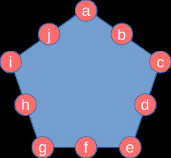

## Magic Triangles

This puzzle features in [CSIRO](https://www.csiro.au/)'s [Double
Helix](https://doublehelixshop.csiro.au/) blog post, [A Magic Triangle
Brainteaser](https://blog.doublehelix.csiro.au/a-magic-triangle-brainteaser/).

The
[Magic Triangle](https://en.wikipedia.org/wiki/Magic_triangle_(mathematics))
problem involves arranging integers on a triangle. Consider a triangle with a
circle at each vertex and along each side:



Arrange the numbers 1 to 6 in the circles so that each side sums to the same
value.

This specific challenge requires each side to sum to 10.

### Method for Triangles

First, label the nodes sequentially starting from any vertex:



The solution involves the following steps:

1. Generate all permutations of numbers 1 to 6 as $a, b, c, d, e, f$.
1. Filter permutations to satisfy the magic shape condition: $a + b + c = c + d
   + e = e + f + a$.
1. Apply the final condition: $a + b + c = 10$.

#### Using Haskell

Generate all permutations of the numbers 1 to 6:

```haskell
import Data.List

permutations [1..6]
```

This yields $6! = 720$ permutations.

Filter for sides with equal sums:

```haskell
[
  [(a,b,c), (c,d,e), (e,f,a)] | [a,b,c,d,e,f] <- permutations [1..6],
    a+b+c == c+d+e &&
    c+d+e == e+f+a
]
```

This produces all solutions where the sides have equal sums:

```text
  [(3,2,5),(5,4,1),(1,6,3)]
  [(2,4,3),(3,5,1),(1,6,2)]
  [(1,5,3),(3,4,2),(2,6,1)]
  [(1,4,5),(5,2,3),(3,6,1)]
  [(5,3,4),(4,2,6),(6,1,5)]
  [(6,2,4),(4,3,5),(5,1,6)]
  [(4,5,2),(2,3,6),(6,1,4)]
  [(6,3,2),(2,5,4),(4,1,6)]
  [(2,3,6),(6,1,4),(4,5,2)]
  [(4,1,6),(6,3,2),(2,5,4)]
  [(3,4,2),(2,6,1),(1,5,3)]
  [(1,6,2),(2,4,3),(3,5,1)]
  [(5,4,1),(1,6,3),(3,2,5)]
  [(4,3,5),(5,1,6),(6,2,4)]
  [(6,1,5),(5,3,4),(4,2,6)]
  [(3,6,1),(1,4,5),(5,2,3)]
  [(5,2,3),(3,6,1),(1,4,5)]
  [(2,6,1),(1,5,3),(3,4,2)]
  [(3,5,1),(1,6,2),(2,4,3)]
  [(1,6,3),(3,2,5),(5,4,1)]
  [(5,1,6),(6,2,4),(4,3,5)]
  [(2,5,4),(4,1,6),(6,3,2)]
  [(6,1,4),(4,5,2),(2,3,6)]
  [(4,2,6),(6,1,5),(5,3,4)]
```

Filter for sides summing specifically to 10:

```haskell
[
  [(a,b,c), (c,d,e), (e,f,a)] | [a,b,c,d,e,f] <- permutations [1..6],
    a+b+c == 10 &&
    c+d+e == 10 &&
    e+f+a == 10
]
```

This yields the following list of solutions:

```text
[(3,2,5),(5,4,1),(1,6,3)]
[(1,4,5),(5,2,3),(3,6,1)]
[(5,4,1),(1,6,3),(3,2,5)]
[(3,6,1),(1,4,5),(5,2,3)]
[(5,2,3),(3,6,1),(1,4,5)]
[(1,6,3),(3,2,5),(5,4,1)]
```

These solutions are not unique, as the list includes rotations and reflections.
To isolate the unique solution, impose an ordering constraint on the vertices:

```haskell
[
  [(a,b,c), (c,d,e), (e,f,a)] | [a,b,c,d,e,f] <- permutations [1..6],
    a+b+c == 10 &&
    c+d+e == 10 &&
    e+f+a == 10 &&
    a > c &&
    c > e
]
```

This yields the unique solution:

```text
[(5,2,3),(3,6,1),(1,4,5)]
```

Refined Haskell implementation:

```haskell
[
  [(a,b,c), (c,d,e), (e,f,a)] | [a,b,c,d,e,f] <- permutations [1..6],
    all (==10) [a+b+c, c+d+e, e+f+a] &&
    a > c && c > e
]
```



Verify the answer on the [CSIRO
page](https://blog.doublehelix.csiro.au/a-magic-triangle-brainteaser/#answer).

### Using Python

[Python](https://www.python.org/) supports [list
comprehensions](https://docs.python.org/3/tutorial/datastructures.html#list-comprehensions)
comparable to Haskell's. The
[`permutations`](https://docs.python.org/3/library/itertools.html#itertools.permutations)
function from the
[`itertools`](https://docs.python.org/3/library/itertools.html) module generates
the candidates:

```python
import itertools

[
  [(a,b,c),(c,d,e),(e,f,a)]
    for a,b,c,d,e,f in list(itertools.permutations(range(1,7)))
      if a+b+c == 10 and c+d+e == 10 and e+f+a == 10
        and a > c and c > e
]
```

This yields the same result:

```text
>>> [[(5, 2, 3), (3, 6, 1), (1, 4, 5)]]
```

## Magic Pentagons

The pentagon below features 10 circles: five at the vertices and five at the
edge midpoints. Place the numbers 1 to 10 in the circles so that each side sums
to the same value.



### Method for Pentagons

To find solutions where all sides sum to an equal value, first label the
vertices:



Similar to the magic triangle approach, we search all permutations for those
where side sums are equal. The search is limited to the first result for each
total sum.

```haskell
import Data.List
import Data.Maybe

solve :: Int -> Maybe [(Int,Int,Int)]
solve n
    | null ns   = Nothing
    | otherwise = Just (head ns)
    where ns = [ [(a,b,c), (c,d,e), (e,f,g), (g,h,i), (i,j,a)]
                  | [a,b,c,d,e,f,g,h,i,j] <- permutations [1..10],
                    all (==n) [a+b+c, c+d+e, e+f+g, g+h+i, i+j+a] ]
```

Solutions are calculated for side sums from 10 to 27:

```haskell
-- solve for sums 10 to 27
solutions = map solve [10..27]
```

The range 10–27 is generous. While theoretical bounds for a side sum with inputs
1-10 are 6 and 27, the pentagon's constraints narrow this significantly (likely
14-19).

Show the solutions:

```haskell
-- show solutions
zip [10..27] solutions
```

The solutions are:

```text
10: Nothing
11: Nothing
12: Nothing
13: Nothing
14: Just [(3,6,5),(5,7,2),(2,8,4),(4,9,1),(1,10,3)]
15: Nothing
16: Just [(5,2,9),(9,4,3),(3,6,7),(7,8,1),(1,10,5)]
17: Just [(6,9,2),(2,7,8),(8,5,4),(4,3,10),(10,1,6)]
18: Nothing
19: Just [(8,5,6),(6,4,9),(9,3,7),(7,2,10),(10,1,8)]
20: Nothing
21: Nothing
22: Nothing
23: Nothing
24: Nothing
25: Nothing
26: Nothing
27: Nothing
```

Dr Stephen Weissenhofer from the School of Computing, Data and Mathematical
Sciences at [Western Sydney University](https://westernsydney.edu.au) kindly
provided these problems.
