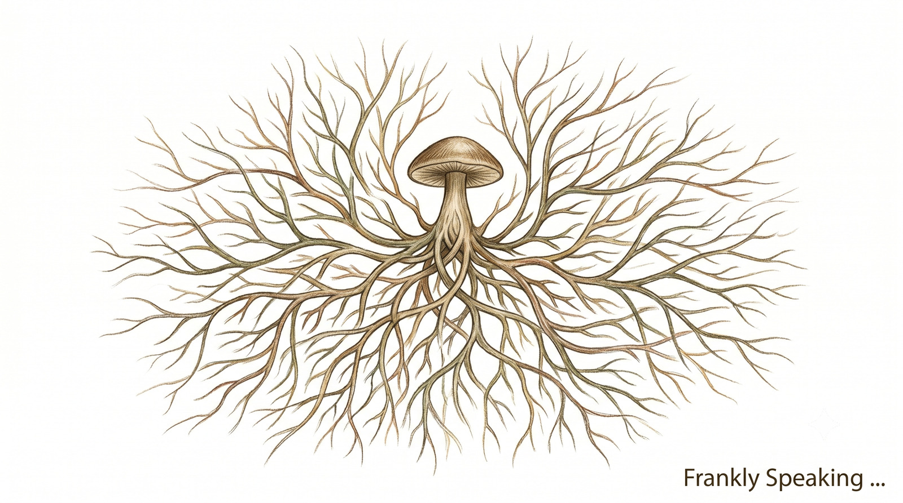
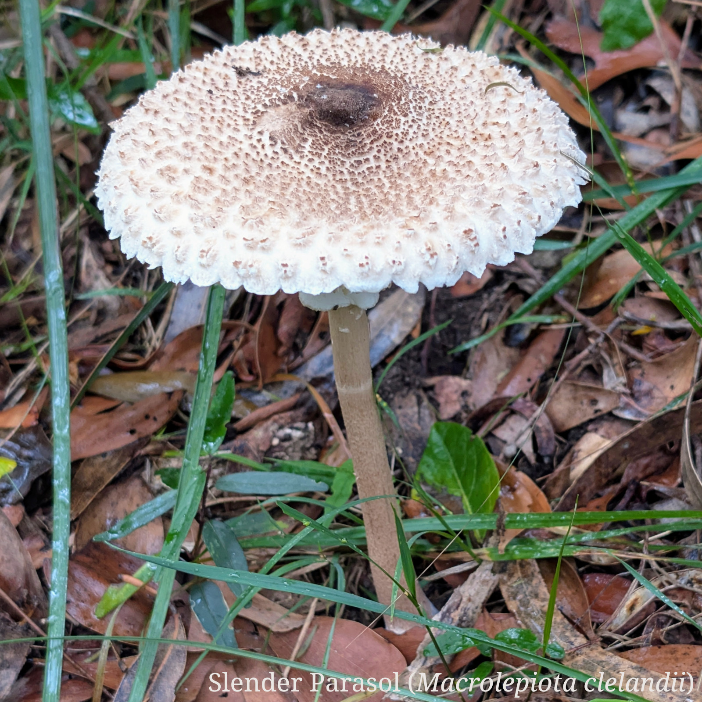
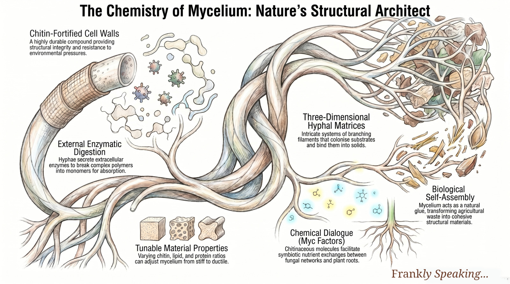
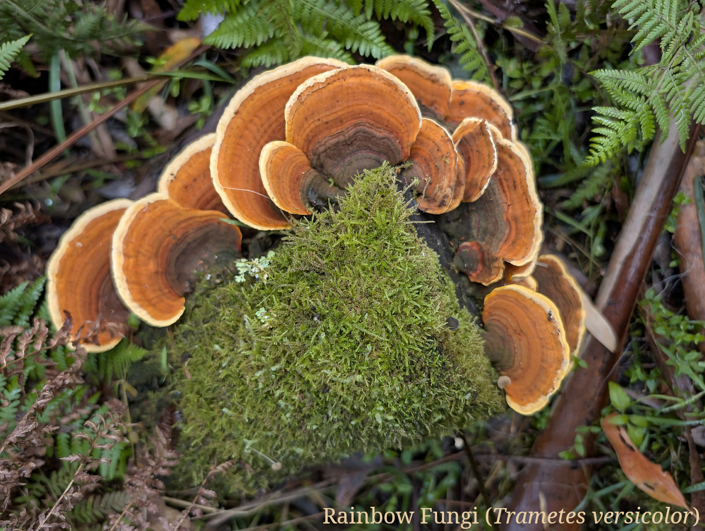

_Over the weekend, I had the chance to explore a local forest with my partner.
As we wandered along the track, we came upon a variety of mushrooms and fungi
sprouting from the forest floor. It was a magical moment that sparked my
curiosity about these fascinating organisms._

When I think of the terrestrial world, I usually picture plants as the
foundational pillars of life on land. However, long before the first leaves
reached for the sun, a vast, hidden network was already laying the groundwork:
[fungi][fungi]. What fascinates me about fungi is how they exist in a category
entirely their own—neither plant nor animal, yet holding the world together.

Molecular evidence suggests they diverged from a common eukaryotic ancestor
roughly 1.5 billion years ago (much like the deep evolutionary history I
explored in my post on [LUCA][luca]). Surprisingly, they are closer evolutionary
cousins to animals than plants. In their earliest days, these organisms likely
lived in water and possessed [flagella][flagella]. But as life eventually
crawled out of the ancient seas, fungi were the pioneering forces that made the
barren rock of early Earth habitable.

## Pioneering Land Before Plants

The evolutionary history of fungi is deeply mysterious, largely because their
soft, fleshy tissues and microscopic structures do not fossilise well. However,
recent breakthroughs have drastically altered our timeline.

Fossilised remains of mycelium—a network of interconnected microscopic
strands—have been found in rocks dating back 715 to 810 million years ago,
during the Neoproterozoic era. This discovery proved that fungi were present on
land about 300 million years earlier than the scientific community previously
believed. Found in rocks formed in coastal lakes and lagoons, these ancient
fungi were perfectly positioned in the transitional zones between water and
land. Consequently, scientists believe these early fungal networks acted as
crucial partners for the first plants that eventually colonised the Earth's
surface roughly 500 million years ago.

To survive on land, fungi had to evolve completely new ecological strategies to
obtain nutrients. Moving away from their aquatic origins, they developed
symbiotic [mycorrhizal][mycorrhiza] relationships, as well as saprotrophy
(decaying matter) and parasitism.

## The Chemistry of Mycelium

To understand how fungi conquered the world, we must look at their chemistry and
their primary structure: the [mycelium][mycelium].

Mycelium is a root-like structure consisting of a massive, branching network of
thread-like hyphae. Unlike animals, which ingest their food, fungi digest their
food externally. Through the mycelium, a fungus secretes powerful enzymes onto
or into a source of nutrition. These enzymes break down large, complex
biological polymers into smaller units (monomers), which the mycelial network
then physically absorbs through active transport and facilitated diffusion.

Chemically, fungi are heavily fortified. Their cell walls contain
[chitin][chitin], a highly durable compound that allows them to withstand
various environmental pressures.

## The Alchemists of Decay

In the evolutionary grand scheme, fungi carved out a unique niche: they are the
great decomposers. As Scott Baker, a biologist at the Pacific Northwest National
Laboratory, puts it: "We all live in the digestive tract of fungi."

About 400 million years ago, plants developed wood containing a resilient
polymer called [lignin][lignin]. This provided crucial structural support for
plants to grow upright and transport water, but it also made them exceptionally
difficult to decompose. For millions of years, very little could break down
lignin; when trees died, they accumulated in swamps, eventually forming the
Earth's vast coal beds. According to the classic evolutionary lag hypothesis, it
was not until around 300 million years ago that a group known as "white rot
fungi" evolved the unprecedented chemical ability to break down lignin using
specialised enzymes. While geologists now believe that wet, anoxic climates also
played a major role in preventing decay during this era, the arrival of [white
rot fungi][white-rot] permanently transformed the global carbon cycle.

Later, another group called "brown rot fungi" evolved from early white rot
species with an even more specialised chemical toolkit. Instead of relying
solely on enzymes, [brown rot][brown-rot] fungi use a "chelator-mediated Fenton
reaction" (CMF). The fungus secretes hydrogen peroxide and iron-reducing
chelators that react with naturally occurring iron in the wood. This process
generates highly reactive hydroxyl radicals that rapidly disrupt cell walls.

By mastering the chemistry of decomposition, mycelial networks not only secured
their own survival but ensured that carbon and essential nutrients could be
endlessly recycled. The world as we know it—fertile soils, towering forests, and
complex ecosystems—is ultimately built upon this ancient, microscopic web. It is
a humbling reminder that our terrestrial existence depends on the quiet,
tireless work of an alchemical network nearly a billion years in the making.

[brown-rot]: https://en.wikipedia.org/wiki/Wood-decay_fungus#Brown_rot
[chitin]: https://en.wikipedia.org/wiki/Chitin
[flagella]: https://en.wikipedia.org/wiki/Flagellum
[fungi]: https://en.wikipedia.org/wiki/Fungus
[luca]:
ttps://frankhjung.blogspot.com/2026/04/our-oldest-ancestor-was-surprisingly.html
[lignin]: https://en.wikipedia.org/wiki/Lignin
[mycelium]: https://en.wikipedia.org/wiki/Mycelium
[mycorrhiza]: https://en.wikipedia.org/wiki/Mycorrhiza
[white-rot]: https://en.wikipedia.org/wiki/Wood-decay_fungu
