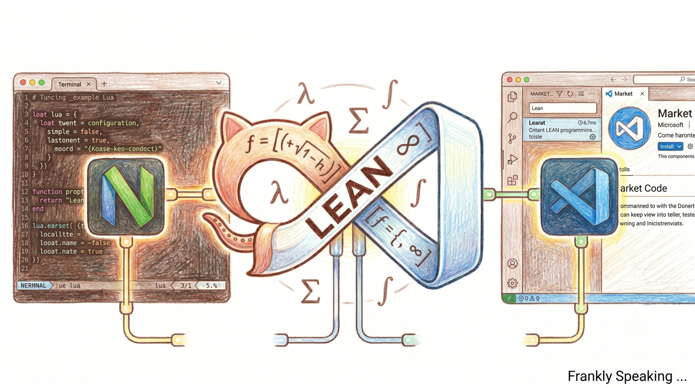

_I've been busy this month learning about the success of LLMs in the
**[Mathematical Olympiad][1]**. What interested me was not the result itself,
but the tools used by the AI teams. They used the proof assistant called
**[Lean][2]**. Lean is an interactive theorem prover and functional programming
language. It also has dependent types. That opened up a rabbit hole that has
consumed me for the past three weeks. So the **[yak shaving][3]** began…_

## Neovim

My editor of choice, [Vim][4], did not support [Lean][2]. That meant retooling
from Vim to [Neovim][5]. Instead of keeping my old Vim configuration, I decided
to go fully Neovim-native with Lua configuration. That meant reviewing my Vim
plugins and syntax files. The move was made a little harder because the version
of Neovim available on Debian testing is v0.11.6. Many useful features landed in
Neovim v0.12 and later, but those are not yet available on Debian testing. They
are, however, available on [Debian unstable][6]. I just have to be patient.

So, for each Vim plugin I had to find a Lua alternative. Once I had that, I
updated my Ansible playbooks for the Neovim installation. This took about a
week. Once I had a repeatable process, I tested it on my other machines and,
once satisfied, archived Vim from my Ansible playbooks. The plugins I ended up
with are:

| Name                | Description                                |
| ------------------- | ------------------------------------------ |
| [bufferline][7]     | Buffer display                             |
| [conjure][8]        | Lisp and Clojure support                   |
| [devicons][9]       | File icons                                 |
| [dokuwiki][10]      | DokuWiki syntax                            |
| [git][11]           | Git integration                            |
| [lean][12]          | Lean language support                      |
| [lsp][13]           | LSP configuration                          |
| [lualine][14]       | Status line display                        |
| [miniicons][15]     | Mini icons                                 |
| [sexp][16]          | Precision editing for S-expressions        |
| [sexp-mappings][17] | Sexp key mappings for regular people       |
| [tree][18]          | File explorer                              |
| [windsurf][19]      | Codeium code completion                    |

However, plugins were only part of the migration. Lean uses an extended font
set, enabling mathematicians to use familiar symbols in code and proofs. My
default terminal font did not support those characters. Neovim offers a solution
via [Nerd Fonts][20]. That meant updating my terminal emulator and reviewing
other UI tools such as Gitk, Git GUI, and Mousepad. Resetting the system font
would be the obvious thing to do, but the fonts need to be installed early in
the site's playbook, otherwise trouble might ensue.

| Name            | Description            |
| --------------- | ---------------------- |
| [adwaita][21]   | Adwaita Mono Nerd Font |
| [cousine][22]   | Cousine Nerd Font      |
| [firacode][23]  | FiraCode Nerd Font     |
| [lua-ls][24]    | Lua language server    |
| [marksman][25]  | Marksman markdown LSP  |
| [texlab][26]    | TexLab LaTeX LSP       |

Once the plugins, fonts, and LSP servers were in place, the next step was syntax
highlighting. Neovim v0.12 would have made that easier, but I still found syntax
files for my most commonly used languages, including Lean.

After a week, I had a native Neovim environment. One unforeseen benefit of the
transition was that I ended up with less Ansible code. I dropped a few plugins,
but overall the configuration was simpler for Neovim.

## VS Code

I also use VS Code. To support Lean, I installed the following extensions:

| Name              | Description                                     |
| ----------------- | ----------------------------------------------- |
| [Lean 4][27]      | Lean 4 language support for VS Code             |
| [Loogle Lean][28] | Loogle Lean search for VS Code (like Hoogle)    |

This was straightforward. VS Code's default font supports the mathematical
characters needed for Lean 4. The extensions are available through the
[official marketplace][29].

That left the main task: installing Lean, which was the whole point of the
Neovim exercise…

## Lean 4

The first thing I discovered was that Debian does not package Lean. That was
disappointing. However, after some reading, I found a package called [elan][30].
Elan works as a toolchain manager similar to Rust's `rustup` or Haskell's
`ghcup`. Elan is Lean's official version manager, which handles downloads and
updates. Once installed, it manages Lean versions. I now have all the tools
ready to start learning Lean 4.

This will be covered in the next blog post. The following introduction was
generated from my Lean 4 NotebookLM: [Software as Absolute Mathematical
Proof][31].

[1]: https://deepmind.google/blog/ai-solves-imo-problems-at-silver-medal-level/
[2]: https://lean-lang.org/
[3]: https://youtu.be/AbSehcT19u0?si=CoYAs4dVeLHqhu0x
[4]: https://www.vim.org/
[5]: https://neovim.io/
[6]: https://packages.debian.org/source/unstable/neovim
[7]: https://github.com/akinsho/bufferline.nvim.git
[8]: https://github.com/Olical/conjure.git
[9]: https://github.com/nvim-tree/nvim-web-devicons.git
[10]: https://github.com/nblock/vim-dokuwiki.git
[11]: https://github.com/NeogitOrg/neogit.git
[12]: https://github.com/Julian/lean.nvim.git
[13]: https://github.com/neovim/nvim-lspconfig.git
[14]: https://github.com/nvim-lualine/lualine.nvim.git
[15]: https://github.com/nvim-mini/mini.icons.git
[16]: https://github.com/guns/vim-sexp.git
[17]: https://github.com/tpope/vim-sexp-mappings-for-regular-people
[18]: https://github.com/nvim-tree/nvim-tree.lua.git
[19]: https://github.com/Exafunction/windsurf.nvim.git
[20]: https://www.nerdfonts.com/
[21]: https://github.com/ryanoasis/nerd-fonts/releases/download/v3.4.0/AdwaitaMono.zip
[22]: https://github.com/ryanoasis/nerd-fonts/releases/download/v3.4.0/Cousine.zip
[23]: https://github.com/ryanoasis/nerd-fonts/releases/download/v3.4.0/FiraCode.zip
[24]: https://github.com/LuaLS/lua-language-server/releases/download/3.18.2/lua-language-server-3.18.2-linux-x64.tar.gz
[25]: https://github.com/artempyanykh/marksman/releases/download/2026-02-08/marksman-linux-x64
[26]: https://github.com/latex-lsp/texlab/releases/download/v5.25.1/texlab-x86_64-linux.tar.gz
[27]: https://github.com/leanprover/vscode-lean4/
[28]: https://github.com/Shreyas4991/loogle-lean
[29]: https://marketplace.visualstudio.com/vscode
[30]: https://github.com/leanprover/elan
[31]: https://open.spotify.com/episode/4vCfmNc7V4obec3ek8DFxt?si=85y6jpuHRTeVDFo2_6fs7A
