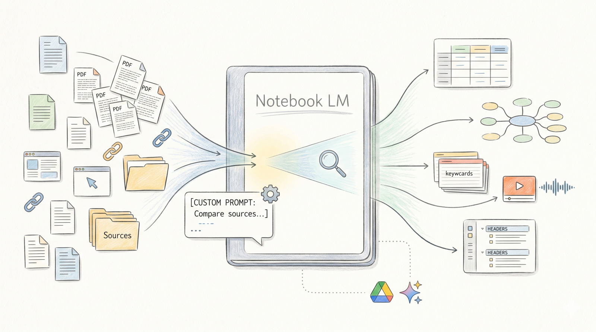

## What is it?

[Notebook LM][notebook-lm] is a research and study companion that helps you work
with your own source material. I have been using Notebook LM for nearly a year
to help prepare blog posts and do deep dives into topics that interest me.

My usual workflow is simple: I collect trusted sources as documents, PDFs or web
links, upload them into a notebook, then use chat to interrogate the content.
From there, I use studio features to generate podcasts, video overviews,
infographics, and custom reports.

In practical terms, Notebook LM feels like a custom ad hoc
[retrieval-augmented generation (RAG)][rag-wiki] tool. You upload your corpus,
then query it in context rather than relying on a general model response.

## Custom Personas

The default experience keeps improving, with better templates, export options,
and integration with tools such as Gemini and Google Drive. Those defaults are a
good starting point, but I get better outcomes when I add custom personas.

Custom personas let me control scope, tone, and output format. This is similar
to how I customise agents for LLM workflows in my IDE.

There is a large context window to describe a persona or role you want Notebook
LM to adopt. This can be as simple as "You are a helpful assistant" or as
detailed as a full CV. The **Learning Coach** below is based on one from
[ShareUHack][shareuhack-guide]:

```text
Learning Coach (for exam prep, self-study, mastering new topics):
You are a patient but demanding learning mentor. Interaction rules:
1. Never give the answer directly. Start with 1-2 guiding questions to make me
   think first.
2. When I answer correctly, push deeper ("Why?" "What if the conditions
   changed?").
3. When my understanding is wrong, correct me using specific passages from the
   sources—explain which assumption I got wrong.
4. At the end of each exchange, summarize the core concept I learned in one
   sentence.
5. Keep responses concise—focus on guiding, not lecturing.
```

I adapt this pattern by tightening the rules for each task, then reuse that
structure across my workflows. One practical tip is to keep persona descriptions
in their own notebook. That way you can copy and paste them into new notebooks
without needing to rewrite them each time.

## Use Cases

I have used Notebook LM for several recurring use cases.

### Daily Brief

This is one of the most useful patterns I discovered recently. I provide a
prompt that asks Notebook LM to monitor and compare recent research papers.

```text
You are a rigorous research advisor analysing the latest Computer Science AI
papers. Format your response as a comparison table with columns for Paper
Title, one-line Summary, and Peer Review Status. Clearly distinguish facts
from inference. If the sources do not state whether a paper is peer-reviewed,
say "The current sources do not cover this" and do not speculate. End with
a confidence rating of High, Medium, or Low based on the provided evidence.
```

From this, I get a shortlist of papers to review or import into a notebook for
deeper analysis. Before I read a full paper, I run a second prompt:

```text
Give a summary of "XYZ":
- What was the core objective of the research?
- What was the experimental method?
- What were the key findings?
- What limitations were observed during the experiments?
- What areas require further work?
- What current implementations of this work exist?
```

This gives me a fast orientation pass and helps me decide where to spend time.

### Review Product Information

I have used Notebook LM to make sense of superannuation documentation and
government legal information. It is especially helpful for answering targeted
questions quickly.

What I value most is citation tracing. Notebook LM links responses back to the
source passages, which makes verification straightforward. Even when summaries
look accurate, I still validate important decisions against the original text.

### Subject Deep Dives

This is where Notebook LM is strongest for me. I upload trusted articles,
documents, and links to websites, then use chat for rapid summarisation and
follow-up questions.

I mainly use the studio features to generate audio and video summaries. The
audio output is particularly useful for me because I can listen while commuting
or walking. I have prepared two examples. The first is a
[podcast discussing the features of Notebook LM][notebooklm-podcast]. The second
is a [short video on how to master Notebook LM][notebooklm-video].

### Study Guide

I have been working through books on functional programming in Haskell, and one
topic I found challenging was type-driven design. By uploading reference
material, I can use Notebook LM as a structured study guide.

Beyond studio output, I use mind maps, quizzes, detailed study guides, and flash
cards. These features make it easier to move from passive reading to active
revision.

## Integration with Gemini and Google Drive

A notebook can be linked into a broader workflow with [Gemini][gemini] and
[Google Drive][google-drive]. This creates a useful research ecosystem where
source collection, analysis, and synthesis are connected.

As Google continues integrating AI across its products, I expect this
cross-referencing capability to become stronger.

## Practical Notes

Notebook LM is powerful, but the quality of outcomes still depends on source
quality and prompt quality. If your source set is weak, your summary will be
weak too.

For sensitive topics, I also recommend checking the latest
[Notebook LM Help resources][notebooklm-help] and your organisation's
data-handling policies before uploading internal documents.

## Summary

My use of Notebook LM continues to grow. It helps me extract value from large
information sets and move from raw material to practical understanding faster.

If you are constantly switching between PDFs, notes, and links, it is worth
trying. Start with one focused notebook, define a clear prompt style, and build
from there.

Have you used Notebook LM? I would be keen to hear what workflows or prompts
work best for you.

[rag-wiki]: https://en.wikipedia.org/wiki/Retrieval-augmented_generation
[notebook-lm]: https://notebooklm.google/
[shareuhack-guide]: https://www.shareuhack.com/en/posts/notebooklm-advanced-guide-2026
[notebooklm-podcast]: https://open.spotify.com/episode/0r6pvbyqLYqeYadV7Kvnzy?si=TLQnjobtQu-bNLn3H4nVyg
[notebooklm-video]: https://youtu.be/cvgG08viRko
[gemini]: https://gemini.google.com/
[google-drive]: https://workspace.google.com/products/drive/
[notebooklm-help]: https://support.google.com/notebooklm/
