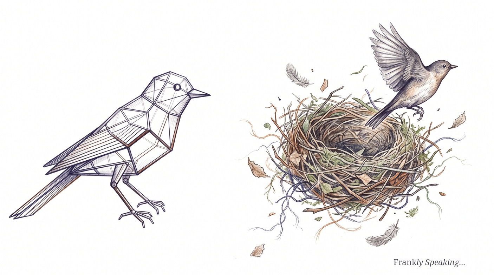

I recently read several pieces on AI and mathematics, including Stephen
Wolfram's essay on [the future of pure math research][stephen-wolfram-2026-09],
Scientific American on
[the role of mathematicians][scientific-american-2026-09], and the World Science
Festival podcast
[AI Creativity: Genius or Gimmick?][world-science-festival-2024-09]. This got me
thinking about the nature of creativity itself.

The real question isn't whether AI can produce novel work. It's whether we keep
moving the goalposts of creativity just to keep humans at the centre of the
story.

The truth is, we don't have a single, settled definition of creativity. But
whenever a machine masters something we thought was uniquely ours, our instincts
kick in. We begin insisting that true creativity demands consciousness,
intention, emotion, or lived experience. In other words, we stop judging the
work on its merits and start judging the mind behind it.

## The AI Effect and the Moving Goalposts

We've seen this pattern before. In computer science, it is known as the **AI
Effect**—or as Tesler's Theorem famously quips, *"AI is whatever hasn't been
done yet."*

We used to treat playing master-level chess, composing sonnets, or painting
photorealistic portraits as the ultimate tests of human creativity. But the
moment software mastered them, our consensus shifted. Suddenly those
achievements were "just maths," "pattern matching," or "fancy statistics." In
short, the bar moved.

The friction comes down to two different ways of looking at creativity:

* **Focusing on the outcome:** If creativity means producing ideas or works that
  are both novel and useful, then AI is already creative. It routinely serves up
  surprising combinations, cracks difficult problems, and scores highly on tests
  of divergent thinking.
* **Focusing on the process:** If creativity demands consciousness, intention,
  raw emotion, and lived experience, then AI isn't creative. It isn't a person;
  it doesn't have a point of view, memories, or feelings.

This distinction matters because we often confuse the *act* of creating with the
*experience* that makes it meaningful. The second an AI mimics human craft, we
scramble to draw a line between an output that looks creative and a mind that
actually feels creative.

## Margaret Boden's Three Types of Creativity

To keep the goalposts from sliding all over the field, researchers often turn to
cognitive scientist [Margaret Boden][margaret-boden]. She breaks creativity down
into three useful flavours:

1. **Combinational creativity:** Mixing familiar ideas in unfamiliar ways—like
   asking an AI to write a poem about quantum physics in the voice of a 1920s
   gangster. Machines shine here. They can connect dots across disciplines far
   faster and more broadly than most people could.
2. **Exploratory creativity:** Searching inside a defined conceptual space to
   uncover fresh possibilities. Think of discovering a new molecule, finding a
   clever chess tactic, or proving an elusive mathematical lemma. AI excels
   here, as AlphaGo and automated theorem provers have shown.
3. **Transformational creativity:** Breaking the rules of the game to invent an
   entirely new paradigm. This is the creativity behind Picasso, Einstein, or
   the birth of jazz. Here, AI stumbles. Models are bound by their training data
   and architectures. They can surprise us, but they can't easily rebel against
   the conceptual structures that built them.

Boden's framework shows why the debate gets so muddled. AI can be genuinely
creative in some ways while still lacking the game-changing originality we
associate with genius. That doesn't make AI a gimmick; it just means we need to
be clear about which kind of creativity we're talking about.

## The Legal Exclusion

While philosophers debate, the legal system has already drawn a hard line.

Copyright offices and patent authorities around the world have made their
position clear: authorship requires a pulse. Even if a machine generates a
stunning, valuable, and highly original design, the law refuses to recognise the
software as a creator. It insists that genuine authorship must trace back to a
human being.

That isn't a scientific finding; it's a deliberate social choice. The legal
framework wants to keep human agency at the heart of invention and art. And that
is a sensible policy, even if it leaves the deeper philosophical questions
unsettled.

## From Novelty to Wisdom

Generative AI hasn't destroyed creativity. Instead, it has forced us to untangle
two things we long lumped together: making something new, and living a human
life. If creativity is simply about the end product, machines can clearly
deliver. But the human side of the craft—intention, context, and meaning—is an
entirely different story.

The useful response isn't to dismiss artificial creativity as a cheap parlour
trick, nor is it to keep moving the goalposts whenever software surprises us.
The smarter path is to recognise what each partner brings to the table.

Human creativity isn't just about remixing ideas; it is rooted in lived
experience, community, and an innate sense of what matters. An AI can spin up an
elegant mathematical proof or write evocative verse, but it doesn't share the
human condition that gives those works emotional weight.

Without that discernment, we risk mistaking a fast engine of novelty for a
genuine source of wisdom. In the end, the real challenge isn't deciding whether
machines deserve the title of creator—it's using our own creativity to decide
which ideas are worth caring about.

[margaret-boden]: https://en.wikipedia.org/wiki/Margaret_Boden
[stephen-wolfram-2026-09]: https://writings.stephenwolfram.com/2026/09/whats-the-future-for-pure-math-research-in-the-age-of-ai/
[scientific-american-2026-09]: https://www.scientificamerican.com/article/mathematicians-confront-the-ai-apocalypse/
[world-science-festival-2024-09]: https://music.youtube.com/watch?v=wU49MKIhMRU&si=Bj_PmzA-SFyUvISw
