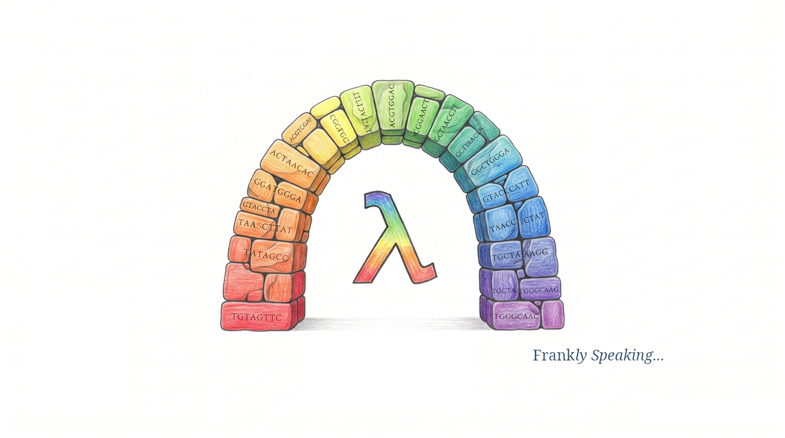

## A Puzzle Without a Picture

Genome sequencing faces a fundamental physical constraint: modern instruments
cannot read a long chromosome continuously from end to end. Instead, they
synthesise or capture millions of short sequence fragments called reads. These
range from 150 base pairs in high-throughput short-read chemistry to tens of
thousands of base pairs on long-read instruments—and well over a million base
pairs with Oxford Nanopore ultra-long protocols. Reconstructing a complete
genome from these fragments is like solving a multi-million-piece jigsaw puzzle
without the picture on the box top.

To tackle this challenge, I turned to graph-theoretical assembly frameworks.
The [Overlap-Layout-Consensus (OLC)][overlap-layout-consensus] paradigm is one
of the classic, most intuitive ways to stitch fragments into continuous
sequences called contigs.

While building [`reconstruct-strings`][reconstruct-strings]—a pure and total
Haskell implementation of a greedy OLC assembler—I set out to explore sequence
reconstruction from first principles. In this article, I walk through how the
algorithm works, the engineering problems I hit while building it, and why
long-read hardware is reviving interest in OLC.

## How Overlap-Layout-Consensus Works

The OLC paradigm decomposes [de novo genome assembly][de-novo-genome-assembly]
into a three-stage pipeline:

1. **Overlap:** I search for pairwise suffix-prefix matches across the fragment
   pool. When the tail of one fragment matches the head of another, I record a
   directed connection between them.
2. **Layout:** I condense the web of overlaps into an ordered chain of
   fragments. This step strips away transitively redundant connections—shortcuts
   that skip intermediate fragments—leaving a clean, linear path that forms a
   contig.
3. **Consensus:** I align the constituent reads across the chosen layout and
   determine the most likely nucleotide sequence at each position, using
   majority voting to resolve sequencing errors or biological variations.

As Ben Langmead puts it in his *Algorithms for DNA Sequencing* lectures, the
standard strategy for unresolvable repeats is straightforward: leave them out.
Rather than forcing false joins across ambiguous branching paths in the overlap
graph, I learned to terminate paths at repeat boundaries. That leaves some
regions unresolved, but it produces shorter contigs that are far more accurate.

## Tuning the Overlap Threshold

Setting the minimum overlap threshold ($m$) is the kind of tuning problem that
keeps assembly engineers awake at night. I quickly learned that it is a balance
between two opposing failure modes: accidental collisions and coverage
fragmentation.

The underlying tension comes from alphabet size. DNA consists of just four
nucleotides: adenine (A), thymine (T), guanine (G), and cytosine (C). With
$|\Sigma| = 4$, there are only $4^4 = 256$ possible 4-base words (4-mers).
Assuming equal nucleotide frequencies, any specific 4-mer has a probability of
$1 / 256 \approx 0.0039$ (0.39%) at any given position, making random 4-base
collisions virtually inevitable across even a modest sequence. By contrast, an
unconstrained 26-letter alphabet yields $26^4 = 456,976$ possible 4-mers
($P \approx 2.19 \times 10^{-6}$). Even though natural English word frequencies
reduce this diversity in practice, the collision risk remains orders of
magnitude lower than in DNA.

This low information density creates a severe hazard for genome assembly:

- **Setting Overlap Too Low:** If the threshold is too short, independent
  fragments from unrelated parts of the genome appear to overlap by chance. A
  greedy assembler can merge them, producing chimeric contigs or collapsing
  distinct repeat copies into one sequence.
- **Setting Overlap Too High:** If the threshold is too high, genuine physical
  overlaps between adjacent fragments get rejected. The moment physical
  coverage dips, reads cannot bridge the gap. The assembly stalls, and the
  genome fragments into tiny, disconnected pieces.

I found that the optimal threshold is a
[Goldilocks problem][goldilocks-problem]: high enough to suppress accidental
random collisions and false joins, but low enough to preserve connectivity
across the entire sequence.

| Metric | DNA (ATGC) | Text (A-Z) |
| :--- | :--- | :--- |
| Alphabet Size | 4 letters | 26 letters |
| Distinct 4-mers | $4^4 = 256$ | $26^4 = 456,976$ |
| 4-mer Odds | $1/256$ (~0.39%) | $1/456,976$ (~0.0002%) |
| Minimum Overlap | Long (exceeds repeats) | Short (unique words) |
| Flaw (Low $m$) | Chimeras & collapsed repeats | Spurious collisions |
| Flaw (High $m$) | Coverage gaps & fragments | Fragmented gaps |

For formal statistical derivations of collision probabilities and coverage
bounds, see the companion [heuristics guide][heuristics-guide].

## Five Lessons from the Haskell Implementation

Implementing a greedy OLC assembler in Haskell looked straightforward on paper:
find the pair with the longest overlap, merge them, and repeat until no overlaps
remain. In practice, turning this intuition into a robust, deterministic engine
revealed subtle edge cases and architectural discoveries.

### 1. Multiset Reduction Over Graph Mutation

Traditional assemblers rely on mutable graph pointers and in-place memory
updates. In Haskell, sequence reconstruction is more naturally modelled as pure
multiset reduction over immutable data structures.

Instead of building a sprawling graph, the engine maintains an active pool of
candidate fragments. At each step, it finds the best matching pair, merges them
into a composite contig, and returns the updated pool for the next iteration.

Domain newtypes prevent "stringly-typed" confusion, while algebraic sum types
represent failure modes explicitly as values rather than throwing exceptions:

```haskell
newtype Fragment = Fragment { unFragment :: Text }
  deriving stock (Eq, Ord, Show)

newtype Contig = Contig { unContig :: Text }
  deriving stock (Eq, Ord, Show)

data AssemblyError
  = InvalidMinOverlap !Int
  | EmptyFragmentEncountered
  deriving stock (Eq, Show)

assemble :: [Fragment] -> Int -> Either AssemblyError [Contig]
```

Returning `Either AssemblyError [Contig]` ensures invalid inputs are handled as
pure values. In Haskell, achieving true totality requires pairing this type
design with discipline: avoiding partial library functions (such as `head`)
and enabling compiler warnings like `-Wincomplete-patterns` to ensure every
pattern match is exhaustive.

### 2. Determinism Demands a Total Order

The classic greedy heuristic merges the candidate pair sharing the longest
suffix-prefix overlap. But what happens when multiple pairs share the exact same
overlap length?

Early on, I found that relying on list ordering or map traversals caused the
assembly output to vary depending on how fragments were initially ordered. In
scientific software, non-determinism is unacceptable; shuffling input reads
should never produce a different genome.

To ensure complete permutation invariance, I implemented a strict, three-tier
total order using Haskell's `Ord` typeclass and the monoidal `<>` operator:

```haskell
data OverlapCandidate = OverlapCandidate
  { prefixFragment :: !Fragment
  , suffixFragment :: !Fragment
  , matchLength    :: !OverlapLength
  } deriving stock (Eq, Show)

instance Ord OverlapCandidate where
  compare a b =
    compare (matchLength a) (matchLength b)
      <> compare (prefixFragment b) (prefixFragment a)
      <> compare (suffixFragment b) (suffixFragment a)
```

The `<>` operator falls through to lexicographical comparisons whenever overlap
lengths tie. Because all active fragments are distinct strings, this rule gives
me a deterministic merge candidate at every step.

### 3. Containment Is a Moving Target

A fragment is "contained" if it exists entirely as a substring within a longer
fragment. Filtering out contained fragments once during pre-processing seems
sufficient at first glance.

However, containment is dynamic. When the assembler merges fragment $A$ and
fragment $B$ into composite contig $AB$, that new sequence can suddenly engulf a
third fragment $C$ that was previously uncontained.

If ignored, fragment $C$ remains in the active pool, generating redundant
zero-gain merges, duplicate contigs, or infinite loops. Containment elimination
must be dynamic: after every merge, the active pool is re-evaluated to purge any
fragments engulfed by the newly formed contig.

### 4. Treat Duplicate Reads as Coverage, Not Noise

High physical sequencing coverage means that identical reads occur frequently.
In naive string matching, duplicate fragments trigger immediate issues: a read
can overlap 100% with an identical copy of itself, causing trivial
self-overlaps.

Rather than treating duplicates as errors, the assembler recognises them as
redundant physical coverage. Deduplicating identical fragments into a single
representative upfront eliminates self-overlap loops while preserving sequence
integrity.

### 5. Respect the Repeat Boundary

When testing with repetitive sequences (such as tandem `ATAT` repeats), the
greedy heuristic readily falls into overcollapsing: merging distinct genomic
copies of a repeat into a single collapsed contig, or incorrectly joining
unrelated loci into a chimeric sequence. When repeats exceed fragment lengths,
an assembler must refuse to guess; terminating at repeat boundaries is essential
to avoid false biological findings.

To stress-test these invariants, I relied on QuickCheck property-based testing.
While testing cannot formally prove totality, running randomly generated inputs
(defaulting to 100 tests per property, or more under stress testing) gives me
empirical confidence that the engine handles edge cases cleanly:

- **Crash Resilience:** The pipeline executes without uncaught exceptions on
  valid inputs.
- **Permutation Invariance:** Shuffling input fragments produces identical
  contigs.
- **Dynamic Containment:** No emitted contig is ever a substring of another.

## The Fall and Rise of OLC

Despite its conceptual elegance, classic OLC hit a scaling wall when
next-generation sequencing arrived and generated hundreds of millions of short
reads.

In a naive formulation, finding all overlaps means comparing every read against
every other read—an all-pairs search that scales as $O(N^2)$. I later learned
that real assemblers use more efficient indexes to narrow candidate pairs and
avoid brute-force quadratic work, but pairwise comparison is still expensive at
very large scale.

| Paradigm | Nodes | Edges | Path | Complexity |
| :--- | :--- | :--- | :--- | :--- |
| **OLC** | Reads | Overlaps | Hamiltonian path | NP-complete |
| **DBG** | ($k-1$)-mers | $k$-mers | Eulerian path | $O(E)$ (idealised) |

To scale, the industry shifted to [de Bruijn graphs (DBG)][de-bruijn-graphs],
which decompose reads into fixed-length $k$-mers. In an idealised formulation,
this transforms assembly from an NP-complete
[Hamiltonian path problem][hamiltonian-path] into an
[Eulerian path problem][eulerian-path] solvable in linear time ($O(E)$).
In practice, sequencing errors, coverage gaps, and repetitive sequences create
branching tangles, requiring modern DBG tools to rely on complex graph-cleaning
heuristics rather than a simple linear walk.

### The Long-Read Renaissance

Yet algorithmic paradigms often come full circle. Third-generation long-read
technologies produce reads spanning tens of thousands of base pairs—such as
[PacBio HiFi][pacbio-hifi]—and well past a hundred thousand base pairs with
ultra-long [Oxford Nanopore][oxford-nanopore] protocols.

Because individual reads are so long, they readily bridge repetitive elements
that confound short-read assemblers. Moreover, far fewer total reads are needed
to achieve coverage, making pairwise overlap search tractable once more.

This has sparked a renaissance for long-read assemblers built on overlap and
string-graph ideas, even as the field increasingly blends multiple strategies.
Rather than replacing de Bruijn graphs outright, long reads have revived a more
hybrid approach in which overlap-based methods and $k$-mer frameworks are used
alongside one another to resolve repeats, bridge difficult regions, and improve
assembly quality.

## Summary and Code Resources

Building an Overlap-Layout-Consensus assembler from scratch illustrates how
functional programming brings clarity and rigour to a problem. By treating
sequence assembly as a pure multiset reduction in Haskell, edge cases like
non-deterministic tie-breaking and dynamic containment can be resolved with
mathematical precision.

To explore the implementation and dive deeper into the mathematics:

- **Source Code:** Explore the full Haskell implementation, test suite, and
  simulation scripts on GitHub:
  [`haskell-reconstruct-strings`][reconstruct-strings].
- **Mathematical Heuristics:** For detailed statistical derivations of collision
  probabilities, coverage equations, and parameter selection formulas, read the
  companion [Assembly Dynamics and Parameter Heuristics][heuristics-guide]
  guide.

[de-bruijn-graphs]: https://en.wikipedia.org/wiki/De_Bruijn_graph
[de-novo-genome-assembly]: https://en.wikipedia.org/wiki/De_novo_sequence_assemblers
[eulerian-path]: https://en.wikipedia.org/wiki/Eulerian_path
[goldilocks-problem]: https://en.wikipedia.org/wiki/Goldilocks_principle
[hamiltonian-path]: https://en.wikipedia.org/wiki/Hamiltonian_path
[heuristics-guide]: https://github.com/frankhjung/haskell-reconstruct-strings/blob/main/docs/heuristics.md
[overlap-layout-consensus]: https://en.wikipedia.org/wiki/Sequence_assembly
[oxford-nanopore]: https://nanoporetech.com/platform/technology
[pacbio-hifi]: https://www.pacb.com/technology/hifi-sequencing/
[reconstruct-strings]: https://github.com/frankhjung/haskell-reconstruct-strings
