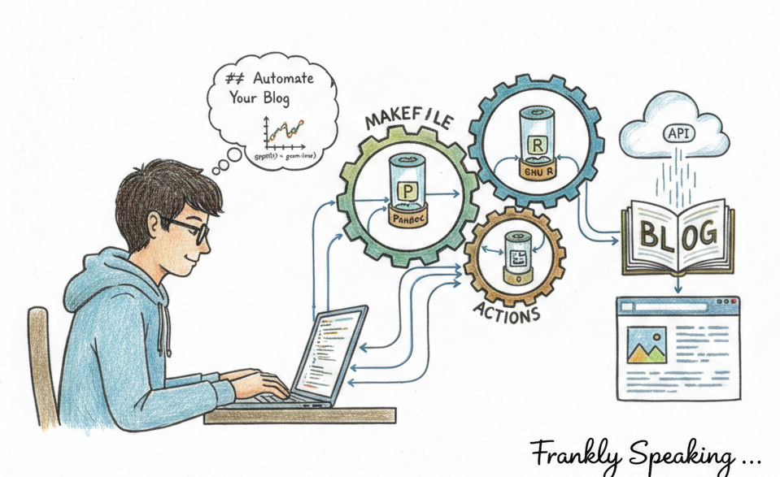
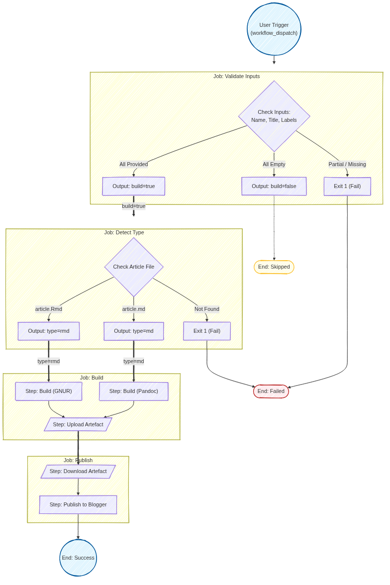

*This article is a companion piece to [From Code to Content: Automating Your
Blogger Workflow with
GitHub](https://frankhjung.blogspot.com/2026/02/from-code-to-content-automating-your.html)
which focused on the Blogger API and [The Art of the Repeatable Post: Why
Structure
Matters](https://frankhjung.blogspot.com/2026/02/the-art-of-repeatable-post-why.html),
which focuses on the importance of structure for a consistent and high-quality
blogging workflow.*

*This article ties together the concepts of automation and structure, showing
how to build a CI/CD pipeline for your technical blog using GitHub Actions and
Docker.*

## The Hook: Escaping the Manual Blogging Loop

For the modern developer, the desire to share technical insights is often
hindered by administrative overhead. We spend our professional lives in code
editors and terminal sessions, yet sharing those insights on platforms like
Blogger often requires a return to manual labour. We find ourselves copy-pasting
HTML, struggling with clunky web-based editors, and manually managing assets.
This friction discourages regular contributions, often leading to stale
repositories and abandoned drafts.*

*Treat your blog with the same engineering rigour as your production software.
By adopting a "Blogging as Code" approach, you replace manual tasks with an
automated CI/CD pipeline. This transforms your workflow from a chaotic scramble
of files into a disciplined content lifecycle.*

## Objective: A Unified, Repeatable Build Process

The primary goal of this project is to establish a consistent, automated
build process. It generates a single, web-ready HTML file from either standard
Markdown or R Markdown. Whether your content is a simple text-based tutorial or
a complex data-driven analysis, the output must be perfectly styled and ready
for the web.

"By adopting a 'Blogging as Code' approach, you can replace manual copy-pasting
with an automated CI/CD pipeline."

*By viewing your blog as a deployment target, not just a website, you
ensure every post follows a repeatable, high-quality path from your local
environment to the global reader.*

## The Foundation: Using Makefiles for Local and Cloud Consistency

In this project, GNU Make serves as the declarative blueprint for the entire
content lifecycle. Makefiles ensure the command used to build and preview an
article on your local machine is identical to the command executed by the
GitHub Actions runner in the cloud.

*This consistency comes from a shared logic system. Instead of
duplicating build rules, we use a standardised folder structure (including
`/images` and `/files`) where each article subfolder contains a link to a
central template, `article.mk`. This ensures that when you update your build
logic or CSS styling once, those improvements propagate across every post in
your repository. This approach catches formatting glitches in version control
long before they can reach your audience.*

## The Engine: Docker Containers in the GitHub Pipeline

To achieve true environment parity, we rely on containerisation. Docker
containers package every dependency—from XeLaTeX for document processing to
specific R packages—ensuring that the build never breaks due to a missing
library on a local machine or a cloud runner.

The pipeline uses three specialised images to drive the workflow:

* **frankhjung/pandoc (v3.1.11.1):** The industry standard for converting
  Markdown into clean, standalone HTML.
* **frankhjung/gnur (v4.5.2):** A heavy-duty image for processing R Markdown,
  capable of rendering complex data visualisations and statistical models.
* **frankhjung/blogger (v1.3):** The deployment interface that interacts with
  the Google Blogger API.

*A major feature of this engine is automated asset management. The Blogger image
automatically encodes local images as **Base64 data URIs**. This eliminates the
common pain point of broken image links and the need for external image hosting;
your images are embedded directly into the HTML document itself.*

## The Unified Pipeline: Markdown and R Markdown Together

The pipeline handles diverse formats within a single GitHub Actions workflow.
Rather than maintaining separate processes, the system uses conditional logic to
select the correct Docker image based on the file extension (e.g., `.md` or
`.Rmd`).

*Because both the Markdown and R Markdown subfolders utilise the same shared
`article.mk` logic, the pipeline maintains a "single source of truth." Different
content types coexist harmoniously, following the same validation and build
steps. This unified approach lets you focus on the story you're telling—whether
it's a code snippet or a data plot—knowing the deployment path is already set.*

## Why Automate? The Operational Advantages of Content CI/CD

Transitioning to "GitOps for Content" offers critical advantages that go beyond
simple time-saving:

* **Credential Management:** Sensitive credentials like your `CLIENT_ID`,
  `CLIENT_SECRET`, and `REFRESH_TOKEN` are never exposed. They are managed as
  encrypted GitHub Secrets, injected into the environment only during execution.
* **Idempotent Updates:** The system is "smart" about updates. By using the post
  title as a unique identifier, the pipeline can find and update an existing
  post instead of creating a duplicate. You can fix a typo, push to Git, and
  see the change on your blog without cluttering your feed.
* **Draft Safety Net:** To provide a final layer of protection, all new posts
  are created as **drafts by default**. This gives you one last chance for a
  manual preview in the Blogger dashboard before the content goes live.
* **Version Control:** Your blog becomes a historical record. Every edit,
  reformat, and update is tracked via Git, providing a complete audit trail of
  your intellectual contributions.

*Treating your blog as a deployment target via an API offers three key
advantages for the DevOps-minded writer: **Version Control**, **Consistency**, and
**GitOps for Content**.*

## Conclusion: The Future of Your Technical Writing

While building an automated deployment pipeline requires an initial investment
in configuration, it pays immediate dividends by permanently removing
administrative overhead. It bridges the gap between how we work—in editors and
version control—and how we share—on the web. *By treating your blog as a
deployment target, you clear the path for your creativity. You no longer need to
worry about the software required to display your insights; you only need to
worry about the insights themselves. Embrace the "Blogging as Code" philosophy,
build your pipeline, and get back to the story.*

## Explore the Source: Repositories and Images

Ready to implement "Blogging as Code" for yourself? All the components of this
project are open-source and available for you to fork, adapt, or study.

### The Toolchain (Docker Images)

These images handle the heavy lifting of conversion and deployment:

* **[frankhjung/pandoc](https://hub.docker.com/r/frankhjung/pandoc/tags):**
  Converts Markdown into clean, standalone HTML.
* **[frankhjung/gnur](https://hub.docker.com/r/frankhjung/gnur/tags):**
  Processes R Markdown for data-heavy posts.
* **[frankhjung/blogger](https://hub.docker.com/r/frankhjung/blogger/tags):**
  Manages the API handshake and asset encoding for Blogger.

### The Orchestration (GitHub Repositories)

Find the Makefiles and GitHub Action workflows in this repository:

* **[frankhjung/article-markdown](https://github.com/frankhjung/article-markdown):**
  The blueprint for standard Markdown workflows.

