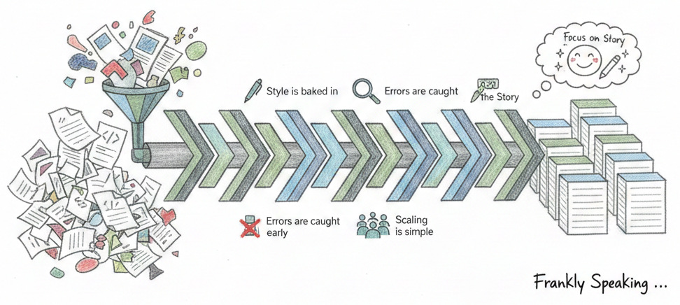

*In my [previous
article](https://frankhjung.blogspot.com/2026/02/from-code-to-content-automating-your.html),
I explored the technical "plumbing" required to connect GitHub to Blogger. It is
a powerful setup, but a pipeline is only as good as what you put into it. If
every blog post starts as a chaotic scramble of files and mismatched formats,
you are still working harder than you should.*

*The real magic happens when you move beyond just "automation" and start
embracing **a consistent project structure**.*

## Consistency is a Writer's Best Friend

When you use a standardised repository structure—like the one found in the
[article-markdown](https://github.com/frankhjung/article-markdown) framework—you
are not just organising files; you are creating a mental shortcut. Because every
post has the same folder layout, you never have to wonder where your images go
or how to name your source files.

## Professional Rigour for Every Paragraph

We often hear that we should treat "content as code". In practice, this means
your blog benefits from the same discipline as a software release. When your
project structure is repeatable:

* **Style is baked in:** Your formatting remains identical across every post.
* **Errors are caught early:** Broken links or formatting glitches are spotted
  in the repository before they ever reach your readers.
* **Scaling is simple:** If you decide to collaborate with others, they will
  immediately understand how to contribute because the "blueprints" are already
  there.

## Focus on the Story, Not the Setup

The greatest benefit of a structured publishing pipeline is the freedom it
provides. By removing the manual "toil" of publishing, you clear the path for
your creativity. You do not have to worry about the deployment; you only have to
worry about the insight you are sharing.

By investing a little time in your project structure today, you are making every
future post significantly easier to write.

## Detailed Implementation & Resources

For those who wish to dive into the technical specifics of setting up these
structures, please refer to the following resources:

* [Repository: Publish to Blogger](https://github.com/frankhjung/article-publish-to-blogspot): A template for managing the deployment process.
* [Repository: Article Markdown Framework](https://github.com/frankhjung/article-markdown): A structured environment for technical writing.
* [Repository: Blogger GitHub Action](https://github.com/frankhjung/docker-blogger): A reusable GitHub Action for deploying to Blogger.
