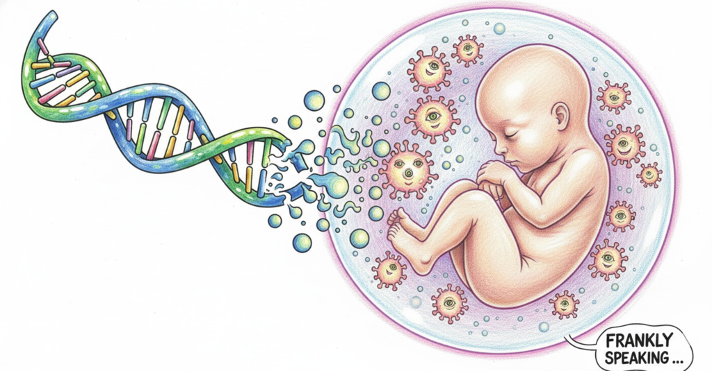
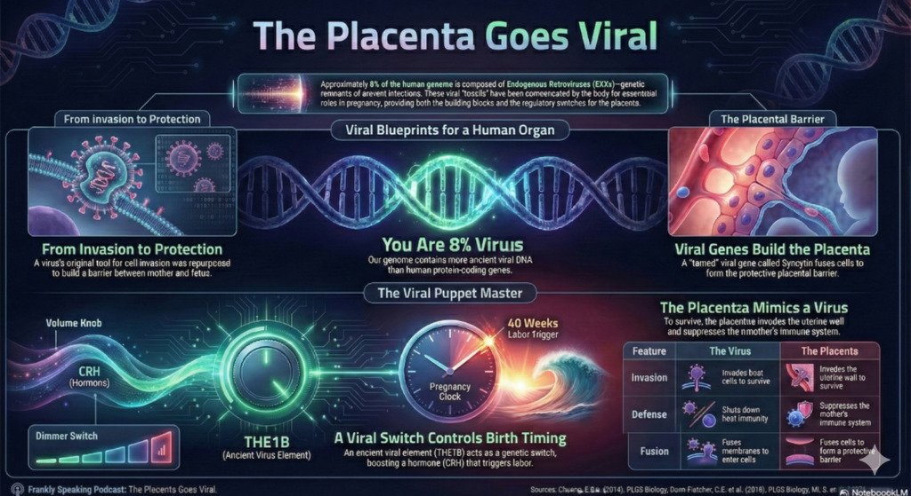
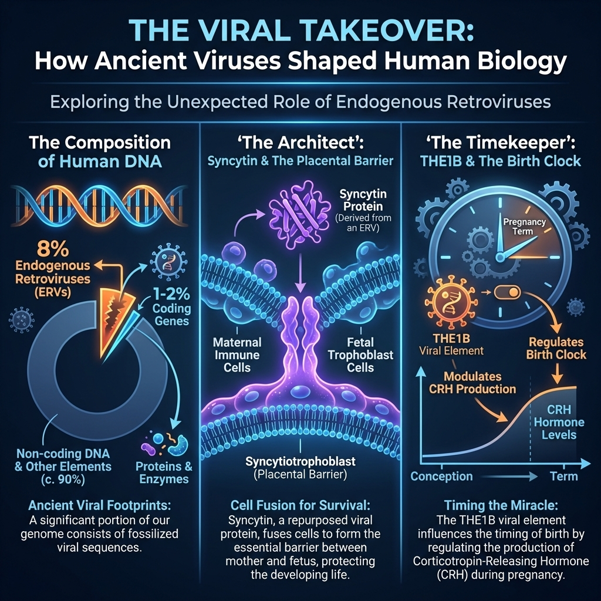

*Reading
[Pathogenesis by Jonathan Kennedy](https://www.goodreads.com/book/show/61327450-pathogenesis),
the first revelation came very early in the book. In the introduction Kennedy
claimed that human birth wouldn't be possible without an ancient retrovirus. I
went down a research rabbit hole trying to make sense of it, and that's when I
hit on this mind-bending number…*

## 8%

That is the percentage of your genome that is made up of
[Endogenous Retroviruses (ERVs)](https://en.wikipedia.org/wiki/Endogenous_retrovirus).

To put that in perspective, the protein-coding genes that make up your "human"
parts - your eye colour, your enzymes, your height - only account for about 1-2%
of your DNA. You are literally more "ancient virus" than you are "human.

Usually, we are told this is just "junk DNA"—fossils of old infections that
didn't kill our ancestors millions of years ago. But recent research suggests
something far stranger.

We didn't just survive these infections; we domesticated them. In fact, without
these ancient viral invaders, mammals as we know them likely wouldn't exist.

## The Placenta Goes Viral

There is a fascinating commentary by
[Edward Chuong](https://scholar.google.com/citations?user=VLibLeMAAAAJ&hl=en)
titled
[The Placenta Goes Viral](https://www.semanticscholar.org/paper/The-placenta-goes-viral%3A-Retroviruses-control-gene-Chuong/c8a7b62ea3d5f753b6ca726efab1cc88252bbfd7),
which perfectly captures this biological plot twist. The argument is simple: the
placenta is the most "viral" organ in the human body.

Think about what a placenta does:

1. **It invades** the uterine wall aggressively, much like a tumor or an
   infection.

2. **It suppresses** the mother's immune system so she doesn't reject the fetus
   (which is, genetically speaking, a foreign object).

3. **It fuses** cells together to create a barrier.

It turns out, the placenta behaves like a virus because it is built using stolen
viral blueprints.

## The Architect: Syncytin

The most famous example of this is a gene called
[Syncytin](https://en.wikipedia.org/wiki/Syncytin-1). Originally, this was a
viral "envelope" gene. Viruses use it to fuse their outer shell with a host cell
so they can invade it.

Millions of years ago, a primate ancestor contracted a retrovirus but didn't
die.

Instead, through a stroke of evolutionary luck, the viral gene was co-opted. We
repurposed that "fusion" tool.

Instead of fusing a virus to a cell, we use it to fuse placental cells together
into a single, massive layer called the
[syncytiotrophoblast](https://en.wikipedia.org/wiki/Syncytiotrophoblast).

This layer is the critical barrier between mother and fetus.

It facilitates nutrient exchange and, crucially, protects the baby from the
mother's immune cells. We effectively stole the burglar's crowbar and used it to
bolt our own door shut.

## The Timekeeper: THE1B

While Syncytin builds the house, it turns out viruses also run the clock.

This is the newer, deeper discovery that I find absolutely fascinating. Research
by Dunn-Fletcher and colleagues identified an ancient viral element called
[**THE1B**](https://journals.plos.org/plosbiology/article?id=10.1371/journal.pbio.2006337).

This isn't a gene that makes a protein; it's a "dimmer switch" (an enhancer).
This viral switch controls the gene for
[**Corticotropin-Releasing Hormone (CRH)**](https://en.wikipedia.org/wiki/Corticotropin-releasing_hormone).

In primates, placental CRH levels skyrocket late in pregnancy, triggering the
hormonal cascade that starts labor.

The study showed that this ancient virus, which infected anthropoid primates
about 50 million years ago, is responsible for cranking up that hormone. When
researchers deleted this viral element in mouse models, the "birth clock" broke,
and gestation length changed.

This implies that the specific timing of human pregnancy—and perhaps our ability
to give birth to large-brained babies—is regulated by a piece of alien code we
picked up 50 million years ago.

## Visualizing the Viral Takeover

Here is a visual breakdown of how this works. It covers the 8% stat, the
"Builder" (Syncytin), and the "Clock" (THE1B).

## Main Takeaway

We tend to think of evolution as a slow, gradual polish of our own genes. But
this data suggests that evolution is also a scavenger. It grabs useful tools
wherever it finds them—even from the parasites trying to kill us.

And remember, we are only talking about the 8% of our genome that we know is
viral. We still have vast stretches of so-called 'junk DNA' that we are just
beginning to understand. We used a virus to learn how to build a placenta; who
knows what other stolen tools are hiding in the dark matter of our DNA?

## More

For more see the following resources:

* Podcast:
  [Retroviruses: Ancient Viruses Built the Human Placenta](https://open.spotify.com/episode/16BBKPt6HUoo74nat8PJpq?si=KDw1dZdVTvCIMxzUPv-o4A)
* Video: [Your Inner Virus](https://youtu.be/hcjql6YAWhY)

## References

* Chuong, E.B. (2018).
  [The placenta goes viral: Retroviruses control gene expression in pregnancy.](https://journals.plos.org/plosbiology/article?id=10.1371/journal.pbio.3000028)
  PLOS Biology.

* Dunn-Fletcher, C.E. et al. (2018).
  [Anthropoid primate-specific retroviral element THE1B controls expression of CRH in placenta.](https://journals.plos.org/plosbiology/article?id=10.1371/journal.pbio.2006337)
  PLOS Biology.

* Mi, S. et al. (2000).
  [Syncytin is a captive retroviral envelope protein involved in human placental morphogenesis.](https://pubmed.ncbi.nlm.nih.gov/10693809/)
  PubMed.

* Ryan, F.P. (2004).
  [Human endogenous retroviruses in health and disease.](https://pmc.ncbi.nlm.nih.gov/articles/PMC1079666/)
