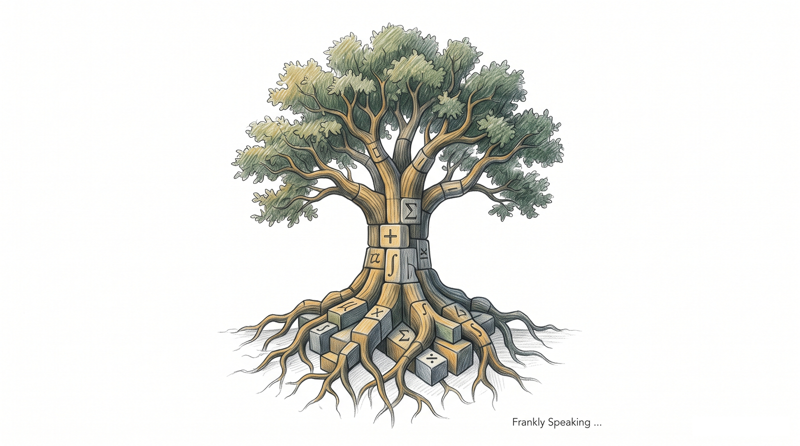

## The Fragility of Modern Foundations

Almost everything in our modern world runs on software stacks that are
terrifyingly fragile. From medical infusion pumps and power grids to autonomous
vehicles, the systems we trust with our lives routinely depend on operating
system kernels containing tens of millions of lines of code. In that kind of
monolithic architecture, a single misplaced pointer or buffer overflow in a
peripheral driver can compromise the entire machine. For decades, we have
treated software security as an endless game of whack-a-mole: patch a
vulnerability, ship an update, and hope attackers do not find the next hole
first.

The [seL4][sel4] microkernel takes an entirely different path. Rather than
trying to make a sprawling code base slightly less vulnerable, it strips the
kernel down to a minimal core of roughly 10,000 lines of C. More importantly, it
replaces wishful thinking with mathematical proof. It is not just another
operating system; it is a demonstration of what software looks like when
correctness is guaranteed from the ground up.

## A Mathematical Proof, Not Just a Program

Every working developer knows the frustration of testing. You write unit tests,
integration tests, and fuzzers, but as Edsger Dijkstra famously observed,
testing can demonstrate the presence of bugs, never their absence. seL4 escapes
this trap through formal verification. Using the Isabelle/HOL interactive
theorem prover, researchers at [NICTA][nicta] (now [Data61][data61]) and UNSW
constructed an airtight mathematical proof that the C implementation of seL4
strictly satisfies its abstract specification.

This is not a theoretical exercise; the proof covers functional correctness.
Buffer overflows, null pointer dereferences, memory leaks, and undefined
behaviours are mathematically impossible in the verified builds. On
architectures like Arm and x86, researchers have even verified the compiled
binary code, ensuring the compiler itself introduced no flaws. For the complete
technical record, [Klein et al. (2014)][klein] provide a comprehensive summary,
while [Gernot Heiser's white paper (2020)][heiser] offers an accessible
overview. The takeaway is profound: we no longer have to guess whether the
foundation holds. We have a mathematical proof that it does.

## Memory-Neutral Architecture: No Kernel Malloc

One of the most elegant departures from traditional OS design is that the seL4
kernel refuses to allocate dynamic memory for itself. There is no `malloc` in
kernel space. In a conventional operating system, when an application asks the
kernel to create a thread or open a socket, the kernel allocates memory from its
own internal pool. This creates a classic denial-of-service vector: a poorly
written or malicious application can spam requests until the kernel exhausts its
memory and crashes.

seL4 eliminates this vulnerability by making user applications responsible for
all physical memory. At boot, the kernel hands all unallocated RAM to the root
task as "Untyped Memory". Whenever an application needs the kernel to create an
object — such as a thread control block or page table — the application must
explicitly provide a slice of its own untyped memory to host that object. If
memory runs out, only the requesting application fails. The kernel remains
unharmed, making resource management explicit, predictable, and immune to
memory-exhaustion attacks.

## Capabilities: The End of Ambient Authority

Most mainstream platforms rely on "[ambient authority][ambient-authority]". If a
process runs under your user ID, it inherits all your permissions. A compromised
text editor or malicious script can read your personal SSH keys or scan your
local network simply because the operating system assumes that any code you
execute should have access to everything you own.

seL4 replaces this model with capability-based security, enforcing the Principle
of Least Privilege at the hardware level. A capability is an unforgeable token
representing a specific right to a specific resource (such as a memory region,
an endpoint, or a thread). Threads hold no ambient authority; they can perform
no action without presenting a valid capability. Furthermore, applications can
mint restricted sub-capabilities and pass them to child components without
granting broad, sweeping privileges.

| Traditional (Ambient Authority)  | seL4 (Capability-Based)             |
| :------------------------------- | :---------------------------------- |
| Authority tied to user/process.  | Authority tied to token possession. |
| Broad, unearned privileges.      | Explicit, least-privilege rights.   |
| Confused-deputy vulnerabilities. | Unforgeable, fine-grained access.   |
| Hard to sandbox components.      | Strict isolation by default.        |

## CPU Time as a First-Class Citizen

Isolating memory is only half the battle. In critical systems, you also need to
isolate time. If a low-priority logging service enters an infinite loop and
starves the flight-control thread of CPU cycles, the system still crashes.
seL4's Mixed-Criticality Systems (MCS) extension treats execution time as a
first-class managed resource, represented by a Scheduling Context. Much like a
prepaid phone plan, each context specifies an explicit budget and period (such
as 5 milliseconds out of every 20). When a thread exhausts its allotted budget,
the kernel suspends it until the next period begins.

MCS also introduces an ingenious concept called "Passive Threads". These are
worker threads that possess no scheduling budget of their own. Instead, when a
client makes an IPC call to a passive server, the server borrows the client's
time budget to process the request. This ensures that background services can
never be hijacked to consume unauthorised processor cycles.

## IPC: The Art of the Secure Rendezvous

Processes in a microkernel must communicate constantly. In seL4, Inter-Process
Communication (IPC) takes place across kernel objects called Endpoints. Unlike
desktop operating systems that buffer messages in kernel queues, seL4 uses a
synchronous "rendezvous" model. The sender and receiver must meet at the
endpoint simultaneously. The kernel copies message registers directly from one
thread's context to the other without buffering or intermediate copying, keeping
the message path blisteringly fast and deterministic.

Endpoints also serve as the secure gateway for delegating authority. A thread
can only transfer a capability across an endpoint if that endpoint possesses an
explicit "Grant" right. Because authority must be handed over deliberately,
permissions can never be leaked accidentally.

## Beyond Hope-Based Security

For decades, the software industry has accepted catastrophic vulnerabilities as
the inevitable cost of doing business. We built magnificent digital towers on
foundations of shifting sand, spending billions on defensive patches and threat
monitoring.

seL4 proves that an alternative exists. By pairing clean capability-based
abstractions with machine-checked mathematical proof, it delivers a kernel that
is verifiable, efficient, and robust against entire categories of failure. For
engineers building systems where failure is not an option, the lesson is
unmistakable: stop hoping your code is secure, and start building on foundations
that prove it.

[ambient-authority]: https://en.wikipedia.org/wiki/Ambient_authority
[data61]: https://en.wikipedia.org/wiki/Data61https://www.csiro.au/en/about/people/research-units/Technology
[heiser]: https://sel4.systems/About/seL4-whitepaper.pdf
[klein]: https://sel4.systems/Research/pdfs/comprehensive-formal-verification-os-microkernel.pdf
[nicta]: https://en.wikipedia.org/wiki/NICTA
[sel4]: https://sel4.systems/