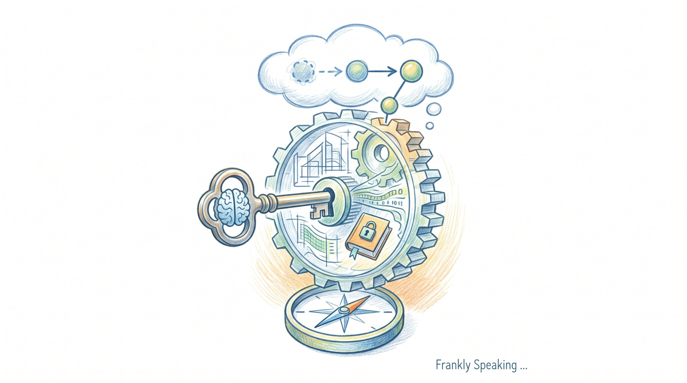

## 1. The Problem: AI Amnesia

We’ve all been there. You’re working with an AI agent, and for a moment, it
feels like magic. Then, five minutes later, it forgets the architectural
decision you just made and defaults to some generic, shallow solution. It’s
disconcerting.

The truth is, AI-assisted development often lacks discipline. We’ve moved away
from rigorous systems and into "vibe coding"—just hoping the right prompt will
magically give us a maintainable codebase. It rarely does.

[Matt Pocock](https://www.totaltypescript.com/) nailed the core frustration:

> You have access to a fleet of middling to good engineers that you can deploy
> at any time. But these engineers have a critical flaw: they have no memory.
> They don't remember things they've done before.

I’ve learned that the only way to keep these agents on track is to stop treating
them like magic chatboxes and start treating them like disciplined (if
forgetful) engineers.

The fix? Agent Skills. These are modular, encoded processes that force the AI to
follow a strict, repeatable path. By encoding my own engineering Intellectual
Property (IP) into these skills, I can turn a "middling engineer" into a
high-functioning member of my team.

This work builds on Matt Pocock’s [skills repository][s]. I’ve adapted his
patterns for my own functional-programming workflow using Haskell, Clojure, and
Python. You can find my customised skills on [GitHub][c].

## 2. "Grill-Me": Talking Before Coding

I’ve found that the most important part of any task isn’t actually writing the
code—it’s making sure we both understand the problem. Most AI agents fail
because they rush into execution mode before the requirements are clear.

The [grill-me][g] skill exists to stop this. It’s based on the idea of "walking
the design tree" from Frederick P. Brooks' [The Design of Design][b]. Every
technical choice we make creates new questions that need answers. If we don't
resolve those early, we’re just guessing.

When I use this skill, the agent doesn't just wait for me to tell it what to do.
It interviews me. It explores the codebase to answer its own questions where it
can, then asks me about the gaps. It’s a relentless process of refinement that
ensures we have a solid design before a single line of code is written.

## 3. Better Architecture: Deep vs Shallow

If your codebase is a mess, the AI is going to produce more mess. It’s that
simple. To make my code "AI-navigable," I use a skill called
[improve-codebase-architecture][a].

The goal is to find "Deepening Opportunities." I think of it like this:

* **Deep Modules:** These are high-leverage. The interface is simple, but it
  hides a lot of complexity. The agent can use it easily without needing to know
  how it works.
* **Shallow Modules:** these are just architectural friction. The interface is
  almost as complex as the implementation, which means the agent (and I) have to
  understand the internals just to get anything done.

I use the "Deletion Test" to find these. If I imagine deleting a module and the
complexity just spills out into all its callers, that module was shallow. It
wasn't earning its keep.

My workflow for this is a rigorous loop: the agent finds friction points,
suggests ways to deepen the code (usually pushing side effects to the system
boundaries), and then we use [TDD][t] to build it out.

## 4. Staying on the Same Page: The Glossary and Language Files

Skills don't work in a vacuum. If the AI starts using generic synonyms that
don't match the project, things fall apart. I prevent this "term drift" by
maintaining two source-of-truth files.

### GLOSSARY.md: The Domain Truth

This file defines the project’s language. If a `grill-me` session clarifies a
fuzzy term, I have the agent update the `GLOSSARY.md` immediately. It’s the
literal encoding of my IP. I keep it simple: one term per heading, alphabetical,
and written in plain language.

### LANGUAGE.md: The Architectural Truth

While the glossary handles *what* the project does, `LANGUAGE.md` defines *how*
it's built. It forces the AI to use precise terms like "Seam," "Adapter," or
"Contract" instead of generic words like "component." This ensures the AI speaks
the project's language, not just some generic "AI-speak."

## 5. From Prompting to Strategising

Shifting from manual steering to building Agent Skills is how I’ve improved my
AI workflow. I’m no longer just a "prompt engineer"; I now design and run the
engineering workflows that shape how work gets done. Some people now call this a
[DevEx][d] Strategist role.

Skills let me capture my own engineering standards—like [TDD][t] or
architectural deepening—and turn them into reusable building blocks. Once a
process is encoded into a skill, I don't have to guide the agent through every
step. I just deploy the process.

This is how I scale. I’m not just getting one-off wins; I’m building a fleet of
agents that work exactly the way I do.

## 6. Conclusion: Reclaiming the Architect Role

The real competitive advantage today isn't being good at writing prompts. It's
being able to encode your engineering fundamentals into a system that outlasts a
single chat.

By moving beyond the chatbox and building a real infrastructure—`grill-me`
sessions, deep modules, and a shared language—you reclaim your role as an
architect.

Look at your own workflow. Where are the leaks? What are you doing manually that
could be turned into a skill? Stop "vibe coding" and start encoding your
engineering standards into repeatable skills.

[a]: https://github.com/frankhjung/cli-tools/blob/main/files/gemini/skills/improve-codebase-architecture/SKILL.md
[b]: https://www.goodreads.com/en/book/show/7157080-design-of-design-the
[c]: https://github.com/frankhjung/cli-tools/tree/main/files/gemini/skills
[d]: https://en.wikipedia.org/wiki/Developer_experience
[g]: https://github.com/frankhjung/cli-tools/blob/main/files/gemini/skills/grill-me/SKILL.md
[s]: https://github.com/mattpocock/skills
[t]: https://en.wikipedia.org/wiki/Test-driven_development
