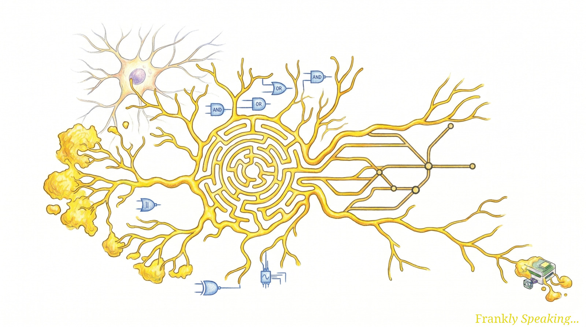
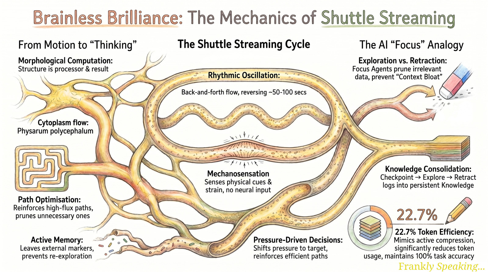
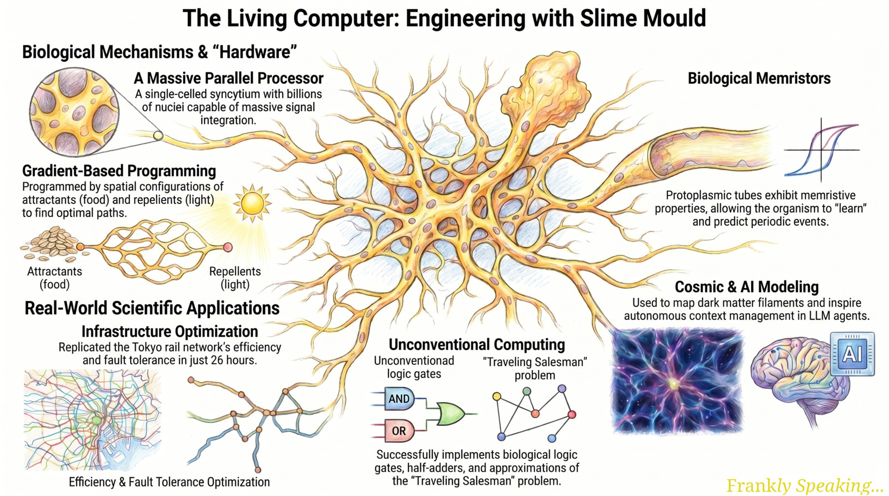

## Introduction: The Smartest Single Cell

My interest in slime mould was piqued when I read [Active Context Compression:
Autonomous Memory Management in LLM Agents](https://arxiv.org/abs/2601.07190)
and learned that the design drew inspiration from
[_Physarum polycephalum_](https://en.wikipedia.org/wiki/Physarum_polycephalum).
In maze experiments, the mould prunes branches that do not lead to a reward and
reinforces productive paths. That simple strategy maps surprisingly well to how
we now think about managing context in large language model (LLM) systems.

That connection led me to look more closely at the organism itself. _Physarum
polycephalum_ looks, at first glance, like a vibrant splash of yellow paint or a
forgotten kitchen spill. Yet this "blob" is a syncytium: a single, massive cell
containing billions of nuclei that share one continuous cytoplasm. It might be
the world's most sophisticated "brainless" computer.

What captivates me is its capacity for primitive cognition. Without a single
neuron, it solves mazes, remembers past stimuli, and makes complex decisions. It
has become an important engineering model, helping us understand biological
intelligence and improve our own technology. These insights show how nature's
problem-solving strategies can inspire better approaches to computing and
automation.

### Tokyo Experiment: Nature's Railway Engineer

In 2010, [Atsushi Tero and colleagues](https://doi.org/10.1126/science.1177894)
published a result that feels obvious in hindsight, but I still find it
interesting. The team placed oat flakes on a map of the Tokyo metropolitan area,
with each flake representing one of 36 surrounding cities. The slime mould grew
a network to connect these food sources that closely resembled the actual Tokyo
rail system, a network that took human engineers decades to refine. The mould
matched it in efficiency and fault tolerance while minimising material
cost—without any central planning.

The mould's accuracy improved when researchers used light to simulate barriers
like mountains and lakes. The mould avoids these barriers while managing a
self-repairing infrastructure without a central planning board, simply by
pruning inefficient veins and reinforcing productive ones based on nutrient
flow.

### Thinking with Physics

For years, researchers believed _Physarum_ mainly responded to chemical trails.
Pioneering research from the [Wyss Institute and Tufts
University](https://wyss.harvard.edu/news/thinking-without-a-brain/) has
revealed that the mould uses mechanosensation to make decisions. It senses
mechanical stress in its environment from a distance, allowing it to detect mass
before contact.

Richard Novak, a lead engineer at the Wyss Institute, offers a useful analogy:
imagine driving on a highway at night. You see a single bright light and a
cluster of dimmer lights. While the single point is brighter, the cluster
indicates a town—a higher probability of resources. The mould performs the exact
same calculation, preferring a cluster of masses because of the broader pattern
of strain they create in the surrounding gel.

The mould navigates through a fascinating physical process:

1. **Shuttle Streaming:** The organism rhythmically pulses its watery cytoplasm
   back and forth in regular waves.
2. **Sensing Tension:** These pulses allow the mould to "tug" on its surrounding
   surface.
3. **Pattern Recognition:** Using
   [TRP](https://en.wikipedia.org/wiki/Transient_receptor_potential_channel)-like
   proteins in its membrane, it detects how the surface deforms. I think of this
   as a primitive form of touch: deformation becomes a signal, much like
   mechanoreceptors in our own skin transduce pressure.
4. **Key Experimental Evidence:** When researchers used a drug to block these
   TRP channels, the mould lost its ability to distinguish between masses
   entirely. This strongly suggests that its decision-making capacity is tightly
   coupled to its physical ability to sense strain.

   

### Speed vs. Accuracy

Another experiment I find fascinating is
[Audrey Dussutour's research on mould "personalities"](https://doi.org/10.1098/rspb.2018.2825).
Different strains show that biological intelligence is not a perfect calculator;
it is a complex decision-maker that exhibits trade-offs we often describe in
behavioural economics.

* **Japanese Strain (Speed-oriented):** Acts quickly and randomly. In
  resource-scarce, competitive environments, any food is better than no food.
* **Australian Strain (Accuracy-oriented):** Slower and more deliberate, but
  consistently chooses high-quality nutrition. This approach excels in
  resource-rich settings.
* **American Strain (Balanced):** A versatile middle ground that finds a
  functional compromise between speed and quality.

Researcher Tanya Latty has noted that these moulds exhibit "irrational" choices
that are analogous to choices seen in humans under constraints. This suggests
that such cognitive quirks aren't flaws of complex brains, but fundamental
features of how any living system processes information under pressure.

### From Mazes to the Cosmic Web

What I find equally remarkable is how far _Physarum_-inspired logic now reaches
beyond biology:

* **Astronomy:** Researchers are
  [mapping the "cosmic web"](https://doi.org/10.3847/1538-4357/ad4ee2) using
  slime-mould algorithms. In some studies, these models perform strongly when
  tracing dark matter filaments and "galactic ecosystems" because they explore
  all directions simultaneously without bias.
* **Robotics:** Bio-hybrid robots use _Physarum_ as a living "brain" to control
  movement via light sensors. This is revolutionising decentralised swarm
  robotics, where simple units must coordinate without a central leader.
* **Medicine:** The organism's actin-myosin dynamics provide a model for
  studying cancer cell migration and wound healing, while its pulsatile flow
  inspires micro-scale drug delivery pumps.
* **Urban Planning:** Planners use the mould to test Portuguese motorway
  resilience and identify optimal evacuation routes for stadiums, leveraging the
  mould's natural ability to find the most efficient exit paths.

### Computational Substrate: Logic Gates and Beyond

Computer scientist Andrew Adamatzky has pioneered using the organism as an
[unconventional computing substrate](https://doi.org/10.1093/femsre/fuw033). The
mould can implement basic logic gates and solve NP-hard problems, such as the
"Travelling Salesman Problem" or finding "Steiner tree" solutions, often
providing useful approximations where exact optimisation is expensive.

The secret lies in "oscillating regions." Every part of the mould pulses in
rhythm, synchronising with its neighbours. These oscillating regions interact to
govern information processing. What strikes me here is how familiar this pattern
is to anyone who has worked with modern neural networks: only the strongest
signals are reinforced, while weak connections are pruned—a biological analogue
to the sparse attention and mixture-of-experts routing found in today's large
language models. As Tanya Latty observes, individuality in a syncytium is
paradoxical: although many parts function as one unified entity, each part
contributes distinctly to collective decisions.

"Self-organisation, self-optimisation and self-repair as it naturally occurs in
the slime mould _Physarum polycephalum_ are capabilities that may be required
for technological systems," noted Wolfgang Marwan, describing these mathematical
models as "beautifully useful."

### Conclusion: Lessons from Nature's Brainless Intelligence

I think the future of computing is increasingly being inspired by biology.
Experiments on the International Space Station (ISS) have tested primitive
cognition in microgravity, and I expect the integration of biological algorithms
with artificial intelligence (AI) will continue to accelerate.

For me, the deeper lesson is this: sometimes the best way to advance high-tech
engineering is to look down at a yellow blob on a rotting log and recognise that
nature has already solved problems I am only beginning to define. Studying
_Physarum_ has sharpened my own thinking about intelligence—suggesting it may
not need a brain so much as the ability to listen to the physics of the world.
