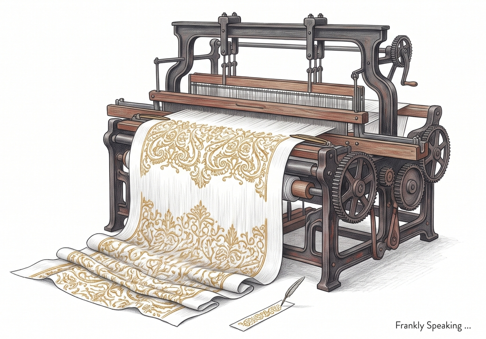

## A Reader Pushes Back

[Why Lean?][why_lean] argued that formal methods are the industry's answer to a
world where testing can no longer keep up with the cost of failure. A reader,
[commenting on that post][reader_comment], pointed out something the post had
left out entirely: sometimes bugs do not survive because testing failed to catch
them. They survive because nobody was ever going to fix them.

That comment, and the conversation it started, turned into more than a reply. It
is the second half of the argument.

## The Bug You Chose Not to Fix

The reader's point was blunt and specific: a company they had just left refused
to fix known bugs because the market and investors wanted to see year-on-year
growth, and growth comes from shipping new features, not from fixing what
already exists. Bugs get "fixed" only when a client trips over one in
production. In effect, the user base becomes an informal, unpaid QA layer —
crowdsourced testing, but not by choice.

This is a different failure mode from the ones covered last time. Optus and
Telstra were systems that broke despite everyone's best effort to keep them
running. This is software that stays broken on purpose because the
organisation's incentives point away from fixing it. Testing did not fail here.
Nobody asked testing to succeed.

## Shipped Complete, Then Shipped Enough

The reader also made a historical point worth sitting with: this is not how
software always worked. A game used to ship as a finished object — the disc was
the product, in full. Now a game ships at 95 per cent complete, and the
remaining five per cent arrives as a day-one patch, because the internet made
"patch it later" technically possible for the first time.

Once patching became cheap, "good enough, fix it in production" stopped being a
failure and became a business model. The opportunity cost the reader described —
bugs deferred because fixing them does not move the growth number — only makes
sense in a world where deferring is an option at all. Pre-internet, it was not.

## When the Reviewer Cannot Keep Up

Here is where the argument catches up with itself. [Why Lean?][why_lean] warned
that AI would eventually generate code, and results, faster than humans could
review them. Anthropic's own account of its
[recursive self-improvement][anthropic_rsi] gives that warning a number: as of
May 2026, over eighty per cent of the code merged into Anthropic's own codebase
was written by Claude, not by a human engineer. The company states plainly that
once human and AI code quality reach parity, human review — not generation —
becomes the bottleneck on how fast the whole pipeline can move.

Anthropic's response was not to review harder. It was to stop relying on human
review as the primary gate at all: an automated model now reads every proposed
change for bugs and security flaws before a human ever sees it. In a
retrospective test, that automated reviewer would have caught roughly a third of
the bugs behind past production incidents — bugs that the engineers who wrote
the code, some of the best in the field, had missed. The bottleneck did not get
fixed. It moved, from writing code to reviewing it, and the response was to make
correctness structural rather than hope a human had time to look.

## The Same Pattern in Mathematics

Terence Tao's [recent essay][tao_paper] describes the identical shift happening
to mathematical proof. As AI generates proofs faster than the community can
verify or explain them, Tao argues that a proof is not finished until a human
can explain it. He also uses Lean 4 himself, for exactly this reason: while
formalising one of his own papers, Lean forced him to justify a step he had
taken for granted, and in doing so he found a genuine error in his own published
argument — one that natural-language review, including his own, had missed.
Machine checking did not just verify the work faster. It caught something a
leading mathematician's own scrutiny had not.

## Two Accelerants, One Bottleneck

Put these together and the shape of the problem changes. The reader's original
point stands on its own: some bugs ship because nobody was incentivised to fix
them, and no amount of formal verification changes an organisation's growth
targets. But AI acceleration compounds the problem in a different way. Even
organisations with every incentive to catch bugs are running out of human
attention to deal with it.

That is the real case for Lean and its wider family, restated: not that testing
is inadequate in principle, but that there is now direct evidence — from
Anthropic's own codebase and Tao's own proofs — that human review is already the
bottleneck in practice for the people trying hardest to get it right. Formal,
machine-checked correctness is not a nice-to-have for the future. It is already
doing the reviewing work that humans no longer have time for.

[why_lean]: https://frankhjung.blogspot.com/2026/08/why-lean.html
[reader_comment]: https://www.blogger.com/comment/fullpage/post/617516323616237963/7284286437939276226
[anthropic_rsi]: https://www.anthropic.com/institute/recursive-self-improvement
[tao_paper]: https://www.alphaxiv.org/abs/2608.16753
