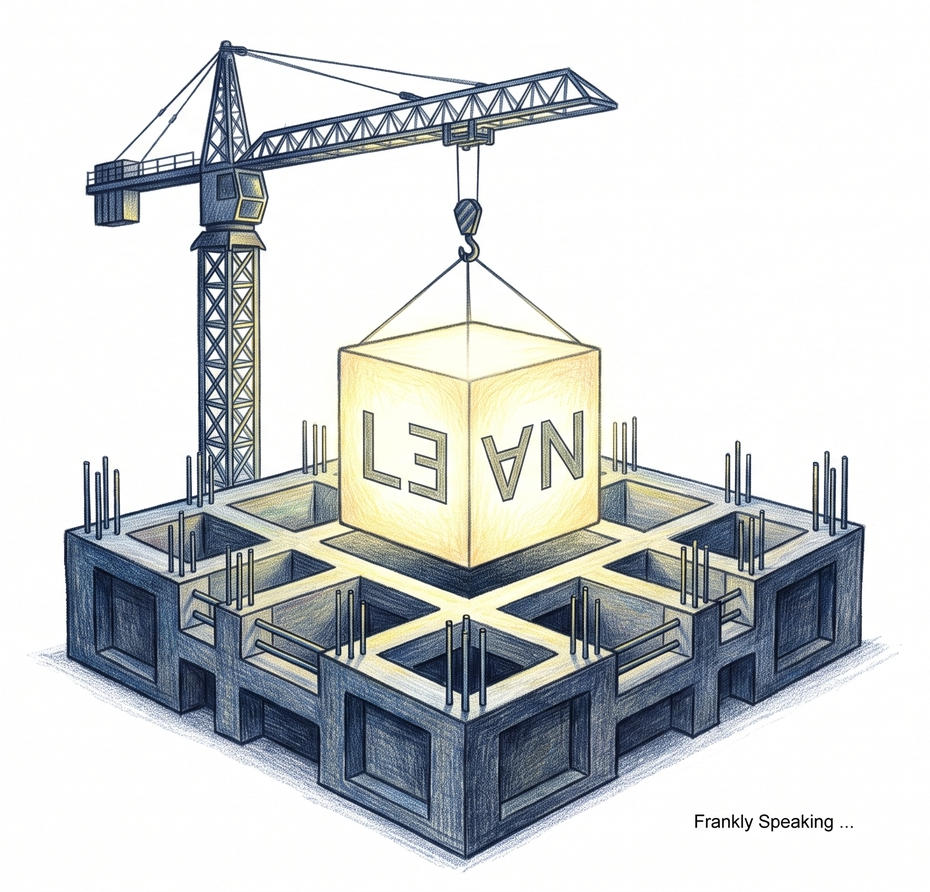

## The Real Issue Is Trust

Modern society runs on software that is increasingly essential and increasingly
fragile. The problem is not simply that code has bugs. The deeper issue is that
we have built a digital civilisation on systems whose correctness is assumed
rather than demonstrated.

The examples are familiar, and they are getting more costly. In 2025, a routine
firewall upgrade caused the [Optus emergency calling outage][optus_2025]:
ordinary calls were automatically rerouted to another network without incident,
but Triple Zero calls were silently left undelivered for hours. The fault was
narrow, yet it landed precisely on the one function that mattered most, raising
serious questions about how deeply society depends on systems we assume are safe
and reliable. In 2026, the [Telstra outage][telstra_2026] brought widespread
disruption across a continent, showing how a single infrastructure failure can
cascade through communications, commerce, and daily life.

In a world where a single logic error can disable a bank transfer, compromise a
supply chain, or collapse a communications network, the industry's traditional
reliance on testing is no longer sufficient. As Edsger Dijkstra observed,
testing can reveal that bugs exist, but it can never prove that they do not.
Testing can show failure. It cannot establish correctness.

That is the real shift represented by [Lean 4][lean4] and the wider family of
formal methods. These tools do not merely help developers write better code;
they change the underlying bargain between software and its users. They move us
from software that is 'probably correct' toward software that is reasoned about,
specified precisely, and checked by machine.

Lean 4 is one of the most visible examples of this change, but it is not the
point in itself. The point is broader: we are entering an era where software
quality will be judged not just by whether it works on the happy path, but by
whether it is provably aligned with the rules, invariants, and constraints that
matter.

## From Debugging to Design

For years, the industry has optimised for speed: ship early, patch fast, learn
in production. This model works until failure becomes expensive enough to
matter. Then the cost of reactive debugging explodes. The real cost of a bug is
not just the fix; it is the downtime, the lost trust, the emergency engineering
effort, and the reputational damage that follows.

Formal verification changes the equation. Instead of treating correctness as a
post-release aspiration, it makes it part of the design process itself.
Architects can express the properties a system must satisfy before the system is
built. They can encode invariants, state transitions, and security rules in a
language that a machine can check.

This marks the important industrial shift. It is not about a niche academic
language or a new philosophy for a small group of specialists. It is about
changing the default standard for critical software: from 'we tested it until it
seemed reliable' to 'we specified it and checked it.' Engineering itself starts
to look different.

## Why Lean Matters

Lean is valuable not because it is the only proof assistant, and not because its
syntax or proof features are magical. Lean matters because it demonstrates that
formal tools can be usable in the real world, not just in research papers.

It sits at the intersection of three trends that are transforming software:

- The cost of failure is rising.
- The complexity of systems is rising faster than human intuition.
- The tooling for automated reasoning is becoming more practical and scalable.

Lean makes this tangible. It shows that a system can combine expressive
specification, executable code, and machine-checked logic in a single workflow.
That matters because software is no longer a collection of isolated programs; it
is a network of interacting systems, each relying on assumptions, hidden
invariants, and brittle interfaces. Formal methods help manage that complexity
without leaving everything to intuition.

Here is what the software industry should pay attention to: the shift from 'best
effort' to 'evidence-backed correctness.' That is the deeper story.

## Trust Is the New Advantage

The most important long-term effect of formal methods may not be technical at
all. It may be economic.

As organisations begin to recognise the true cost of failure, they will
increasingly value software that can show its guarantees, not just claim them.
That creates a new competitive advantage: trust. Banks, insurers, medical
systems, infrastructure providers, and supply-chain platforms all have
incentives to reduce uncertainty. The Optus and Telstra examples are not just
outages; they are reminders that digital trust is itself a product. Formal
methods offer a way to build that trust into the system rather than hoping it
appears after deployment.

This will not happen everywhere at once. It will begin in the parts of the stack
that matter most: compilers, runtimes, libraries, cryptography, infrastructure
controls, and critical business logic. Once those foundational layers become
more verifiable, the reliability benefits spread outward. The result is a slow
but powerful industry-wide shift in standards.

None of this is free. Formal verification takes real engineering effort, it does
not scale evenly across every codebase, and a specification that is wrong will
be checked just as faithfully as one that is right. Those costs are exactly why
adoption will be selective rather than universal, concentrated where the cost of
failure justifies the investment.

In other words, the real adoption path is not 'every company proves everything.'
It is a gradual redefinition of what counts as good engineering. Just as type
checkers became expected in modern software development, proof-aware tooling
will become part of the normal toolkit for high-assurance systems.

## Software's New Contract

What Lean represents is not an abstract technical improvement. It is a change in
how we relate to software itself.

For decades, we have accepted a social contract in which software is expected to
fail occasionally, and users are expected to absorb the consequences. That
contract is increasingly out of date. Society now depends on software for
critical operations, and the tolerance for uncertainty is shrinking.

Formal methods are one route toward a different contract: one in which software
is not merely deployed, but understood. One in which specification is treated as
a first-class engineering artefact. One in which correctness is not a hopeful
claim, but a checkable property.

This is the real significance of Lean. It is a signal that the software industry
is beginning to move beyond the era of ad hoc reliability and into the era of
engineered trust.

## Conclusion

Lean 4 is not necessarily the destination. It is a demonstration that the
industry should no longer treat correctness as an afterthought. It shows that
specification, automated reasoning, and executable software can be brought
together in a way that is practical enough to matter.

The bigger story is not about one language or one proof assistant. It is about a
broader shift in how software is built and trusted. The next generation of
successful platforms cannot merely be fast or clever; they must be demonstrably
reliable. Organisations that embrace that standard early will not only ship
better systems; they will shape the future of software itself.

[lean4]: https://lean-lang.org/
[optus_2025]: https://www.abc.net.au/news/2025-09-20/what-we-know-about-optus-network-outage/105796618
[telstra_2026]: https://www.abc.net.au/news/2026-07-10/telstra-warned-about-vulnerability-before-national-outage/106896906
